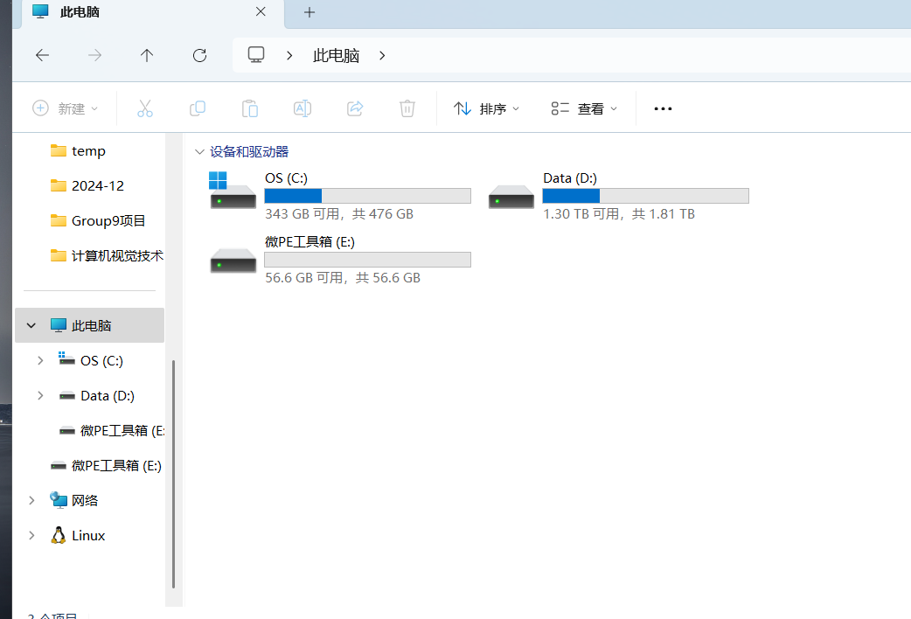
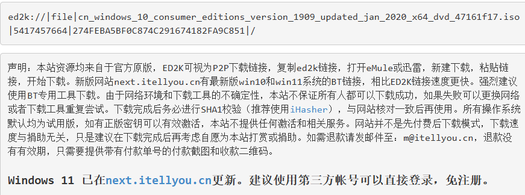
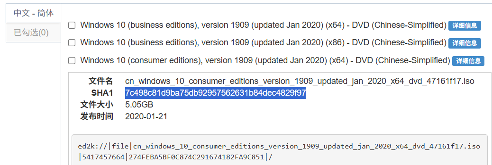
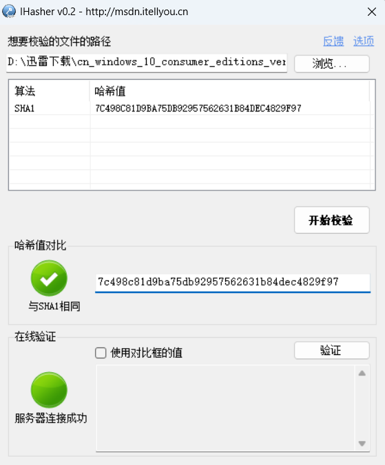

# 利用U盘重装系统（微PE）

​	*注：准备一块空U盘和一台正常的电脑，U盘要用正版且容量大于8G。正常的电脑用于制作启动盘。如果不是空盘请务必将U盘中的内容备份。*

## 下载微PE

​	官网：https://www.wepe.com.cn/

​	点击右上角的下载，选择2.0+版本，64位下载。

## 装入U盘

​	下载好后双击该exe，右下角找到安装PE到U盘，点击。

​	安装方法默认方案一，待写入U盘查看是否为自己的U盘。U盘卷标输入微PE工具箱即可。

​	勾选下面的“包含DOS工具箱”一项，个性化盘符图标随意。

​	点击制作即可。

​	等待一段时间，根据U盘读写速度。

​	写好后点击此电脑，出现空白分区（该分区就可以当做正常U盘使用）：

​	其中还有一个EFI分区，有的会被隐藏，有的可以看到。如果可以看到的话，切记不要动该分区。

## 安装win10镜像文件

​	访问**MSDN，我告诉你**，网址：https://msdn.itellyou.cn/

​	点击操作系统，选择win10，可以选择最新的1909.

​	选择一个consumer editions版本，x64，点击后面的详细信息，复制下面的ed2k链接，此处需使用迅雷。

​	迅雷点击新建，将复制的内容粘贴，下载。

## 校验

​	这个文件在下载以及拷贝过程可能会有损坏，需要检验文件的哈希值。在这个位置：

​	点击iHasher，下载即可。双击打开。

​	将刚刚下载好的win10文件拖入，等待计算完成。

​	切回MSDN，有关于该文件的哈希参考值：

​	复制，粘贴回iHasher，出现以下即为下载完整：

​	之后将该文件拷贝到刚刚的空白分区中，拷贝之后再进行一次哈希校验。

​	到这一步就OK了，以后重新装系统就可以利用该U盘，只要该U盘不被清理。

## 装系统

​	将U盘插入待安装系统的电脑上。

​	开机，进入BIOS界面（笔记本需查询按键，台式机del即可）。

​	找到Boot或Boot Priority，将U盘设置为第一启动项。保存退出即可，这时重启，会进入EFI界面。

## 分区

​	点击分区工具，右键硬盘，删除所有分区（同时清空所有数据），左上角保存更改。再去右侧看分区表类型，我们是UEFI启动，对应GPT。如果不是，需要右击硬盘，转换分区表类型。Legacy启动对应MBR。

​	右击磁盘，快速分区。自定义两个分区即可，系统分区建议分配在80GB左右，剩下的交给D盘，命名不用管。左下角ESP和MSR默认勾选就可以不要动。对齐分区到此扇区数的整数倍，选择2048，一定要勾选该项！

​	点击确定，等待分区精灵运作。当右侧出现磁盘信息就证明结束了。关闭分区精灵。

## 装载系统

​	打开此电脑，会发现成功分区。

​	打开U盘，找到之前下载好的win10，右键，装载。双击setup.exe，即可。

​	选择自定义仅安装Windows的选项，分区选择刚刚选好的80GB的C盘即可。