# 线性回归模型

​	将会有一条直线拟合到我们的数据上。

​	房价预测：

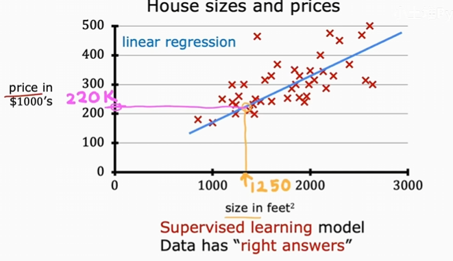

## 一些专业术语

​	用于训练模型的数据集称为**训练集**。

​	一般用小写字母x表示输入，被称为特征或输入特征。输出一般用小写字母y来表示。对于某个训练样本，可以用（x, y）来表示。
$$
具体指到第i行，可以这样表示：(x^i,y^i)，i = 1,2,3,...
$$
​	上面的i可以用括号括起来，区分幂运算。

## 监督学习算法的工作流程

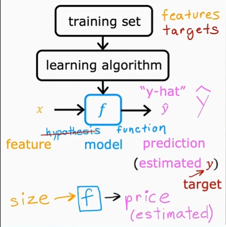

​	对于我们的训练集，通过学习算法生成一个**成本函数**f，将输入特征x传递给f，f会给出一个预估值y-hat，实际房子出售的价格在出售之前都是未知的。那么这个f如何形成呢？

​	在线性回归模型中，我们可以这样：
$$
f_{w, b}(x) = wx + b
$$
​	线性函数简单且易于处理，作为基础，最终也会帮我们过渡到更复杂的非线性模型。这样的模型称为**线性回归**，更具体地说，这是单变量线性回归，其中的“单变量”意味着有一个单一的输入变量或特征x。

## 成本函数

​	为了实现线性回归，第一个关键步骤是定义一个称为成本函数的东西。成本函数将告诉我们模型的表现如何，以便我们可以尝试使其表现得更好。还是上述的f，其中的w,b称为模型的**参数**，模型的参数在训练过程中是可调的变量，以便于改进模型，也会称为系数或者权重。

​	不同的w,b使得线性回归模型的表现不同。对于任意的点xi,yi，其在成本函数的输出预测值是y，我们需要找到w,b，使得y更接近yi。

​	这里需要一个代价函数，我们会用y减去yi，这个差值称为**误差**，代价函数就是各项误差的平方和除以训练集中数据的个数，看起来太像方差了，但是为了后面计算整洁，方差还要除以2，我们用 J 来表示代价函数，即：
$$
J(w,b)=\frac{1}{2m}\sum_{i=1}^{m}(\hat{y}^i-y^i)^2
$$
​	同时也可以写作：
$$
J(w,b)=\frac{1}{2m}\sum_{i=1}^{m}(f_{w,b}(x^i) - y^i)^2
$$
​	这个 J 也被称为**平方误差代价函数**。代价函数的实际作用是什么呢？实际上就是找到w,b使得 J 尽可能小。

​	我们先用一个简单的例子演示一下，将 f 中的参数b去掉，也就是成本函数变为：
$$
f_{w}(x) = wx 
$$
​	代价函数变为：
$$
J(w)=\frac{1}{2m}\sum_{i=1}^{m}(\hat{y}^i-y^i)^2=\frac{1}{2m}\sum_{i=1}^{m}(f_{w}(x^i) - y^i)^2=\frac{1}{2m}\sum_{i=1}^{m}(wx^i - y^i)^2
$$
​	现在有三个点：(1,1)、(2,2)、(3,3)，现在我们让w=1：

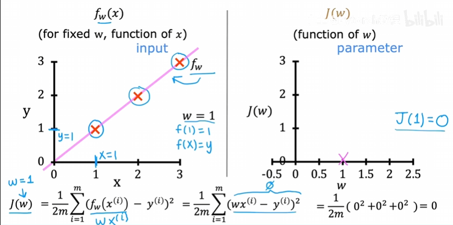

​	我们可以计算出w=1时，J(1)=0，注意到 J 中的横轴是w而不是x。当w=0.5时：

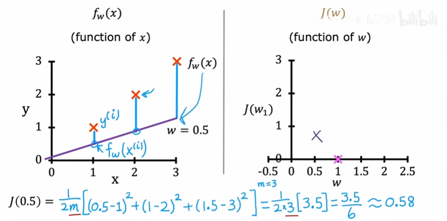

​	我们可以计算出 J(0.5) 约等于0.58。当w=0、w=-0.5时：

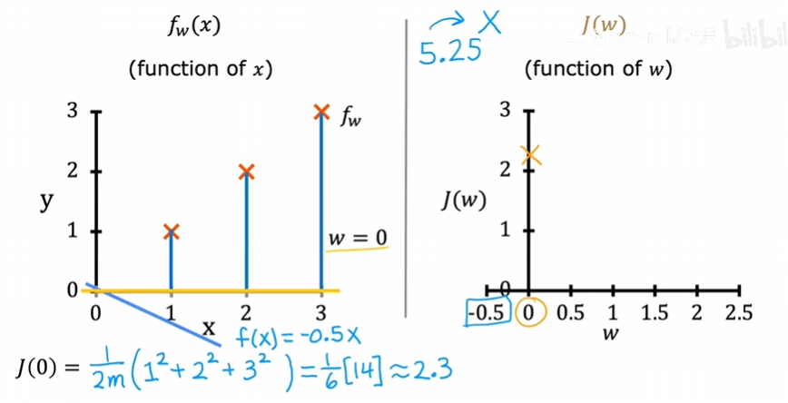

​	J(0) 约等于2.33，J(-0.5)约等于5.25，通过一系列w值来计算 J(w)，我们就可以在右边绘制出图像：

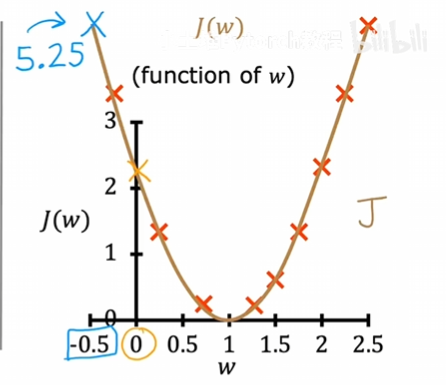

​	我们知道：J(w)是计算实际与计算的偏差的，所以，我们会选择一个w去最小化 J(w)，这样的参数w就是最适合的。在上面的例子中，J(w)是我们很熟悉的抛物线，找最小值很简单：w=1，也就是此时成本函数对于数据的拟合程度最高。

​	那么在一般的情况下，我们有w,b两个参数，我们只需同样的道理求出最合适的w和b即可。线性回归的目标是：找到参数w,b，使得代价函数 J 的值尽可能小。给出一个w,b的一般例子，可视化它，类似于：

​	三维立体图：

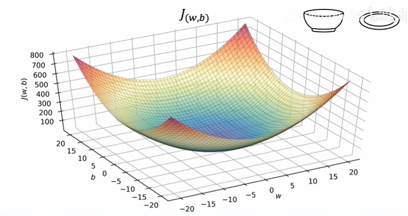

​	等高线画图：

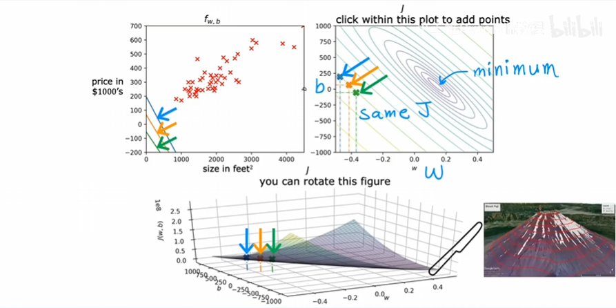

​	下面具体看特定一组w,b：

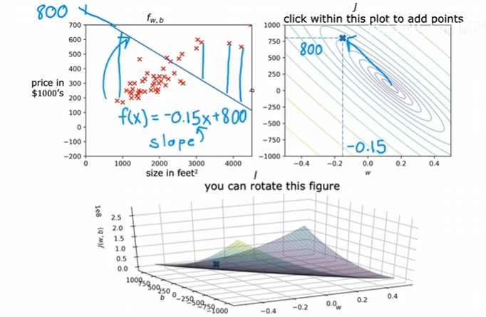

​	对于这组w,b来说，左侧图中这条直线并不好，很多点偏离该直线；看右侧图，距离中心的最小值也差很远。如果在下面的图中画出，应该是函数值比较大的位置。再看一组w,b：

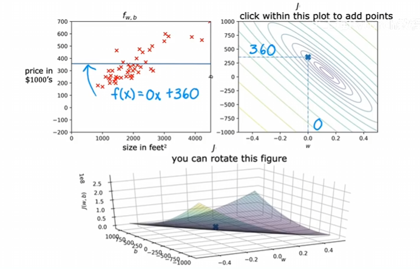

​	该直线效果依旧不好，但是比上一个例子要好一些，看右侧图，距离中心最小值要近一些。再看一组w,b：

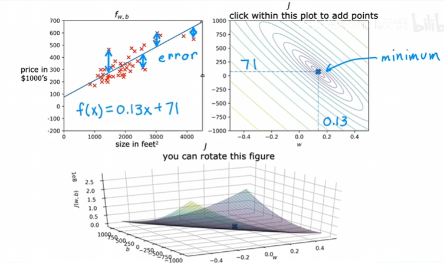

​	在这个例子中，这条直线就很好的拟合了数据集，每个点距离直线的距离和也达到很小的水平；右侧图中，点也很接近最中心的小椭圆，放在下面的图中，应该是函数值非常低的点。

​	现在我们的算法应该能从数据中自动找到最小化代价函数的参数，有一个算法用于此--梯度下降算法。它是机器学习中最重要的算法之一。梯度下降及其变体不仅用于训练线性回归，还用于训练人工智能中一些最大和最复杂的模型。