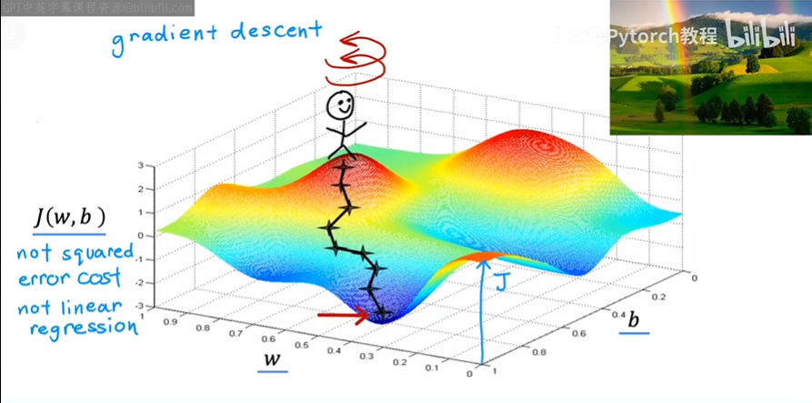
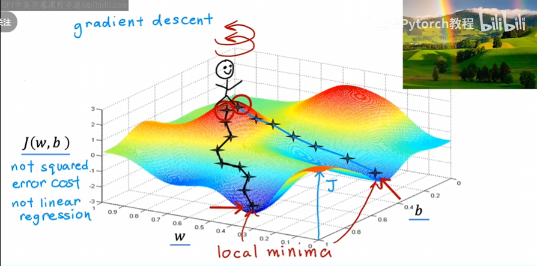
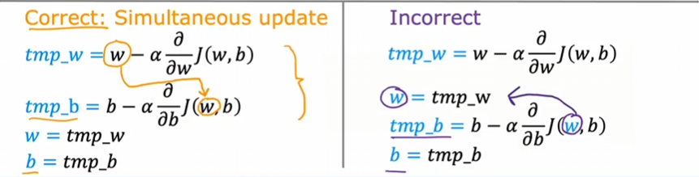
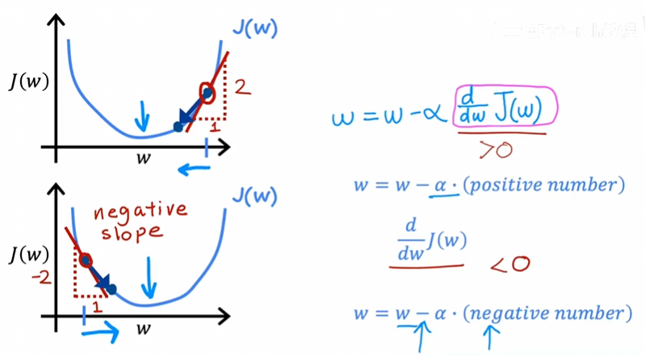
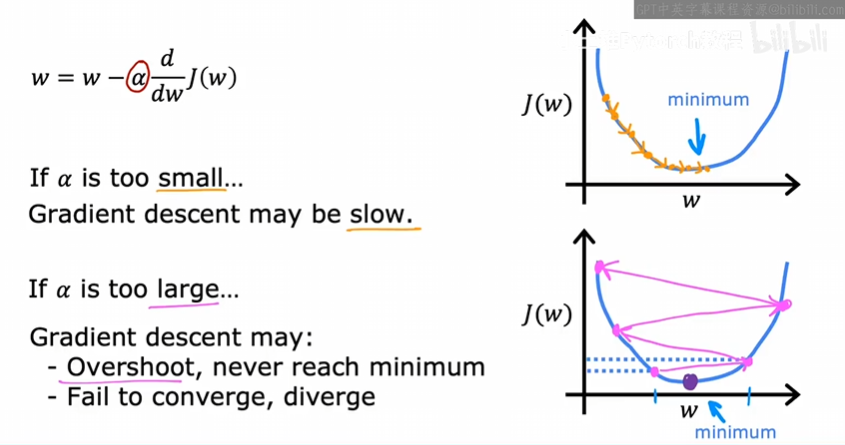
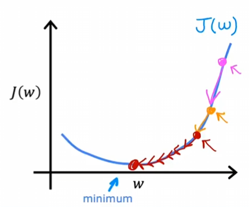
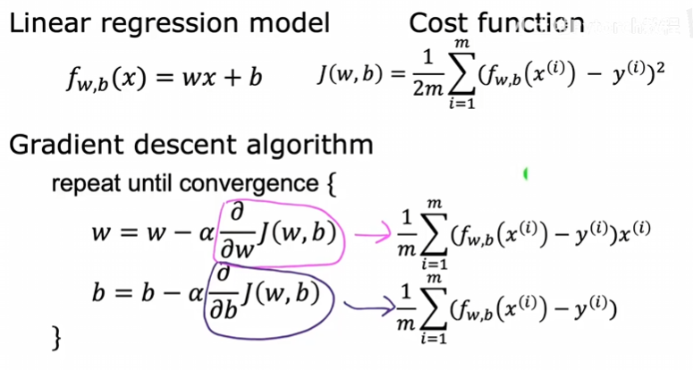
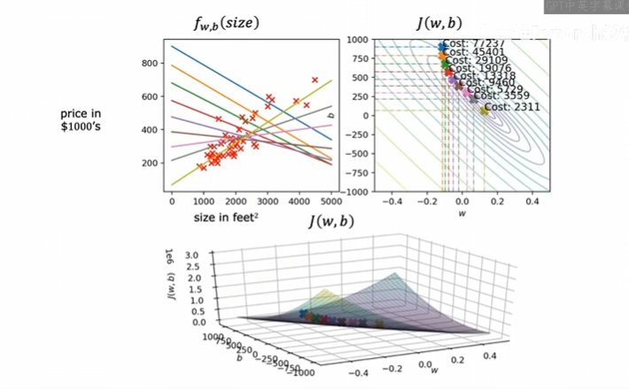

# 梯度下降

## 什么是梯度下降？

​	有一个代价函数 J(w, b)，希望最小化它的值。它可以尝试在任何函数上找最小值，而不单单限定于线性回归的代价函数。

​	事实上，如果训练模型是神经网络，那么它的代价函数可能如下图：

​	我们在训练模型的时候，一般会试着改变w和b的值，直到代价函数值最小。在上图中，假如我们一开始站在其中一个山顶，我们要通过修改w,b的值，走向最低处。那么我们会选择一个下降最快的方向。在高等数学中也会看到过这个例子，实际上就是方向导数最大的方向，这将有助于我们最快、稳定通向最低点。迈出一步后，再来看周围哪个方向下降最快……以此类推，直到最低点。

​	注意到：它的极小值可能不唯一。这就有一个有趣的特性：如果我们选择另一个起点，就有可能通过这条最速下降曲线到达另外的极值点。如下图：

​	通过这两个例子，我们看到了梯度下降如何帮助我们“下山”。

## 实现梯度下降

​	如何更新w？看这个式子：
$$
w = w - \alpha\frac{\partial}{\partial w}J(w,b)
$$
​	这里的等号不是数学意义上的等号（原谅我的不严谨），而是计算机编程中的赋值符号，为了表达更新w的旧值。

​	这里的α称为**学习率**，它通常是一个介于0和1之间的小数，它的作用基本上是控制下坡时步子的大小，如果α非常大，意味着对应的梯度非常激进，下坡步会很大。

​	α后面的导数项，是 J 对w的偏导数，也就是下坡的方向。

​	如何更新b？与w相似：
$$
b = b - \alpha\frac{\partial}{\partial b}J(w,b)
$$
​	在梯度下降算法中，会持续地更新w,b，直到算法收敛。什么是收敛？当达到局部最小值时，参数w,b不会随着接下来采取的每一步而显著变化。同时，为了正确实现梯度下降算法，w和b需要同时更新。这就意味着会有不同时更新产生的错误：

### 公式中的导数部分

​	为了更好的理解，还是将参数中的b暂时省略，只关心 J(w)。这样 J(w)的图像就是一条抛物线了。我们再来看导数部分，由偏导数变为对w的导数，实际上就是对应w点处函数的切线斜率。我们将w更新为w-α导数，这个导数假设为正，α又是[0,1]之间的数，所以，w会变得更小，而导数为正，在抛物线上应该是对称轴右侧，w变小，意味着w更接近对称轴；反之如果导数部分为负，也就是w处于对称轴左侧部分，α为正，所以w会变大，意味着w也会向对称轴移动。也就是w会固定朝向使 J(w)更小的方向更新。如图：

​	当 J(w)已经处于最小值时，该如何更新？事实上在函数中，局部最小值的点导数值为0，这就意味着w被更新为w，不变，这符合我们的预期。

## 学习率

### 如何选择一个合适的学习率？

​	如果学习率很小，那么降低代价 J 会变得非常缓慢，每一步很小，一点一点向最小值移动，需要很多步才能到达最小值。

​	如果学习率很大，那么可能在w靠近最小值时直接越过最小值，然后左右交替，离最小值越来越远。梯度下降可能发散。

​	如图：

###   固定学习率是否合理？

​	事实上对于任何一个函数，不仅仅是线性回归的代价函数，固定学习率不变都是合理的。假设在一个导数大于0，且距离最小值点较远的地方初始化w的值，现在我们要不断更新w，α是个[0,1]之间的定值，而导数部分数值较大，意味着w会迈出较大一步去靠近最小值。而靠近最小值的位置导数会变小，所以w下次更新迈出的步子会变小，以此类推，直至更新为最小值。如图：

​	所以梯度下降可以用来尝试最小化任何代价函数。

## 线性回归的梯度下降

​	这里我们将结合梯度下降、线性回归来实现线性回归模型的梯度下降算法。先来看看我们需要什么：

​	线性回归模型、线性回归对应的代价函数、以及w和b的更新策略。这里重点看一下w和b更新时偏导数的部分是如何得出图中结论的：

​	回归 J(w,b)的定义本身：
$$
\frac{\partial}{\partial w}J(w,b)=\frac{\partial}{\partial w}\frac{1}{2m}\sum_{i=1}^{m}(f_{w,b}(x^i)-y^i)^2
$$
​	利用线性回归的 f 展开上式的f：
$$
\frac{\partial}{\partial w}\frac{1}{2m}\sum_{i=1}^{m}(f_{w,b}(x^i)-y^i)^2=\frac{\partial}{\partial w}\frac{1}{2m}\sum_{i=1}^{m}(wx^i+b-y^i)^2
$$
​	再对w求偏导，得到：
$$
\frac{\partial}{\partial w}\frac{1}{2m}\sum_{i=1}^{m}(wx^i+b-y^i)^2=\frac{1}{2m}\sum_{i=1}^{m}2(wx^i+b-y^i)x^i=\frac{1}{m}\sum_{i=1}^{m}(f_{w,b}(x^i)-y^i)x^i
$$
​	对于b的部分也是类似：
$$
\frac{\partial}{\partial b}J(w,b)=\frac{\partial}{\partial b}\frac{1}{2m}\sum_{i=1}^{m}(wx^i+b-y^i)^2=\frac{1}{m}\sum_{i=1}^{m}(f_{w,b}(x^i)-y^i)
$$
​	将得到的导数部分插入原来的w和b的更新中：
$$
w=w-α\frac{1}{m}\sum_{i=1}^{m}(f_{w,b}(x^i)-y^i)x^i
$$

$$
b=b-α\frac{1}{m}\sum_{i=1}^{m}(f_{w,b}(x^i)-y^i)
$$

​	我们反复更新w和b直到找到最小值。这里需要注意，所谓最小值指的是局部最小值，也就是极值点，可能不是全局最小值。但是使用线性回归的平方误差代价函数时，代价函数不会有多个局部最小值，它只有唯一一个极小值，只要选择合适的α，它总会收敛到最小值。

## 运行梯度下降

​	