# 多特征

## 多特征线性回归

​	在之前的线性回归都是一个单一特征，现在来看如何处理多个特征。

​	先来看一下接下来会用到的符号表示：

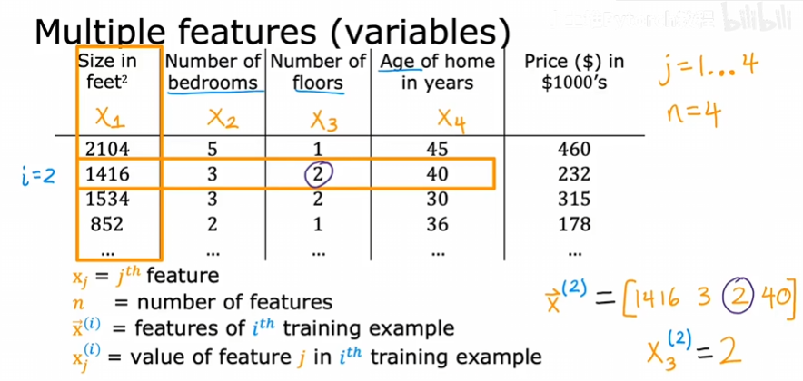

​	x_j表示第j列；

​	n表示列数，也就是输入特征的个数；

​	x^i表示一组输入特征，是一个行向量；

​	x_j^i表示具体定位到第i组输入特征的第j列。

​	那么我们的模型会是这样的：
$$
f_{w,b}(x)=w_1x_1+w_2x_2+w_3x_3+w_4x_4+b
$$
​	例如：
$$
f_{w,b}(x)=0.1x_1+4x_2+10x_3+(-2)x_4+80
$$
​	如何解读这些参数：什么都不考虑的情况下，80k可能是基础价格；0.1意味着房子大小每增加一平方英尺，价格会增加0.1k美元；也许增加一个浴室，价格会增加4k美元；每增加一个楼层，可能会增加10k美元；每增加一年房龄，可能会减少2k美元。

​	接下来看更一般的情况，有n个输入特征：
$$
f_{w,b}(x)=w_1x_1+w_2x_2+w_3x_3+……+w_nx_n+b
$$
​	我们来换一种写法：
$$
\vec{w}=[w_1,w_2,w_3,……,w_n]
$$

$$
\vec{x}=[x_1,x_2,x_3,……,x_n]
$$

​	于是，f可以简洁的表示为：
$$
f_{\vec{w},b}(\vec x)=\vec w\cdot\vec x+b
$$
​	上述模型称为**多元线性回归**，也叫**多特征线性回归**。

## 向量化

​	向量化的编程有什么用？看下面的例子：

​	现在有一个多特征线性回归模型需要计算值：
$$
\vec{w}=[w_1,w_2,w_3],\vec{x}=[x_1,x_2,x_3],b
$$
​	需要计算：
$$
f_{\vec{w},b}(\vec{x})=w_1x_1+w_2x_2+w_3x_3+b
$$
​	写代码时可能需要这样计算：

```python
f = w[0] * x[0] + w[1] * x[1] + w[2] * x[2] + b;
```

​	如果向量的长度达到100000呢？我们不可能逐一去写。那么有编程经验的小伙伴可能会使用循环，像这样：

```python
f = 0
for j in range(0, n):
	f = f + w[i] * x[i]
f = f + b
```

​	注意这里的range(0,n)的意思是[0,1,...,n-1]，左开右闭，不包括n的。

​	但是如果使用向量化乘积，就只需要这样：

```python
f = np.dot(w, x) + b
```

​	我们的函数在Numpy库中，需要安装好。

​	这样写，不仅在代码中只有一行，非常简洁，而且dot函数可以利用计算机中的并行硬件，无论CPU还是GPU，这样就使得代码执行速度也比上面的写法更快。其中dot函数就是数学中的点乘，该函数可以求两个向量的点积。

### 计算机幕后如何使用向量化

​	执行过程如下：

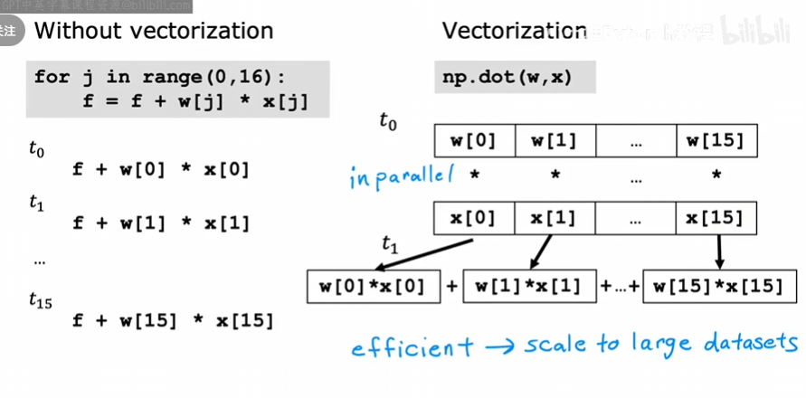

​	在dot函数执行时，他会调动计算机硬件同时计算各个乘积项，然后再高效地加在一起，而不是想我们想象的那样一个一个加起来。

​	看下面的例子：

​	假设有一个输入特征为16的参数，还计算出了各个导数项，并且省略b，学习率设置为0.1：
$$
\vec{w}=[w_1,w_2,w_3,……,w_{16}],\vec d=[d_1,d_2,d3,……,d_{16}]
$$
​	代码可能如下：

```python
w = np.array([0.5, 1.3, ..., 3.4])
d = np.array([0.3, 0.2, ..., 0.4])
```

​	更新wj：wj = wj - 0.1*dj，j = 1, 2, ...,  16.

​	循环更新可能像这样：

```python
for j in range(0, 16):
	w[j] = w[j] - 0.1 * d[j]
```

​	而向量化会这样：

```python
w = w - 0.1 * d
```

​	不仅代码更加简洁，更是利用硬件并行计算同时更新wj的值。

## 多特征线性回归的梯度下降

​	先来看看我们的模型：

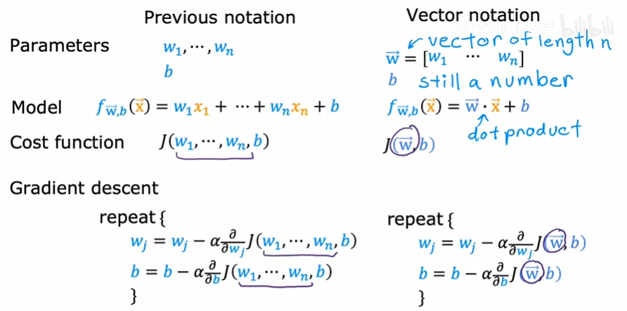

​	重点关注一下导数项，与之前有什么不同：

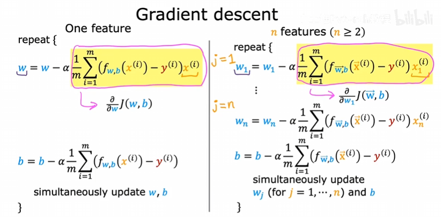

### 正规方程

​	简单提一下，该方法与梯度下降一样，求解w,b使得代价函数值最小。但是它与梯度下降不同的是，他只能用线性回归模型，而不适用于其他模型，另外，特征数量如果很大，该方法也会很慢。同时它的好处是：不需要迭代求w,b。在使用时只需调用库函数就可以了。

​	有一些技技术可以使得梯度下降工作得更好，下面看其中一种：特征缩放。

### 特征缩放

​	特征缩放可以使梯度下降运行得更快。

​	先来看特征的大小与其相关参数的大小之间的关系。举个例子，我们使用两个特征来预测房价：x1是房屋的面积，x2是卧室的数量，即price = w1 * x1 + w2 * x2 + b。我们假设x1的取值范围为300-2000平方英尺，x2的取值范围为0-5间卧室。当x1取2000，x2取5，price取500k，那么参数w1和w2如何选择呢？我们来看这个例子：

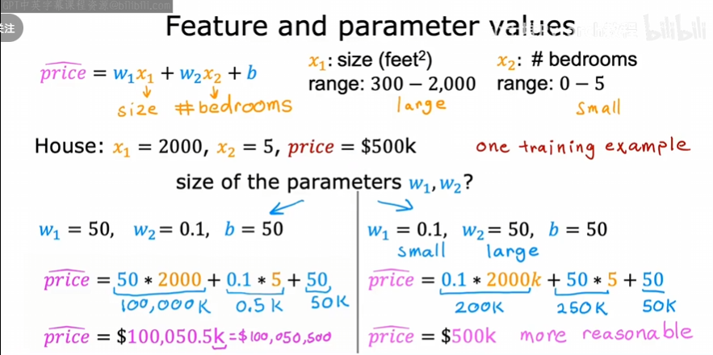

​	左边的取值明显不合理，右边的取值很合理。注意到：当一个特征取值范围较大时，例如x1，那么它的参数w1就会选择一个相对较小的参数值；同理，当特征取值范围较小时，参数w2的合理值将相对较大。这与梯度下降有什么关系呢？

​	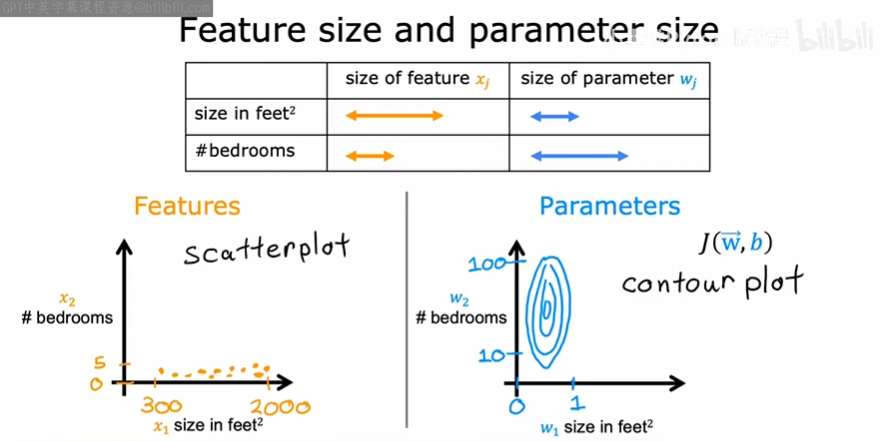

​	左侧的点会相对集中，右侧等高线画出来，会是这种细长的椭圆形，这是因为w1一点细小的变动会使得价格变化较大，因为x1的取值范围大；而w2就不会这样。这就告诉我们：如果直接使用训练集运行梯度下降，可能会发生上图中的情况，等高线又长又窄，找最小值的路径可能会反弹很多次：

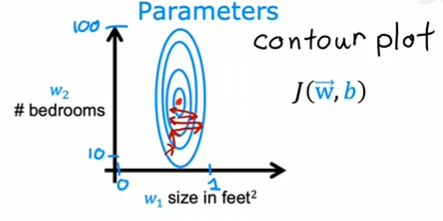

​	我们可以采用特征缩放，这就意味着需要对训练集进行某种变换，使得x1的范围变为0-1，x2也可能是0-1,：

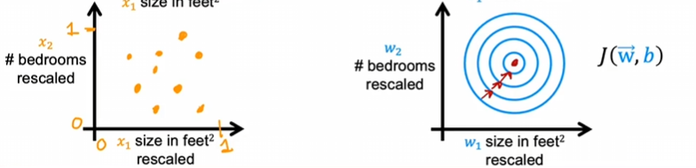

​	在右侧等高线图中，可能会找到一条直接通往最小值的路。

​	总结一下，当我们有不同的特征取值范围差异很大时，可能导致梯度下降运行缓慢（反复横跳）,但是通过重新缩放不同的特征，使它们都取值在可比范围内，这可以显著加快梯度下降运行的速度。如何实现特征缩放呢？

### 如何实现特征缩放

​	对于上面的例子，x1可能需要将自己除以2000，即取值范围的最大值，x1缩放后的范围是[0.15, 1]，类似的x2，可以除以5，使得x2缩放后的取值范围为[0, 1]。

​	除了除以最大值以外，还可以进行所谓的均值归一化。首先找到训练集中的平均值$\mu_1$，假设$\mu_1$为600平方英尺，取每个x1，减去均值$\mu_1$，然后除以2000-300的差值，即1700，如果这样做，将得到归一化的x1范围[-0.18, 0.82]，类似的对x2进行归一化，x2的平均值可能是$\mu_2$=2.3，然后取每个x2，减去$\mu_2$，并除以5-0，即5，归一化的x2范围是[-0.46, 0.54]。使用归一化缩放特征，画图会很大程度上集中在[-1, 1]的范围上，x1和x2都是如此，如图：

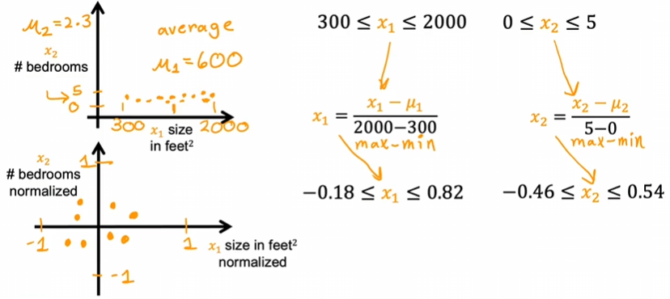

​	还有一种常见的缩放方法，叫做Z分数归一化。要实现Z分数归一化，需要计算每个特征的均值$\mu$以及标准差，标准差通常用$\sigma$。例如，x1的均值为600，标准差为450，然后进行Z分数归一化，取每个x1，减去$\mu_1$，然后除以标准差，例如这样：$x_1=\frac{x_1-\mu_1}{\sigma_1}$，x1的范围现在是[-0.67, 3.1]，类似的，x2的均值为2.3，标准差为1.4，$x_2=\frac{x_2-\mu_2}{\sigma_2}$，x2的范围可能是[-1.6, 1.9]。画图可能像这样：

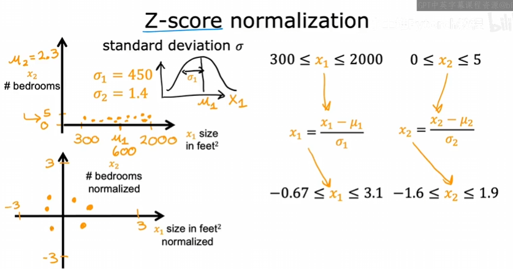

​	根据经验，在进行特征缩放时，可能希望将特征缩放到每个x范围大约[-1, 1]，但是如果是[-3, 3]，可以缩放，也可以不缩放，[-2, 0.5]，都是如此，但是如果有一个[-100, 100]，这个范围距离[-1,1]较大，最好应该缩放该范围，使其更接近[-1, 1]。另外，如果一个取值范围是[-0.001, 0.001]，那么可能也需要缩放，因为范围太小了。

​	特征缩放几乎没有任何坏处，所以其实可以直接进行特征缩放。通过这个小技巧，可以使梯度下降运行得更快。

## 检查梯度下降是否收敛

​	这里如果用图表来表示的话，我们使用的自变量是迭代次数，因为参数会有很多，没法画在图中。如果你的代价函数收敛。或者说你的算法在正常工作，那么随着迭代次数的增加，J($\vec w$,b)的值应该在减小，如下图：

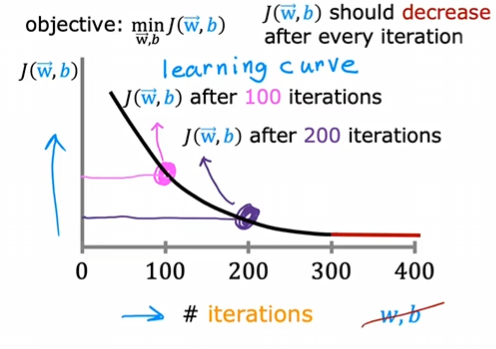

​	这条曲线我们叫做学习曲线。后面还有一些不同的曲线。我们观察到在迭代100次后得到一些w和b，纵轴就是这些暂时的w和b得到的代价值。随着迭代次数增加，代价函数值越来越小。如果随着迭代次数增加，代价函数值也在增加，说明此时的学习率$\alpha$选择不当，通常意味着$\alpha$过大，或者代码出问题了。

​	通过上图还能看出：当迭代次数来到300以后，曲线下降幅度相当小了；而到了400，曲线几乎是平坦的。这意味着梯度下降已经基本收敛了。

​	另外，迭代次数也不是固定的，在不同场景下，可能拥有不同的迭代次数，有时可能30次就收敛，有的可能要一千次或者更大。我们很难提前知道梯度下降需要多少次才能收敛，所以上图这样的学习曲线，能够很好的帮助我们，告诉我们何时可以停止训练我们的模型。

​	还有一种方法可以判断算法是否收敛：自动收敛测试。我们用$\epsilon$作为一个变量，表示一个很小的数值，例如0.001。如果代价函数在一次迭代中减少的量小于$\epsilon$，那么类似于上图学习曲线中，迭代次数300之后的平坦部分，这时可以说算法收敛了。但是找到一个合适的$\epsilon$是有难度的，如果不能方便的估计，还是应该看学习曲线，来判断收敛，它也可以帮你看到梯度下降是否正常工作。

## 选择学习率

​	学习率如果选的过小，那学习算法可能运行的很慢；如果选的过大，学习算法可能根本不会收敛。那么如何选择一个好的学习率呢？

​	看看下面的例子：

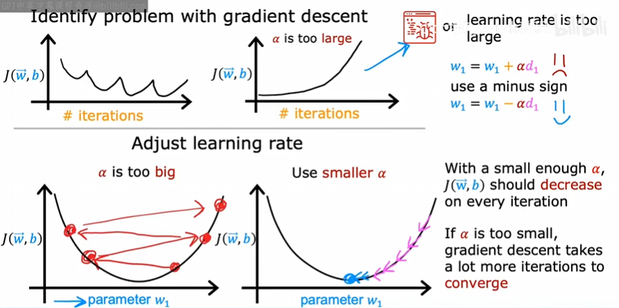

​	在上面的例子中，可能是学习率过大，也可能是代码有问题。下面的例子就是学习率过大，有可能算法不会收敛。

​	我们有时可以将学习率设置为一个特别小的数字，来看看学习曲线是否是下降的，这样至少能说明学习算法没有问题。

​	在选择学习率时，我们可以通过一系列的学习率来调试，例如下图：

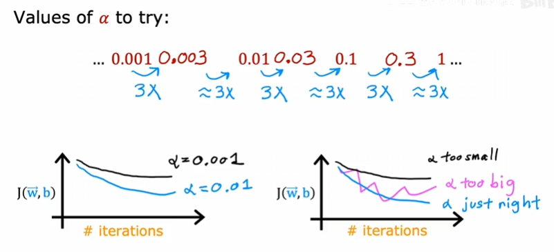

​	这一系列值可能是0.001、0.01、0.1、1，在每个值可能还会多次尝试，比如将该学习率扩大三倍，来观察现在选择的学习率是否过小，如果过小，那么前后变化一定是几乎没有的，前提是学习曲线是下降的。当增大学习率，学习曲线下降的更快了，但是如果学习率增加到过大的值时，就会出现右图中紫色的样子。

​	这样的调试会帮助我们选择一个合适的学习率。

## 选择特征（特征工程）

​	选择合适的特征也能加速算法。看下例：

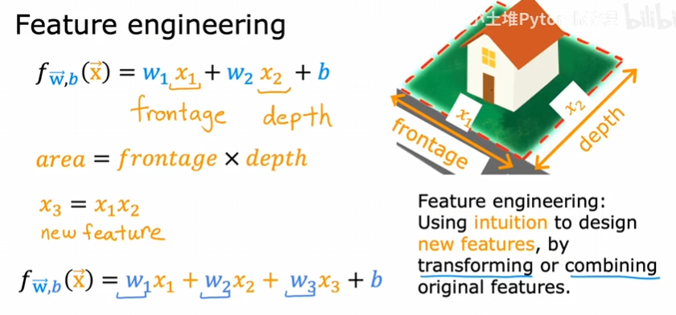

​	一开始可能只用长和宽作为特征输入，但是可以加一个面积的特征，我们通过w1,w2,w3来决定哪些特征更重要。

## 多项式回归

​	它结合了多元线性回归和特征工程，可以将非线性函数拟合到我们的数据上。例如：

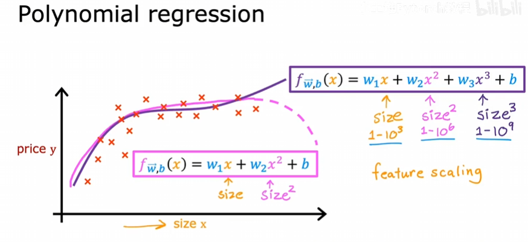

​	这些数据不适合用直线拟合，也可能用三次函数来拟合比较合适。我们三个特征就可以取面积、面积的平方以及面积的立方。这里需要注意，在这种多项式中，特征的取值范围越来越夸张，所以特征缩放会更加重要。

​	在上面的数据集，其实还有一个函数适合拟合，那就是将第二个特征变为面积的平方根：

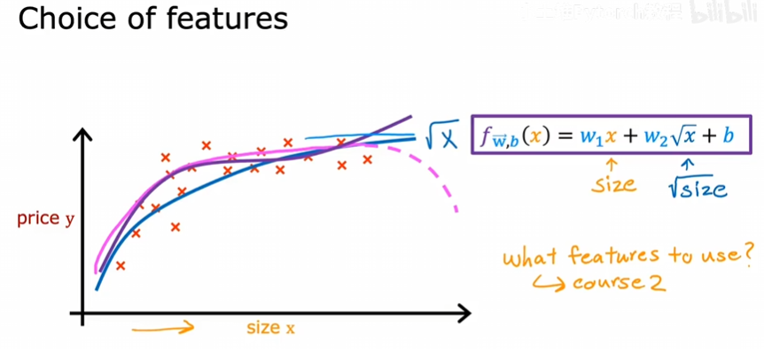

​	如何选择这样的特征，我们会在后续课程讲到。
