# 分类算法

## 引言

​	有一些问题的输出不是无穷多种可能，而是只有有限的几种可能，这类问题不适合用线性回归，而是我们之前提到的分类算法。例如：

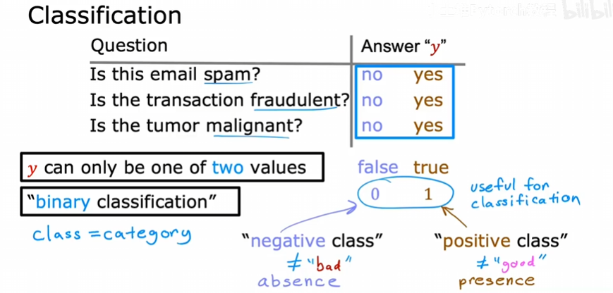

​	我们在上面的问题回答no或yes时，也可以用下面的来替代。这里需要强调一下，所谓“负类”并不一定是坏的，“正类”也不一定是好的，他们表示存在或者缺失。当然这个定义是人为的，也可以反过来，比如用正类来定义好的电子邮件、存在真实的金融交易、健康的患者。

## 如何构建分类算法

​	看肿瘤的例子：

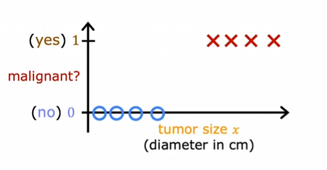

​	现在如果用学习过的线性回归来拟合数据，可能像这样：

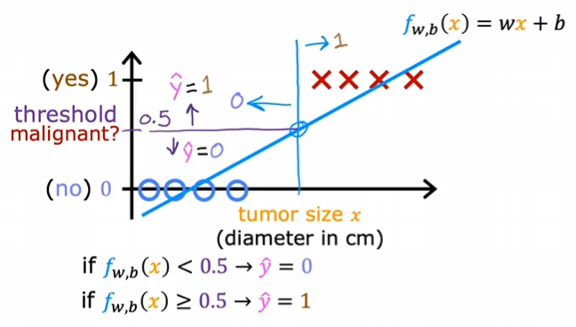

​	我们可以规定一个阈值，比如上图的0.5。那这样左边部分永远是0，右边部分永远是1，在我们上面的例子中看起来没什么问题。但是如果我们在上面的例子中添加一个特殊地数据点，情况就会很不一样：

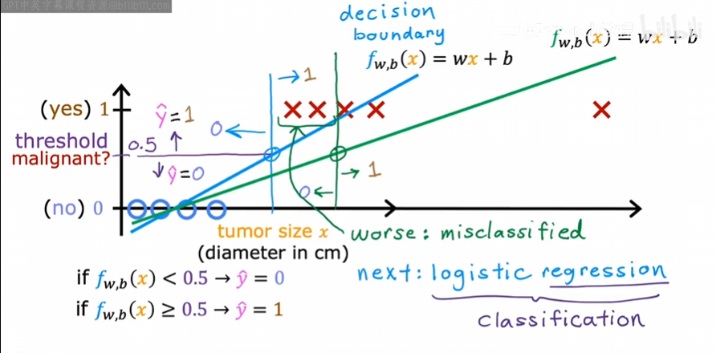

​	我们发现：拟合的直线发生了偏移，同样，纵轴0.5的阈值对应的x也会右移，这样，就可能将是肿瘤的部分归到不是肿瘤的部分，这不是我们想看到的。

​	其中阈值0.5对应的x我们称为**决策边界**，我们接下来将介绍一种分类算法：**逻辑回归**。需要注意的地方是，逻辑回归后面有个回归，但是它实际上不是回归算法，而是分类算法，起这个名字是历史原因。他实际上用于解决二分类问题，输出标签y要么是0，要么是1。

## 逻辑回归

​	这可能是世界上使用最广泛的分类算法。

​	先来介绍一个函数：Sigmoid函数，他的表达式和图像如下：
$$
g(z)=\frac{1}{1+e^{-z}}
$$
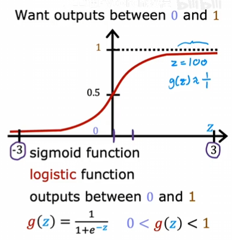

​	当z非常大时，函数值趋于1,；当z非常小时，函数值趋于0。

​	逻辑回归就是将线性回归与Sigmoid函数相结合产生的，看图：

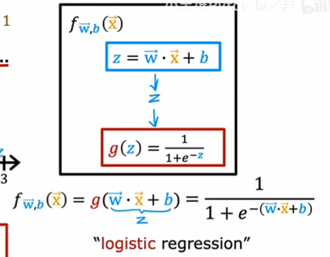

​	这就是**逻辑回归模型**，它的作用是输入一个或一组特征，得到一个0到1之间的数字。那么如何解释这个[0, 1]之间的输出呢？可以这样理解：输入特征后，输出出标签是1的概率。还是肿瘤的例子，如果模型输出0.7，说明该患者的肿瘤有70%的概率是恶性的。所以我们会在一些论文之类上看到这样的表达：
$$
f_{\vec w,b}(\vec x)=P(y=1|\vec x;\vec w,b)
$$
​	这就是我们上面说的逻辑回归模型。

### 决策边界

​	上面也提到了什么是决策边界。我们说可以设置一个阈值，比如0.5，高于阈值为，低于阈值为0。我们给出逻辑回归模型：
$$
f_{\vec w,b}(\vec x)=g(\vec w\cdot\vec x+b)=\frac{1}{1+e^{-(\vec w\cdot\vec x+b)}}
$$
​	何时g(z)大于等于0.5？当z>=0时。z何时大于等于0？$\vec w\cdot\vec x+b$ >= 0时。

​	看一个有两个输入特征的例子：

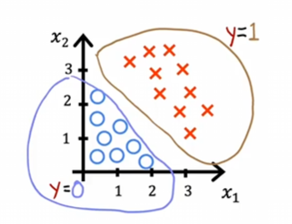

​	假设模型如下：
$$
f_{\vec w,b}(\vec x)=g(z)=g(w_1x_1+w_2x_2+b)=g(x_1+x_2-3)
$$
​	这是一个具体的例子，我们看看逻辑回归如何正确预测。我们需要找到一条直线：$z=x_1+x_2-3=0$，这条线即为边界决策：

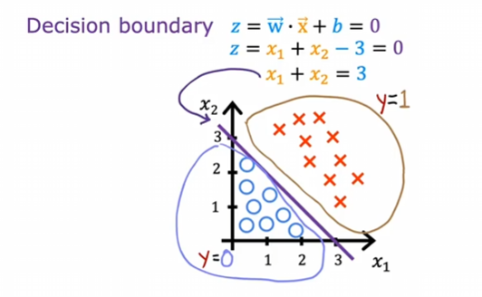

​	通过这条线，我们可以预测：在这条线上方为1，下方为0。当然这只是$w_1=w_2=0，b=-3$的情况。选择不同的参数，决策边界会是一条不同的线。

​	再来看一个更复杂的例子，决策边界不再是直线：

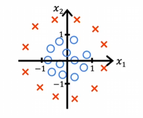

​	这训练出来的模型可能是这样的：
$$
f_{\vec w,b}(\vec x)=g(z)=g(w_1x_1^2+w_2x_2^2+b)=g(x_1^2+x_2^2-1)
$$
​	决策边界是z=0的时候，那么 $z=x_1^2+x_2^2-1$ 在 $x_1^2+x_2^2=1$ 时为0，这个决策边界是一个单位圆。圆外预测为1，圆内预测为0。

​	还有一些更复杂的决策边界：

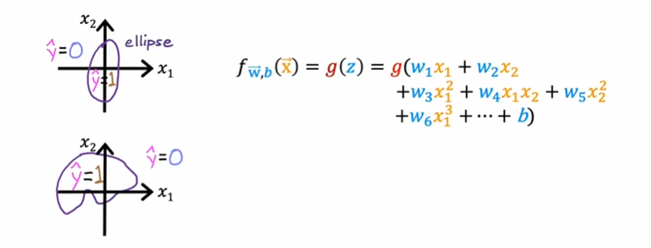

### 逻辑回归的成本函数

​	代价函数提供了一种衡量特定参数集对训练数据拟合程度的方法，从而能使我们尝试选择更好的参数。

​	现有一个训练集长这样：

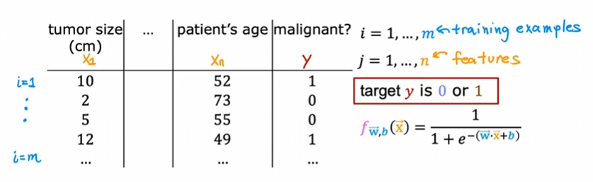

​	那么我们如何选择$\vec w$和b呢？

​	对于线性回归，我们使用平方误差代价函数。能不能将平方误差代价函数应用到逻辑回归模型呢？不能：

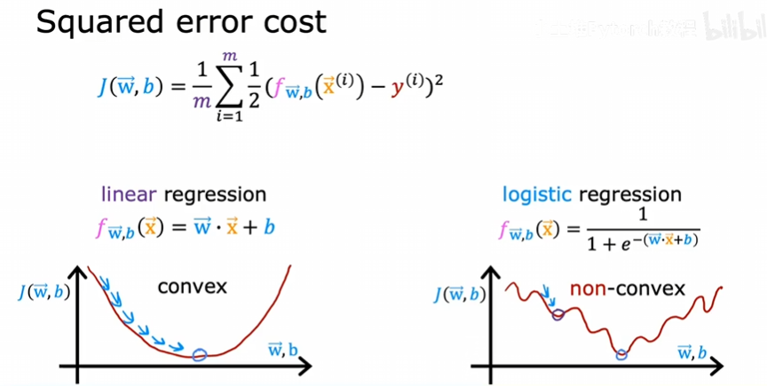

​	逻辑回归模型画出来的代价函数长右图的样子，他不想线性回归，只有一个极小值，而是有多个，他不是凸函数。我们需要换一个更加合适的代价函数，如上图，只是把二分之一写到求和符号的里面。现在我们有新的定义：
$$
L(f_{\vec w,b}(\vec x^i),y^i)
$$
​	上式为损失函数，对于预测值f(x)以及真实值y的差别。那么这个损失函数如何定义呢？
$$
L(f_{\vec w,b}(\vec x^i),y^i)=
\begin{cases}
-log(f_{\vec w,b}(\vec x^i)), & y^i=1 \\
-log(1-f_{\vec w,b}(\vec x^i)),   & y^i=0
\end{cases}
$$
​	为什么是这样的定义？记住：损失函数衡量的是单个训练样本上的表现，通过所有训练样本的损失相加，就可以得到代价函数，代价函数衡量的是整个训练集上的表现。回到损失函数的定义，我们先来看$y^i$=1的情况，图像大概是这样的：

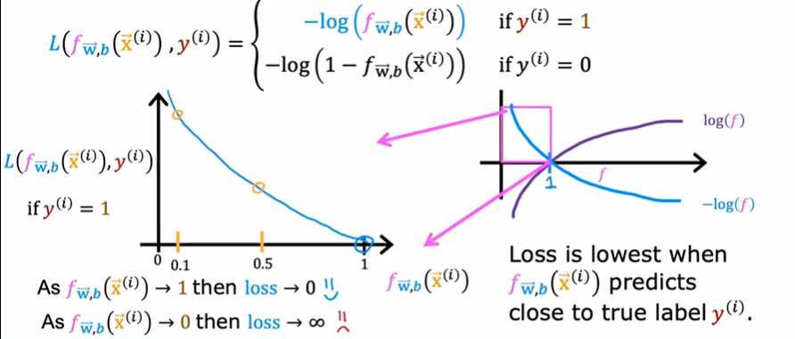

​	我们的 f 在逻辑回归中输出是一个[0, 1]之间的数字，所以上图放大了[0, 1]这段区间。我们发现：在 f 值接近1的时候，损失函数的大小几乎为0，而在 f 值为0.1或更小时，损失函数变得非常大，这是在真实值$y^i=1$的情况下。所以损失函数激励、推动帮助算法做出更准确的预测，因为它接近1时损失最小。再来看$y^i=0$时的损失：

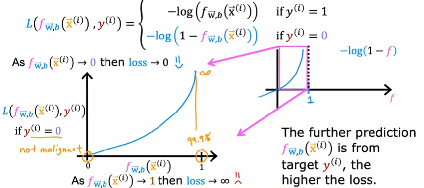

​	同样的道理，如果预测值 f 接近0，损失函数也会接近0，说明预测接近真实值；反之则变得特别大。

​	我们给出成本函数：
$$
J(\vec w,b)=\frac{1}{m}\sum_{i=1}^{m}L(f_{\vec w,b}(\vec x^i),y^i)
$$
​	而损失函数L我们在上面也给出了定义。这样就使得代价函数是凸函数，可以放心使用梯度下降找到最小值。这里不说明这个代价函数为什么是凸的。

​	如果找到一组$\vec w$和b使得代价函数值最小，那么这会是一组非常好的逻辑回归参数值。

### 简化成本函数

​	我们上面定义的损失函数是一个分段函数，且只有$y^i=0、y^i=1$两种情况。我们可以将这个函数写成一个表达式：
$$
L(f_{\vec w,b}(\vec x^i),y^i)=-y^ilog(f_{\vec w,b}(\vec x^i))-(1-y^i)log(1-f_{\vec w,b}(\vec x^i)),y^i=0或y^i=1
$$
​	而带入代价函数，可以得到：
$$
J(\vec w,b)=\frac{1}{m}\sum_{i=1}^{m}[L(f_{\vec w,b}(\vec x^i),y^i)]=-\frac{1}{m}\sum_{i=1}^{m}[y^ilog(f_{\vec w,b}(\vec x^i))+(1-y^i)(log(1-f_{\vec w,b}(\vec x^i)))]
$$
​	为什么会选择这个特定的函数，是否有无数其他的代价函数可以选择呢？这个特定的代价函数是从统计学中使用最大似然估计这一统计原理推导出来的，这是统计学中关于如何高效地为不同模型找到参数的一个概念。这个代价函数有一个很好的性质：凸函数。相关问题感兴趣可以自行查找学习。

### 梯度下降实现

​	还是一样的任务，找到参数$\vec w$和b使得代价函数 J($\vec w$, b)最小，我们使用梯度下降来实现。先来看表达式：

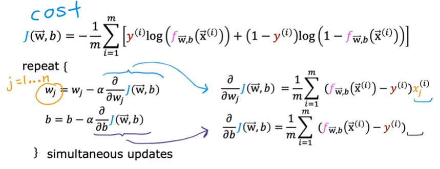

​	我们将导数项带入w和b的更新中：

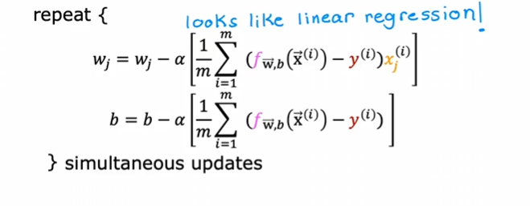

​	这看起来和线性回归模型的一样。尽管方程看起来相同，但是是因为f(x)的定义发生了变化。在线性回归中：
$$
f_{\vec w,b}(\vec x)=\vec w\cdot\vec x+b
$$
​	但是在逻辑回归中，f(x)是这样的：
$$
f_{\vec w,b}(\vec x)=\frac{1}{1+e^{-(\vec w\cdot\vec x+b)}}
$$
​	所以二者是完全不同的。

​	类似的，如何在训练时监控梯度下降以确保收敛，向量化实现，特征缩放，都可以参考线性回归中提到的方法。值得注意的是，向量化可以使逻辑回归的梯度下降运行地更快。
