## 过拟合与欠拟合问题

​	先来看几个例子。

​	线性回归预测房价，假设输入特征是房子的大小，输出是预测的房价。我们需要在数据集上拟合一条直线，类似这样：

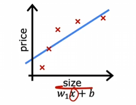

​	我们可以看到，这条直线的拟合效果并不是很好，因为随着房子大小的增加，房价增长的速度可能越来越低。这个问题的技术术语是模型欠拟合训练数据，另一个术语是算法具有高偏差，这里的高偏差可以理解为数据本身的特性与拟合曲线之间的差异，就如上图所示。

​	换一个模型，这次用二次函数拟合数据，输入特征是房子大小和房子大小的平方，看这个例子：

​	这里提到一个词语：泛化能力。我们可以看到上面的曲线很好地拟合了数据，那么如果遇到一个全新的房子大小，该模型也能很好地预测房价，我们认为它对新样本有着很好的泛化能力。

​	再来看一个例子：

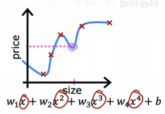

​	在这个例子中，四次函数也很好的通过了五个点，但是这个模型有些位置可能会出现房子大小变大，房价反而更低的错误判断。所以我们不认为这是一个好的房价预测模型。这里的技术术语是这个模型过拟合了数据，或者这个模型存在过拟合问题，他对于新样本似乎没有较好的泛化能力。另一个术语是算法具有高方差，在两次训练中，模型拟合稍微不同的数据集，他们可能会得到完全不同的预测，或者高度可变的预测。

​	回头看三个模型，第一个欠拟合，第二个既不欠拟合、也不过拟合，第三个过拟合。机器学习的目标应该是找到一个既不欠拟合也不过拟合的模型。话句话说，希望找到一个既不高偏差也不高方差的模型。

​	上面的三个例子都是回归算法，分类算法也是如此。

​	看一个欠拟合的例子：

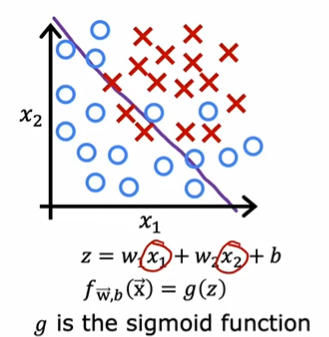

​	既不欠拟合也不过拟合的例子：

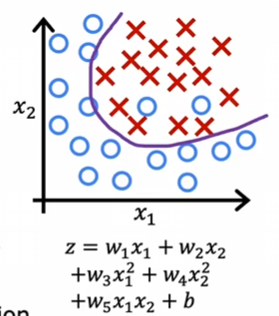

​	过拟合的例子：

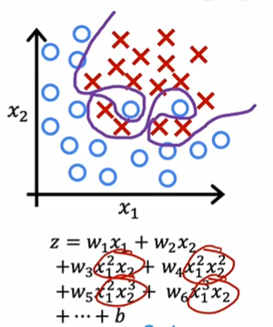

## 解决过拟合问题

​	有一个过拟合的例子：

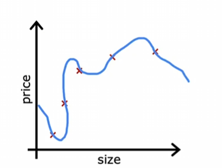

​	其中一个解决办法是：收集更多的训练数据。通过数据集的扩大，算法可能会拟合一条不那么波动的曲线：

​	但是如果没有那么多数据可以获取呢？这个方法似乎就行不通了。

​	解决过拟合问题的第二个方法是，看看能否使用更少的特征。因为当你的特征过多，并且训练样本不充足时，可能就会发生过拟合问题。我们可以选择这些特征的子集，选择那些认为重要的特征。这也会带来一个缺点，那就是算法会丢弃一些关于房屋的信息，称为特征选择，后面会讲到这个问题。

​	第三个方法就是正则化。正则化会将高次特征的参数值调小，当调到0时，就和上面的方法一样，直接将该特征丢弃掉。所以我们可以设置非常小的参数值来解决过拟合问题，他可以保留所有特征。这里的减小特征指的是w，而不是b。

## 带正则化的成本函数

​	还是上面的例子：

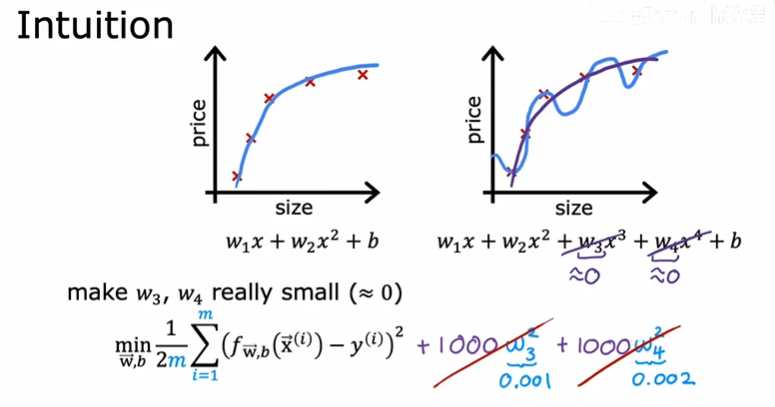

​	我们说上面的w3和w4参数被惩罚了。因为他们俩的参数值太大了，使得曲线过拟合。

​	更一般地来说，我们有若干特征，在解决过拟合问题时，我们需要惩罚一些参数。但是我们并不知道哪些是重要的，我们很难提前选择。这样就需要对所有特征进行惩罚，如何惩罚呢？需要一个合适的参数$\lambda$：

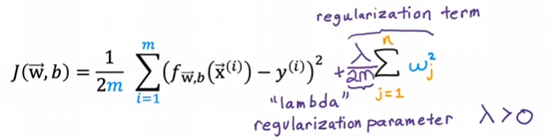

​	我们将前面的叫做平方误差项，后面的叫做正规项。

​	当$\lambda$为0时，那么没有正规项，可能得到一条过拟合的曲线。另外一种情况，当$\lambda$过大时，对右边的正规项施加非常大的权重，而最小化代价函数的唯一方法就是确保所有的w值都非常接近于0。这样f(x)实际上约为b，这拟合出了一条水平的接近直线。

​	所以，$\lambda$为0时，模型会过拟合；$\lambda$过大时，模型会欠拟合。所以选择一个适当的$\lambda$是有必要的。

## 正则化线性回归

​	还是上面代价函数的定义，这里我列出LaTex式子：
$$
J(\vec w,b)=\frac{1}{2m}\sum_{i=1}^{m}(f_{\vec w,b}(\vec x^i)-y^i)^2+\frac{\lambda}{2m}\sum_{j=1}^{n}w_j^2
$$
​	我们的目标没变，找到$\vec w$和b使得 J 最小化。我们之前仅有第一项时的处理方式是，使用梯度下降。在这里继续使用梯度下降更新$\vec w$和b，只不过导数项多了一项：

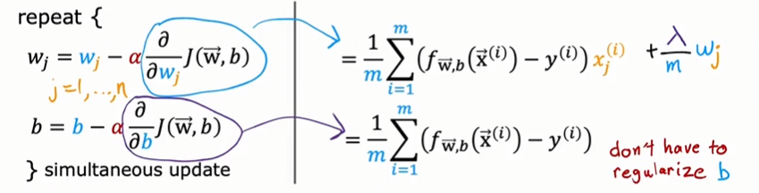

​	右边带入左边：

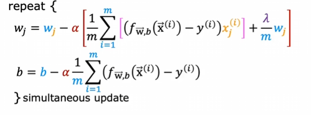

​	接下来是一些数学的解释，如果跳过也没关系。

​	我们来重写wj的更新：
$$
w_j=w_j-\alpha\frac{\lambda}{m}w_j-\alpha\frac{1}{m}\sum_{i=1}^{m}(f_{\vec w,b}(\vec x^i)-y^i)x_j^i=(1-\alpha\frac{\lambda}{m})w_j-\alpha\frac{1}{m}\sum_{i=1}^{m}(f_{\vec w,b}(\vec x^i)-y^i)x_j^i
$$
​	我们只是将括号打开，并把后一项移到前面。我们可以发现，上式后面的项就是未正规化时，线性回归的wj的更新式子。

​	我们再来看第一项，$\alpha$是学习率，是一个很小的数，比如0.01；$\lambda$是正规化参数，也是一个较小的数，比如1；m是数据集的大小，比如50。那么这项将是一个非常小的数，在这个例子中是0.0002。再用1减去这个数，得到一个略低于1，特别接近1的数字，0.9998。所以直观效果就是，每次更新wj时，先将wj乘以一个接近1的数字，比如0.9998，稍微缩小wj的值，再进性常规的更新。

## 正则化逻辑回归

​	给出逻辑回归正则化的代价函数：
$$
J(\vec w,b)==-\frac{1}{m}\sum_{i=1}^{m}[y^ilog(f_{\vec w,b}(\vec x^i))+(1-y^i)(log(1-f_{\vec w,b}(\vec x^i)))]+\frac{\lambda}{2m}\sum_{j=1}^{n}w_j^2
$$
​	我们来看如何更新$\vec w$和b：

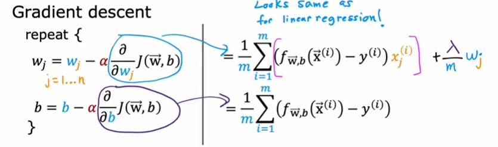

​	看起来和线性回归的还是一样的，但是其实这里面的f(x)不再是线性函数。