# 深度学习部分（神经网络）

## 神经元与大脑

​	在几十年前，神经网络被首次发明时，最初的动机是编写能够模仿人类大脑或生物大脑学习和思考方式的软件。到目前为止，虽然差的比较多，但一些生物学动机仍然存在于我们今天对人工神经网络或计算机神经网络的思考方式中。

​	深度学习与神经网络最开始在语音识别中大放异彩，然后是计算机视觉，接下来是文本或自然语言处理，现在是气候变化到医学成像，在线广告和产品推荐等各个领域。

​	大脑中的神经元如何工作：


​	我们的模仿：

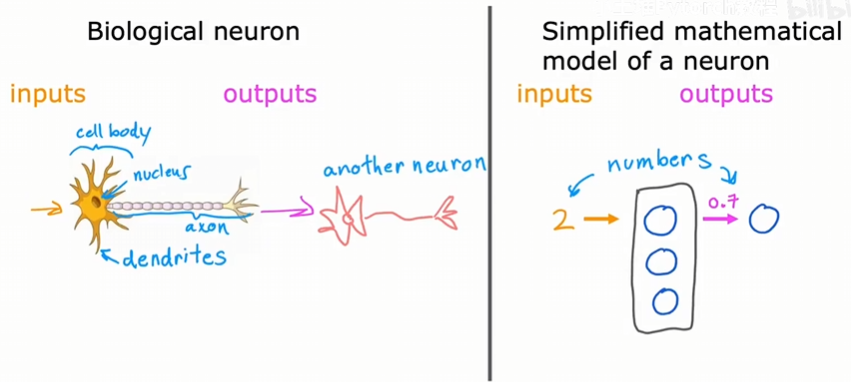

​	构建一些“神经元”，接收输入，产生输出。

​	那么为什么深度学习会兴起呢？看下图：

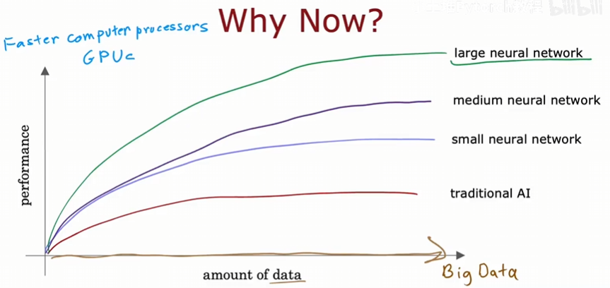

​	随着数据量的增加，我们在传统的学习算法（线性回归、逻辑回归）看到的性能提升几乎没有，很容易存在瓶颈。但是人们注意到，如果训练一个小、中、大型的神经网络性能会得到很大的提升。同时这个提升也依赖于计算机的GPU。

## 神经网络的工作原理

​	我们将使用一个需求预测的例子，在这个例子，查看一个产品，并尝试预测它是否会成为一个畅销品。产品是T恤衫，收集了许多不同T恤的销售数据，包括他们的价格以及哪些成为畅销品。

​	这个例子中，输入特征x是T恤的价格。如果用逻辑回归来预测，那么可能像这样：

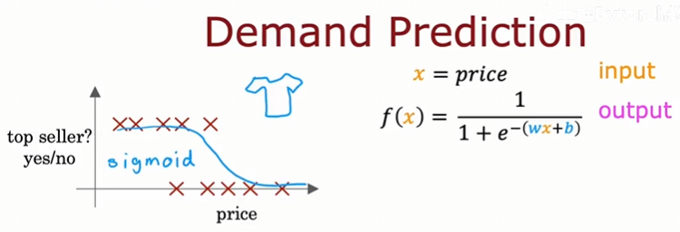

​	为了让我们准备好构建一个神经网络，稍微改变一下术语。用字母a表示逻辑回归的输出，这里的a实际上代表激活，来自于神经科学。大概可以这样理解：

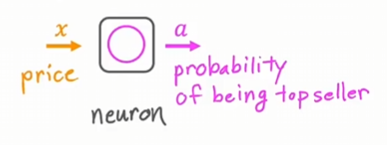

​	这是一个神经元，或者可以看作一个小型计算机。他的任务是接收一些输入，产生输出a。将很多神经元连接在一起，就是一个神经网络。

​	再来看一个更复杂的需求预测例子。

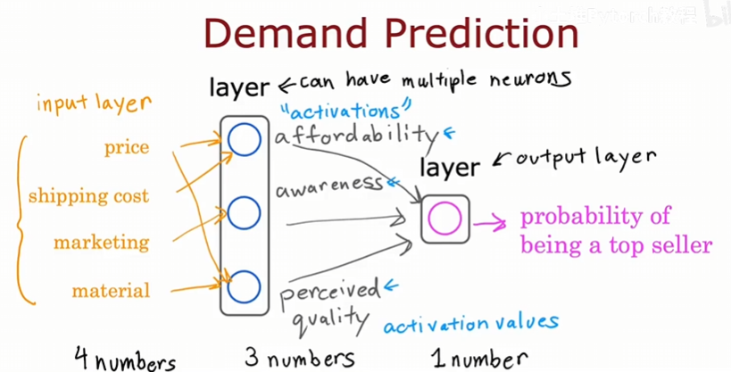

​	在这个例子中，我们会有四个输入特征来预测T恤是否会成为畅销品，分别是：T恤的价格、运费、销量以及材料质量。顾客会在意T恤的可负担性，俗话来说：能买得起不？可负担性取决于价格和运费。这需要创建一个小神经元，输入是运费和价格。然后是认可度，这个取决于销量，我们为这个创建一个小神经元，输入为销量。最后就是T恤的质量，人们认为该T恤是否为高质量，取决于材料和价格，不能否认的是：人们会认为高价格的T恤一般来说对应着高质量，我们为此再创建一个小神经元，输入为价格和材料。我们在最后还需要创建一个神经元，也是逻辑回归单元，最终输入上面三个神经元的输出，并输出该T恤称为畅销品的概率。

​	在术语上，前面三个神经元我们说他们合成一个层（layer），层是一组神经元，它们以相同或相似的特征作为输入，并以此输出一些数字。一层可以有多个神经元，也可以只有一个，像上述例子中的逻辑回归单元一样，该层也被称为输出层。前面的T恤的价格、运费、销量以及材料质量称为输入层或激活值（activations），激活值这个术语来自生物神经元。同样的，前面三个神经元的输出作为后面一个神经元的激活值。中间层（三个神经元）叫做隐藏层。

​	但是在实际预测中，我们可能面对许多输入，我们不能手动决定每个神经元依赖于哪些特征。所以每个神经元接收全部的输入特征并设置适当参数来仅关注与可负担性最相关的特征子集。

​	我们可以把输入特征写作$\vec x$，该特征向量输入三个神经元，这三个神经元输出三个数字，同样的，这三个输出又可以作为一个向量输入给后面的神经元，最终输出T恤称为畅销品的概率。

​	我们可以将神经网络看作是可以自己学习的逻辑回归。我们使用新的三个值去预测T恤成为畅销品的概率，实际上这三个值是来自于原始输入特征的、被优化后的三个值，使用这样的值可以帮助我们更好的预测。

​	总结一下，神经网络的工作原理。输入层有一个特征向量，上面的例子中是四个数字，它被输入到隐藏层，隐藏层输出三个数字，我们使用向量$\vec a$作为输出层的输入，并且输出层输出一个数字，这是神经网络的最终激活值或最终预测。如前面所说，神经网络会自己找出在隐藏层中所要使用的特征，所以我们不必关心可负担性、认可度、质量问题等等。这也就是为什么神经网络如此强大。

​	再来看看多个隐藏层：

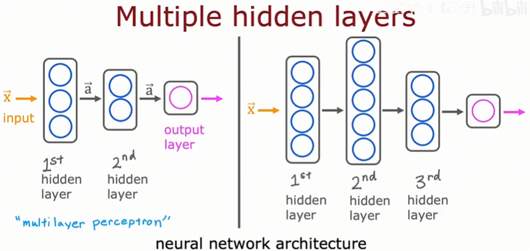

​	可以看到：有几个隐藏层、每层有多少神经元都是不确定的，这叫神经网络架构，在文献中也会看到叫做多层感知器（multilayer perceptron），其实这些东西往往也影响着你的算法性能。

## 示例：图像识别

​	如果你正在构建一个人脸识别应用程序，你可能想要训练一个神经网络。输入是一张人脸图片，输出他的身份。假设像素是1000*1000的，那么在计算机中，实际上有一个1000000个像素值的向量，神经网络接收该向量，并输出该人物的身份。训练过程可能像这样：

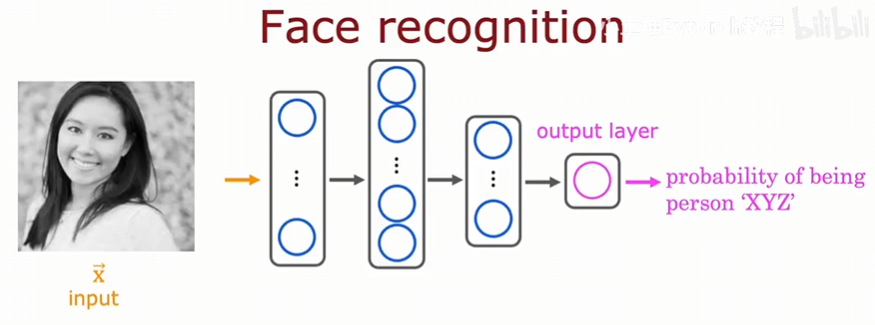

​	当我们想要追踪隐藏层时，可能会发现：在第一个隐藏层中，你可能会发现第一个神经元正在寻找一条小的垂直线或垂直边缘；第二个神经元正在寻找一条定向线或定向边缘；第三个神经元正在寻找那个方向的线，以此类推，该隐藏层在寻找一些线。如果你查看下一个隐藏层，你可能会发现神经元会学习将许多小短线组合在一起，以寻找面部的一部分，例如第一个神经元可能在寻找眼睛的位置，第二个神经元可能在试图检测鼻子的角落，第三个神经元可能在寻找耳朵的位置。当你查看下一个隐藏层时，它可能正在聚合面部的不同部分，然后尝试检测更大、更粗糙的面部形状的存在与否。最后，检测面部与不同面部形状的对应程度创建了一组丰富的特征，然后帮助输出层尝试确定图片中人物的身份，如图：

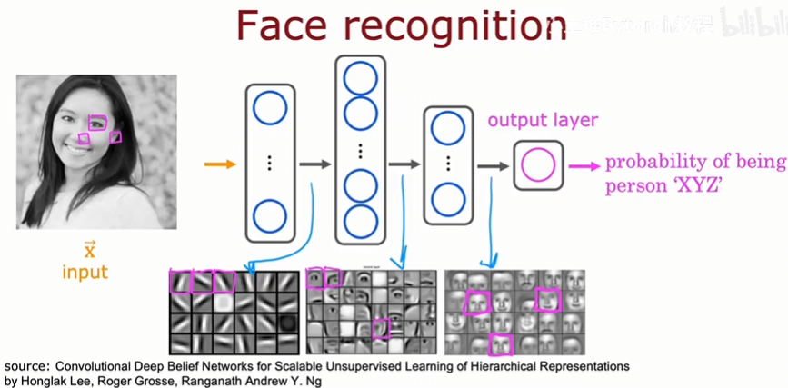

​	神经网络的一个显著特点是它能够自行学习隐藏层的特征，没人告诉她第一个隐藏层找线，第二个找器官，第三个找面部……他能自行从数据中找到这些特征。

​	如果要检测汽车，模型第一层也会检测一些线条，第二层会检测汽车的一部分，第三层会检测完整的汽车形状。因此，只要输入不同的数据，神经网络就会自动学习检测非常不同的特征，以便进行任何事物的检测行为。

## 神经网络层

​	大多数现代神经网络的基本构建块是一层神经元。这部分将告诉你如何构建一层神经元。我们先来看看一层神经元如何工作的，还是上面的例子：

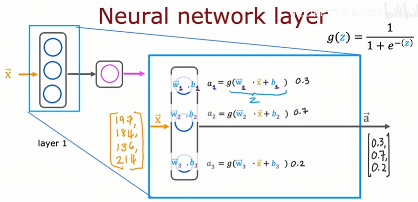

​	展开隐藏层，看看里面如何工作。为不同层编号是有意义的， 比如上面的隐藏层可以编号为第一层，我们这样标识：[1]。它将输出的三个数字传递给第二层。神经网络可能有几十层或几百层。同样标识，第一层的第一个神经元的参数这样标记：$\vec w^{[1]}_{1},b_1^{[1]}$，后面的以此类推，输出的三个数字作为下一层的激活向量，这样表示：$\vec a^{[1]}$，也就是方括号的数字只与神经网络的层数有关。

​	现在再来看看上例中的第二层：

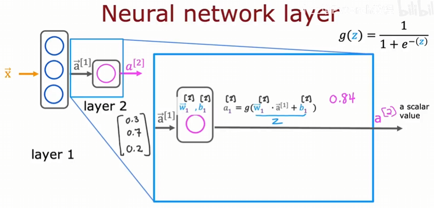

​	一旦神经网络计算出$\vec a^{[2]}$，还有可选的最后一步：你如果想要二元预测，是否会成为畅销品，这时大于等于0.5就输出会，否测输出不会，这里的0.5是我们设置的阈值。

​	所以神经网络就是在每一层，不断地接收一个向量作为输出，然后计算输出一个向量作为下一层的输入，直到得到最终输出层。

## 更复杂的神经网络

​	看这个例子：

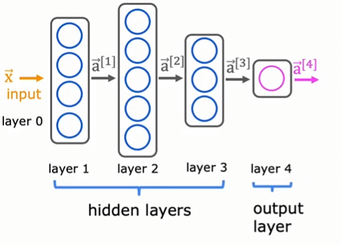

​	这是一个传统四层神经网络，这里需要注意输入层一般称作第0层，不计入总层数，但是输出层计入总层数。让我们看看第三层，即最后一个隐藏层：

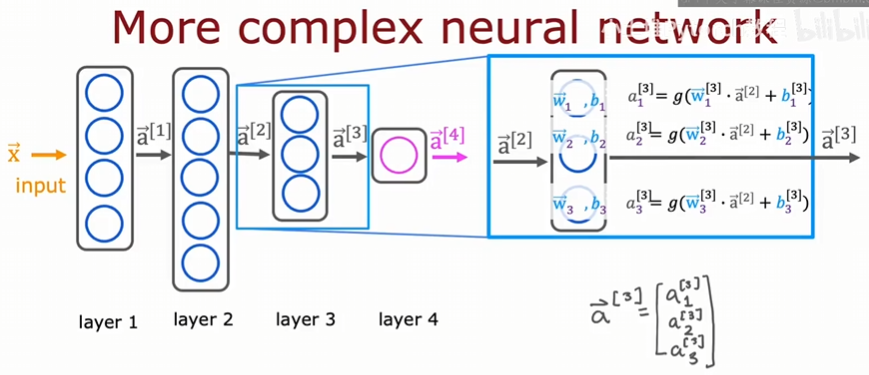

​	注意上图中方括号中数字的标识，$\vec a^{[2]}$作为输入是第二层的输出，但是参数$\vec w_1^{[3]}$是第三层的，所以看到Sigmoid函数（也叫激活函数）g中是$\vec w^{[3]}\cdot\vec a^{[2]}$。更一般的写法：
$$
\vec a_j^{[l]}=g(\vec w_j^{[l]}\cdot\vec a^{[l-1]}+b_j^{[l]}),l是层数，j表示第j个参数
$$
​	这样就得到了层 l 上单元 j 的激活。

​	为了顺应我们这些符号表示，我们将最初的输入向量$\vec x$写作$\vec a^{[0]}$。通过这种符号表示，我们现在知道如何计算神经网络中任何层的激活值，我们把这些放入神经网络的推理算法中，话句话说，如何让神经网络进行预测，接下来看。

## 推理：预测与前向传播

​	这个例子是一个手写数字识别的例子，且为了方便，只识别0和1。我们使用8*8的像素矩阵记录输入，神经网络使用三层，我们看每一层的计算，第一层：

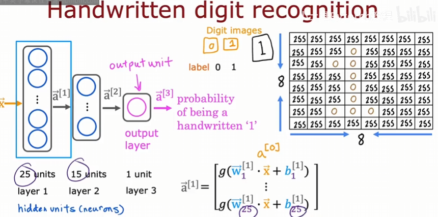

​	第二层：

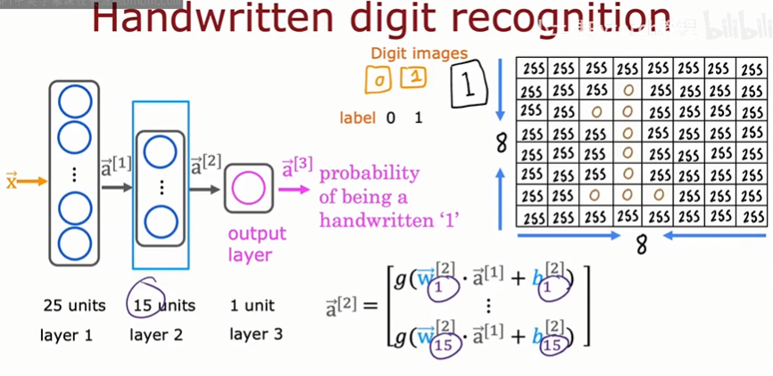

​	第三层：

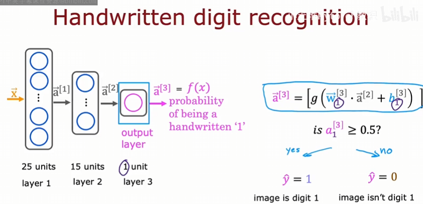

​	我们可以用f(x)来表示神经网络的输出，因为输入$\vec x$，经过一系列的计算，最终得到输出，逐渐向前传播，这种算法称为前向传播，传播的是神经元的激活，在我们看来就是从左到右进行计算。还有一种反向传播算法，后续会介绍。还有一点注意到，从左到右每一层的神经元数量都在减少，这也是很典型的一种神经网络的架构。

### 代码实现（TensorFlow）

​	TensorFlow是实现深度学习算法的主要框架之一，另一个是PyTorch。本课程使用前者，让我们看看如何实现推理。

​	看这个例子：烘焙咖啡豆，输入特征是温度和持续时间。一个符合人们直觉的想法是：温度过低或者时间过短，都会导致豆子不熟，不好喝，或者温度过高、时间久，会导致过熟，不好喝，看图：

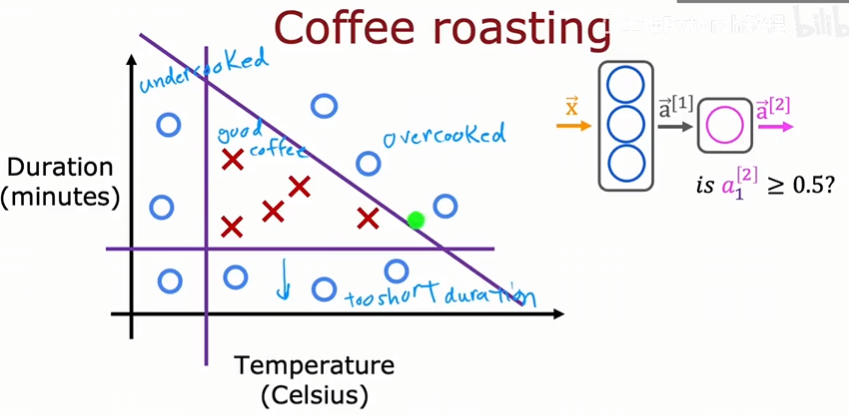

​	只有中间三角形区域内的是好喝的。假如给定输入特征$\vec x$，200度17分钟，输出是否好喝。比如是这样的：

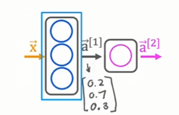

​	代码这样做：

```python
x = np.array([[200.0, 17.0]])
layer_1 = Dense(units=3, activation='sigmoid')
a1 = layer_1(x)
```

​	我们在第一层有三个神经元，所以units参数为3，激活函数选择为sigmoid函数，让a1接收第一层的输出，假设数值如图。再看第二层，它将是一个全连接层：


​	代码这样做：

```python
layer_2 = Dense(units=3, activation='sigmoid')
a2 = layer_1(a1)
```

​	假设a2是0.8，作为最终输出，还要通过阈值判断一下是否会好喝：

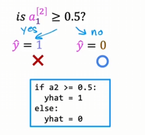

​	这就是如何使用TensorFlow在神经网络中进行推理。这里忽略的：如何加载TensorFlow库，以及如何加载参数w和b。

​	回到手写数字识别的例子，看下图：

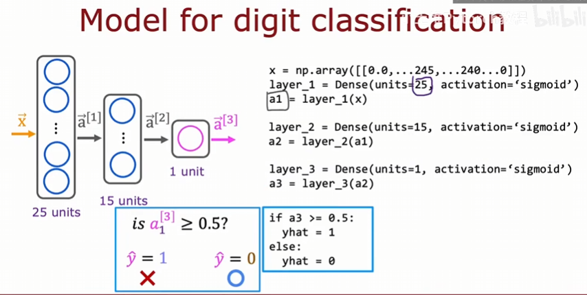

​	以上展示的就是在TensorFlow中进行推理的语法。

### TensorFlow如何处理数据

​	在TensorFlow中如何表示矩阵？

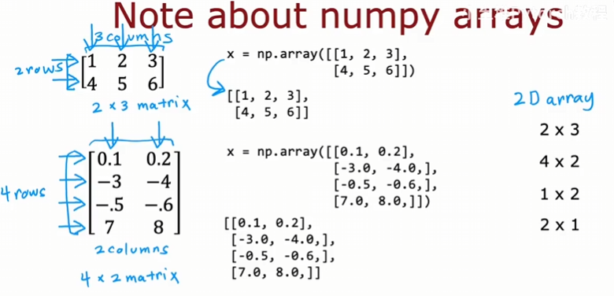

​	最外层有一组方括号，表示矩阵，里面方括号的个数实际上是行数；里面包括每个行向量，每个向量包含的数字个数实际上是列数。

​	区别的是，如果你仅有一层方括号，那么表示这仅是一个数组，而不是向量：

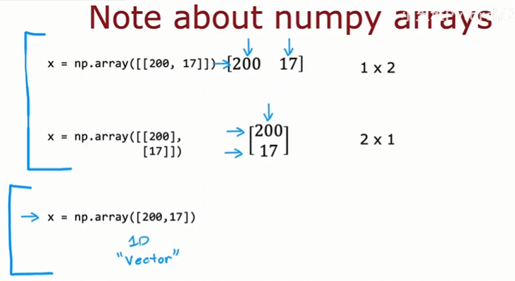

​	在TensorFlow内部，上面比下面在计算上更加高效。

​	看之前的例子：

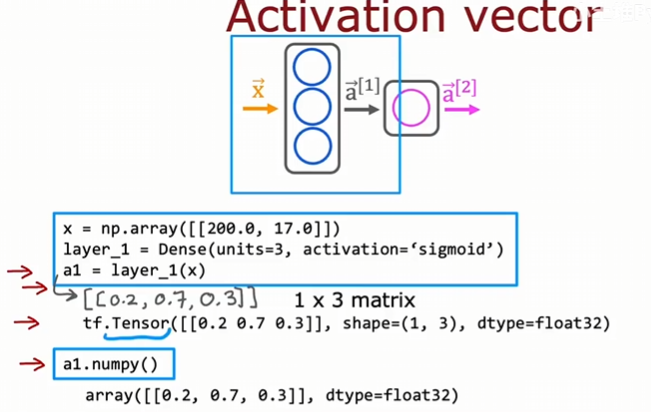

​	

​	在这两个例子中，TensorFlow默认内部数据是张量，numpy是向量。我们在进行张量计算时，依靠GPU加速，专门为深度学习设计的；而numpy只依靠CPU来计算。总而言之，二者因为历史问题，在使用时可能需要进行转换，这需要在我们写代码时注意。