## 构建神经网络

​	如何在TensorFlow中构建数据呢？在前面的文档中，可以看到数据处理的方式，是一种很明显的前向传播：

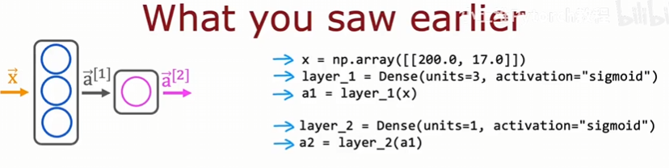

​	TensorFlow还有另一种实现前向传播和学习的方法：

```python
layer_1 = Dense(units=3, activation="sigmoid")
layer_2 = Dense(units=1, activation="sigmoid")
model = Sequential([layer_1, layer_2])
```

​	该顺序函数能为我们做很多事情，看下面的例子，还是关于咖啡：

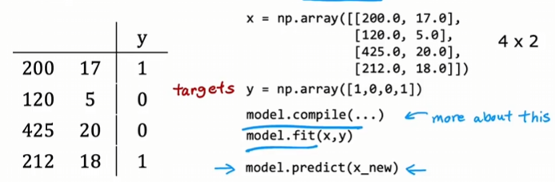

​	想训练该模型，需要调用compile函数传入一些参数，具体后面讲；再调用fit函数，TensorFlow会按顺序串联第一层和第二层创建的神经网络，并在数据x和y上进行训练，这里的细节之后讲。最后是推理或者说前向传播，调用predict函数实现，传入一组新样本x_new，不需要自己逐层前向传播。

​	我们还可以对上面的代码进行简化，layer_1和layer_2不显示创建：

```python
model = Sequential([
    Dense(units=3, activation="sigmoid"),
    Dense(units=1, activation="sigmoid")])
```

​	再看数字分类的例子，一样的编码风格：

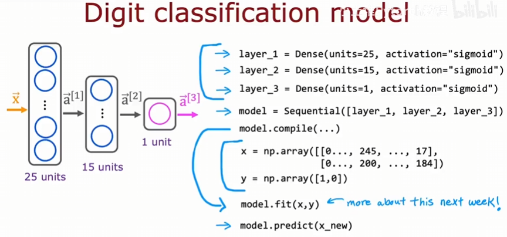

​	还是可以将三层的创建直接拿到Sequential函数中。

​	以上就是在TensorFlow中创建神经网络的方法，很显然只有几行代码，但是我们学习应该了解原理，不应该只停留在使用库的层次。我们接下来剖析几行代码背后的原理，虽然前向传播用的较少。

## 单层前向传播

​	我们来看看从$\vec x$到$\vec a^{[1]}$是如何计算的：

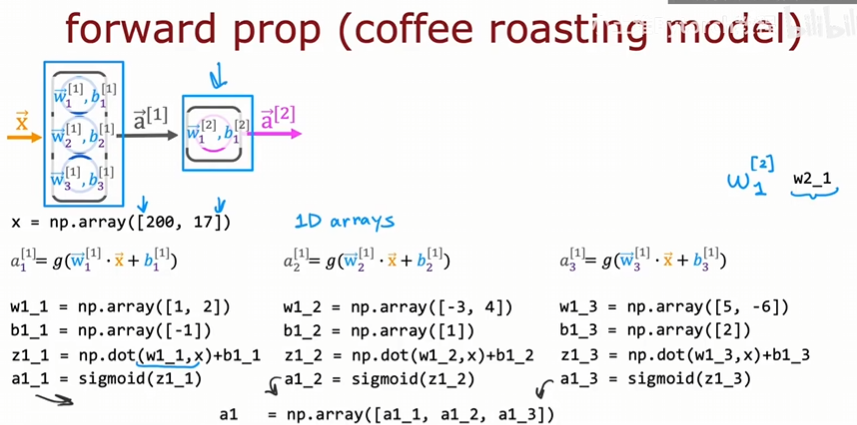

​	右侧的w的变量命名规则，我们自己规定的。在计算出三个数字后，再组合成新的一维数组，就是$\vec a^{[1]}$。接着计算第二层：

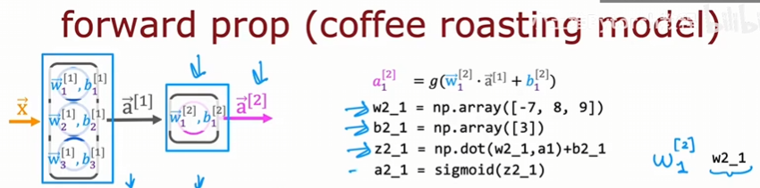

​	上面的硬编码看起来重复且繁杂，我们来看看如何简化它们。

## 前向传播的通用实现

​	我们编写一个函数来实现神经网络中的一个全连接层，我们定义的函数就叫dense，该函数以输入前一层的激活值以及给定层中神经元的参数w和b作为输入。我们还是使用上面的例子，第一隐藏层有三个神经元，我们来初始化一些参数，包含w,b和$\vec x$：

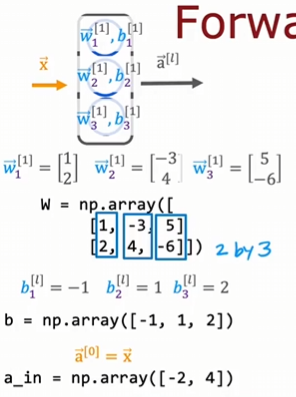

​	我们看到每一列对应一对参数。dense函数实现如下：

```python
def dense(a_in, W, b)
	units = W.shape[1] # 获取该隐藏层的单元数
    a_out = np.zeros(units) # 该层输出数字的个数就是该层的单元数，这里初始化为0:[0, 0, 0]
    for j in range(units): # 枚举0, 1, 2
        w = W[:, j] # 提取W矩阵的第j列，就是第j个神经元的w参数
        z = np.dot(w, a_in) + b[j]
        a_out[j] = g(z) # 这里的g函数，也是激活函数，需要在外面自行定义
    return a_out
```

​	dense函数的作用就是给定前一层的输出作为当前层的输入，计算输出作为下一层的输入，按顺序连接几个隐藏层，就实现了神经网络中的前向传播：

```python
def sequential(x):
    a1 = dense(x, W1, b1)
    a2 = dense(a1, W2, b2)
    a3 = dense(a2, W3, b3)
    a4 = dense(a3, W4, b4)
    f_x = a4
    return f_x
```

​	注意一小点：线性代数中约定，矩阵用大写字母表示，向量和标量用小写字母表示。

## 神经网络的高效实现方式

​	深度学习研究人员在过去十年中能够扩展神经网络并构建非常大的神经网络的原因之一是神经网络可以被向量化。它们可以使用矩阵乘法非常高效地实现。事实证明，包括GPU在内的并行计算硬件，以及一些CPU功能，非常擅长进行非常大的矩阵乘法。

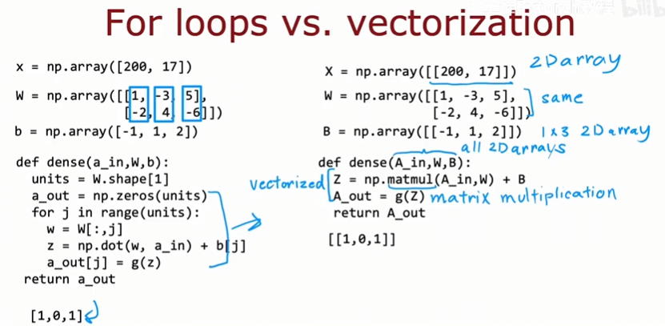

​	右边代码都是二维矩阵的形式，事实证明，右边的实现要比左边的更加高效。其中matmul是矩阵乘法的函数。

### 矩阵乘法

​	这个小节简要介绍矩阵乘法，了解的直接跳过就可以，也可以通过这个复习一下。

​	点积、转置、矩阵相乘：


​	向量与矩阵相乘：

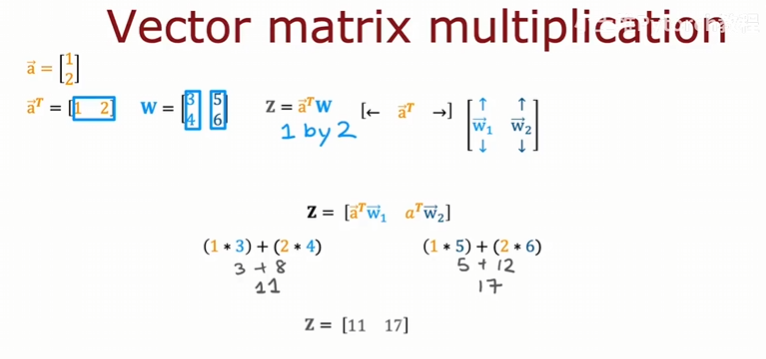

​	矩阵乘以矩阵：

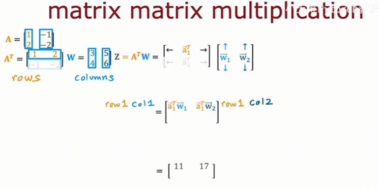

​	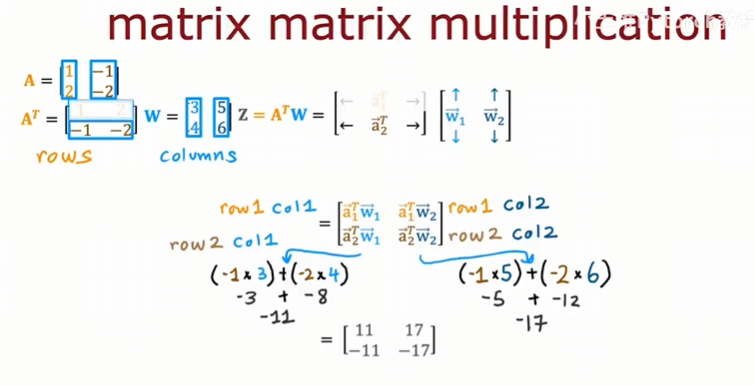

### 矩阵乘法的一般形式

​	计算某个位置的过程：

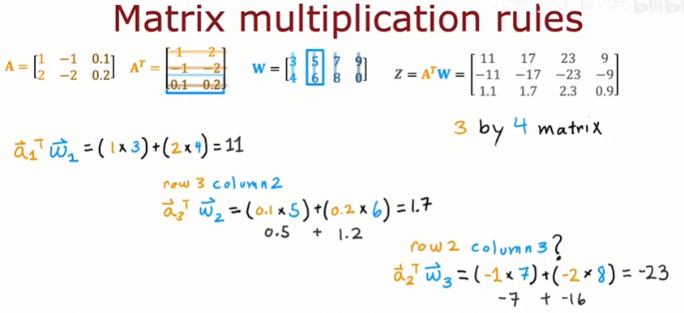	

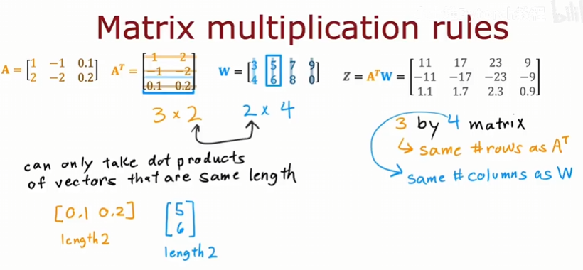

### 矩阵乘法的代码

​	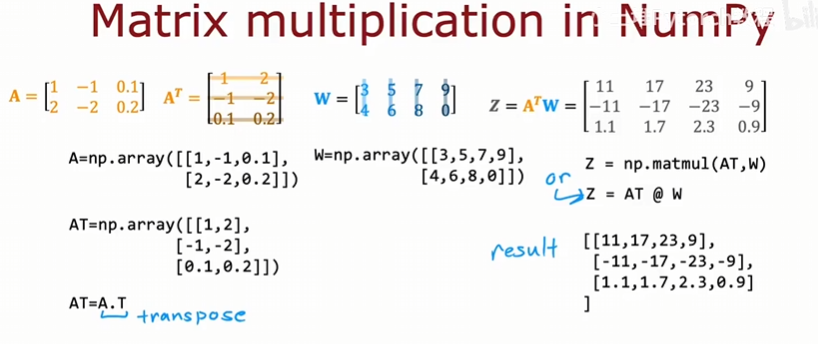

​	看看如何实现前向传播：

​	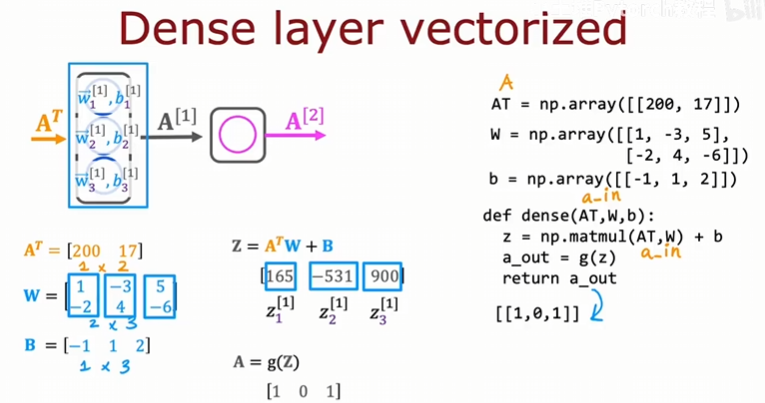