## TensorFlow 实现

​	我们还是看手写数字识别的例子，我们有输入图像x和输出标签y，如何训练参数呢？

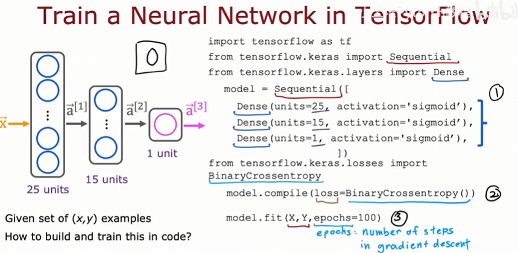

​	上述代码分三步，一是指定模型，使之成为完整的架构，它告诉TensorFlow如何进行推理；二是使用特定的损失函数编译模型，损失函数接下来会谈到；三是训练模型，前面的X和Y是需要拟合的数据，后面的参数100是迭代次数。

## 训练细节

​	我们先来回顾一下训练逻辑回归模型，以及其在TensorFlow中的实现：

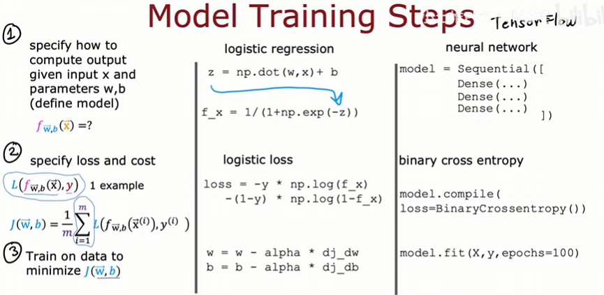

​	具体来看训练细节：

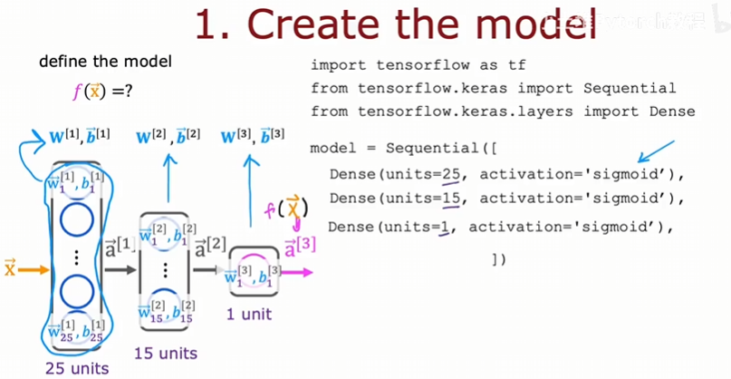

​	给定初始参数值，并指定激活函数为sigmoid函数。

​	接下来指定损失函数，损失函数一旦确定下来，成本函数也就确定下来。在手写数字识别的例子中，输出要么是0要么是1，常见的损失函数是这个：

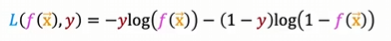

​	它实际上与逻辑回归中使用的损失函数相同。在TensorFlow中，它被称为二元交叉熵损失函数。它的由来有关于统计学，这个函数叫做交叉熵损失函数，这里加入二元，只是说我们的输出只有两类。再例如在线性回归中，损失函数定义为平方误差损失函数，像这样：

```python
model.compile(loss=MeanSquaredError)
```

​	这些名字不用记，用到时直接查就可以了。

​	最后就是要求TensorFlow最小化成本函数。在求导的过程中，TensorFlow在fit中使用反向传播来做到这一点。

## sigmoid激活函数的替代方案

​	我们之前的例子都是使用sigmoid函数作为激活函数来训练模型，但是如何换成其他激活函数可能会使得模型更加强大。

​	在前面预测T恤是否会成为畅销品的例子中，输出要么是0要么是1，但是事实可能不都是这样，例如潜在客户可能对你的商品了解程度不一样，可能完全不了解、有点了解、了解很多、或者病毒式传染。这时再用0和1去判断就并不合适。

​	一个常见的激活函数是ReLU，它的函数表达式为：$g(z)=max(0,z)$，图像长这样：

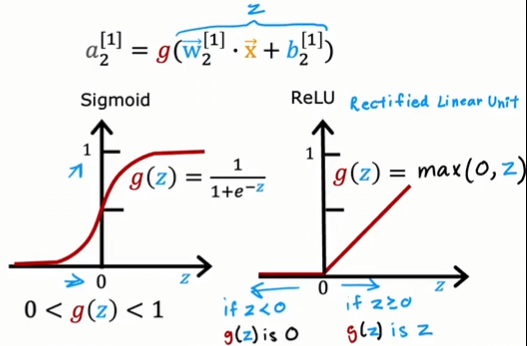

​	还有一个常用的激活函数，线性激活函数：

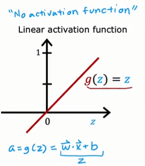

​	注意上面的英文，没有激活函数，因为使用线性激活函数$g(z)=z$，效果上来说，把z传入后还是z，和没有使用激活函数一样。

​	以上三种激活函数可能是最常用的激活函数了，接下来还会提到一种激活函数softmax。如何选择这些激活函数呢？

## 选择激活函数

​	如何在神经网络中为不同的神经元选择激活函数？

​	在为输出层选择激活函数时，通常会根据真实标签y有一个相当自然的选择。如果y是0或1，那么sigmoid函数显然很合适；如果y是明天股票相对于今天的变化，他可能是正数或负数，那么可以使用线性激活函数；如果你正在预测房价，y永远不会是负数时，最自然的选择是ReLU函数。

​	在为隐藏层选择激活函数时，最常见的是ReLU函数。相比于传统的sigmoid函数，它计算会更加快速，因为sigmoid函数还会计算指数和求逆。更重要的原因，ReLU只会在z < 0的左侧平坦，而sigmoid函数会在两侧都平坦。当你在梯度下降时，如果很多地方都平坦，会导致成本函数会有很多平坦的地方，那么梯度下降会非常缓慢。

​	在少数情况下，一些其他的激活函数会工作的更好。感兴趣可以自行网上查找。

## 为什么需要激活函数

​	看这个简单的例子：

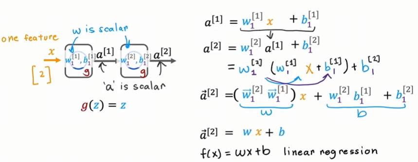

​	一顿操作后发现，最终输出也仅是一个线性函数，那么为什么我们最初不选择线性回归模型呢？就是因为线性回归模型不能训练出更加复杂的模型，而我们恰好需要它。

## 多类别

​	这个问题是指，y的输出不局限于0或1，可能还有3、4、10等等。这类问题本质是分类，y只能取一小部分离散值，而不是任意数字。它的决策边界可能像这样：

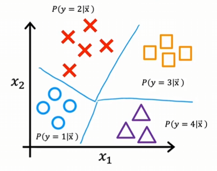

​	我们需要预测y = 1的概率、y = 2的概率、y = 3的概率以及y = 4的概率。接下来会有一种学习算法，可以将x1和x2的空间划分。

## softmax

​	该算法是逻辑回归的一个推广或者说是泛化，它可以进行多类分类。将其拟合到神经网络中，那么神经网络也能进行多类分类问题。

​	来看逻辑回归与softmax回归的对比：

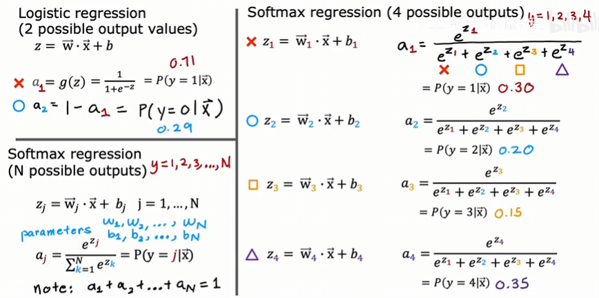

​	左侧上方是逻辑回归，左侧下方是softmax回归，右侧是softmax在n=4时的计算过程，其中各个w和b都是参数。

​	那么softmax回归的代价函数是什么样的呢？还是对比逻辑回归来看：

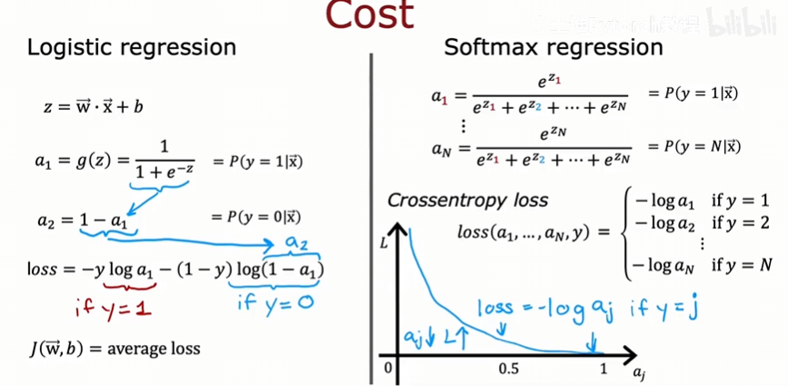

​	我们看右下方负对数的函数图像，当aj接近于1，函数损失接近于0，这就驱动了各个aj去趋于1，毕竟aj表示的是，y=j的概率，肯定越大越好。

## 带有softmax输出的神经网络

​	我们把softmax回归模型放入神经网络的输出层。

​	还是手写数字识别的例子，这次识别的是0-9共十个数字：


​	通过计算输出层的各个z值，计算出十个数字的概率。需要注意的是，在其他的之前提到的激活函数中，aj仅是zj的函数，与其他z值无关；但是在softmax中，每个a值都与所有z值有关。

​	如何在TensorFlow中实现呢？

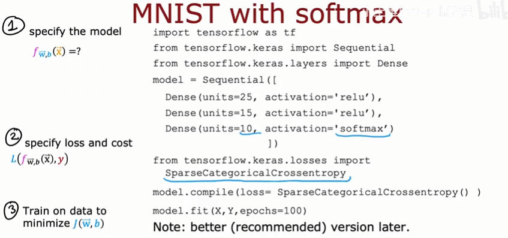

​	经典三部曲，但是实际工作不要用这个，我们有一中更好、计算更准确的方案。

## softmax的改进实现

​	对于计算机我们两种计算方式：

​		1、2/10000

​		2、1+1/10000-(1-1/10000)

​	两种方式在数学上计算是一样的，但是计算中因为只能用固定的位数存储，所以会有舍入误差：

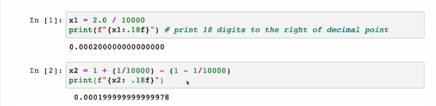

​	对于逻辑回归，他的计算误差会很小：

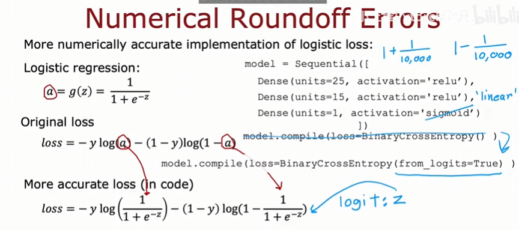

​	但是我们可以通过不设置a这个中间值，而是改变计算方式，直接将sigmoid函数传入，这样少了a这个中间值的些许误差，计算结果会更加准确一些。但是对于softmax函数，这个提升就很明显。同样的来看softmax：

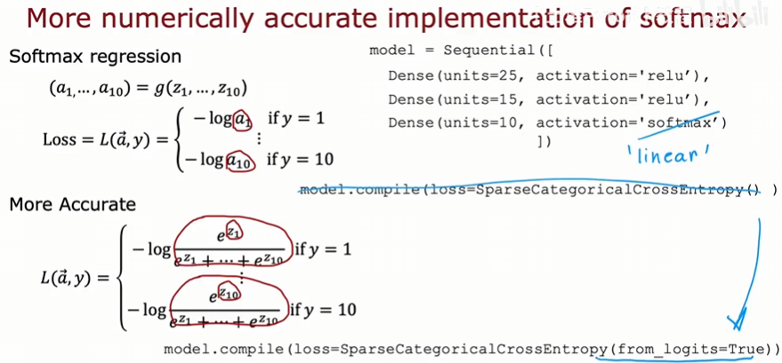

​	这样的实现与之前的实现做的事情是同一个，但是计算会更加准确。缺点就是代码的可读性要差一些。

​	注意一些细节：

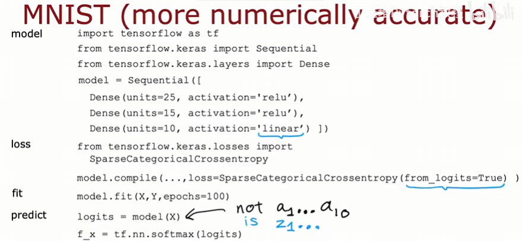

​	输出层的激活函数不再是softmax，而是linear，还有损失函数这里的写法。还要注意，模型这里输出不再是a，而是z。在逻辑回归下也是同理：

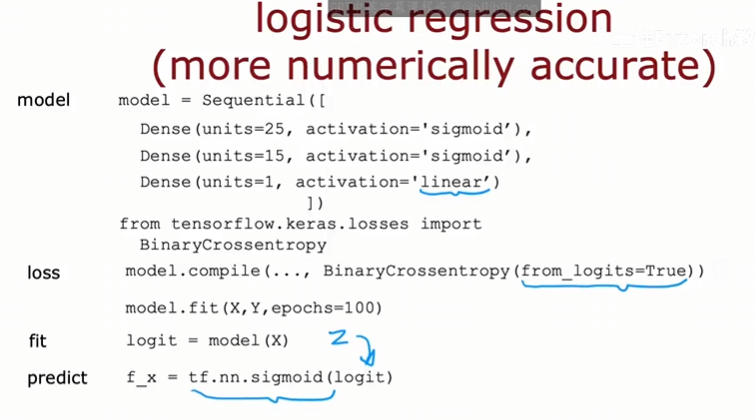

## 多输出分类

​	这个跟多类别不一样，我们上面提到的多类别是指输出可能会有多个分类，但是计算概率后输出只有一个，就拿手写数字识别来说，输出只可能是0-9之间的一个，我们不能说这个数字既是0又是1.但是多输出不一样，他可以对同一事物的输出有多个标签。我们看驾驶辅助系统的例子：

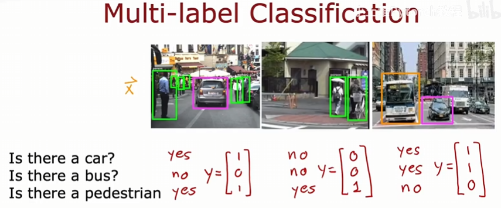

​	对于同一张图片，输出的信息会有很多。这就是多输出分类。

​	如何构建该问题呢？一个很自然的想法是分别构建三个独立的机器学习问题。这实际上并不合理。另外的方法是，通过构建一个神经网络，输出类似于上图的向量，来判断是否存在某个事物。看起来与多类别分类一样，他们确实会混淆，需要注意区分。