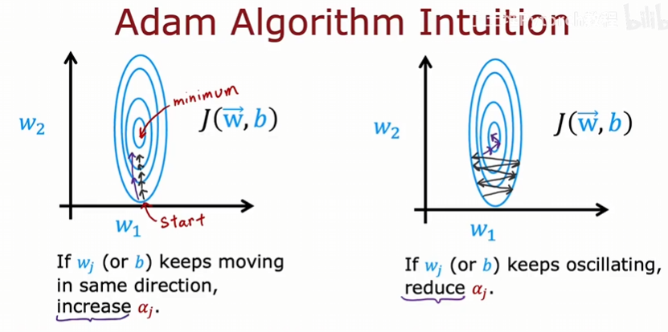
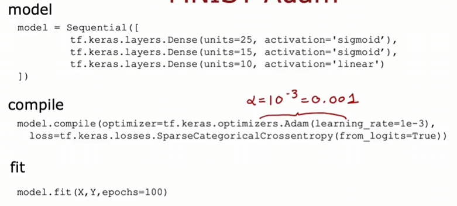

## 高级优化算法

​	梯度下降一直都是一种广泛用于机器学习的优化算法，是许多算法如线性回归和逻辑回归以及早期神经网络实现的基础。但是现在有一些其他优化算法用于最小化代价函数，它们比梯度下降更好。本文介绍一种可以帮助我们比梯度下降更快地训练神经网络的算法。

​	回想一下梯度下降算法，它在更新参数时有一个学习率在控制步长。我们如果设置的学习率很小，那么函数在靠近最小值时，会是朝着最小值的方向一步又一步的缓慢靠近。我们可以优化这个过程，即发现我们只是在相似的方向上重复地采取微小的步长，我们应该让学习率变大。反之如果学习率过大，我们在寻找最小值的过程中可能会发生振荡现象，导致我们离最小值越来越远。这时我们就可以调小学习率。Adam算法就是这样做的，根据梯度下降的进展情况，有时希望有一个更大的学习率，有时希望有一个更小的学习率。

​	Adam代表自适应矩估计。该算法不适用全局的学习率，而是为每个参数设置一个学习率，这方便我们调整相应学习率。

​	关于Adam算法的细节，较为复杂，本文档不再介绍。在代码中可以这样实现：

​	它通常比梯度下降快得多。