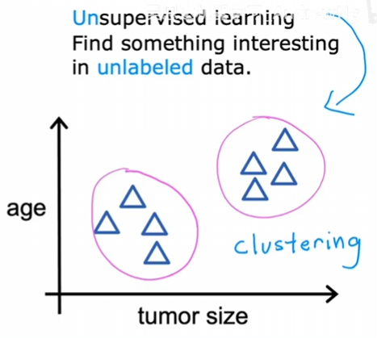

# 什么是机器学习？

## 1、什么是机器学习？

​	Samuel定义：赋予计算机在没有明确编程的情况下学习能力的研究领域。

​	机器学习分为两种类型：监督学习（Supervised learning）和无监督学习（Unsupervised learning）

## 2、监督学习

​	监督学习是一种从input到output的过程。我们对多个输入，标记确定性的output，使得机器可以在接收一个全新的input时，给出相当准确的预测。

​	***example：***

​	在这个例子中，算法会拟合一条合适的线条来预测函数值。机器需要在无限多的数值中预测一个数字，这种算法称为**回归**。

​	还有另外一种监督学习算法：**分类**。例如：乳腺癌肿瘤检测，机器可以预测肿瘤的类型，良性、恶性、还是肿块等。区别于回归，分类算法是从很少的数值中预测，因为分类的类别就是有限个数字。

​	上述两个例子都是一个input，其实也可以多个input。看下面的例子：

​	***example：***

​	

​	该例中，input不仅是肿瘤的大小，还有患者的年龄。这种情况需要算法找到一条边界线，而图中的例子大概率就是良性。

## 3、无监督学习

​	相比较于分类算法，机器并不对结果打标签，也就是没有什么确定的输入，我们要求算法自己找出数据中可能有趣的部分，算法会将数据划分为簇或组，每个簇中的数据拥有相同的模式或者结构。例如谷歌新闻，每天数十万条新闻中，筛选出关键词相同的文章，工作人员不可能每天都指定一些关键词让计算机去寻找，而是机器自己找到包含相同关键词的文章放在一起。这就是无监督学习，这种算法称为**聚类**。

​	***example1：***

​	***example2：***

​	在该例子中，不同人在相同的基因表达上差不多一致的，会被分为同一组。我们并不知道每组的具体类型是什么，算法制史将基因表达大致相同的人放在一组。

​	***example3：***

​	在这个例子中，假设公司具有一个客户数据库，聚类算法自动将同一类客户放在同一组中，以便于公司针对不同客户给出不同的服务。我们不知道每种客户具体的类型，靠算法将客户筛在不同的组。

​	除了聚类，还有两种无监督学习算法：异常检测、降维。具体会在后面介绍。

## 练习题目

​	**第一题：如果下期程序只与自己下少数棋局，那么机器学习的表现会怎样？**

​		答案：会更坏。训练次数越多，效果越好。

​	**第二题：哪些是监督学习应用的例子？哪些是无监督学习应用的例子？**

​		答案：监督学习：1,4；无监督学习：2,3.