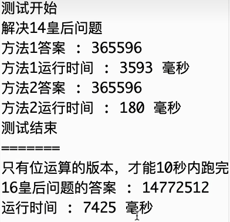

# 位运算的骚操作

***前置知识：二进制与位运算、Brain Kernighhan算法（提取最右侧的1）***

## 开篇

​	位运算速度很快，仅次于赋值操作。

​	位运算有着许多技巧，包括于一些算法、工具的使用，例如状压dp、N皇后问题、集合的运算等。

​	下面来感受先贤的功力。

## 一些位运算的骚操作

### 判断一个数字是否为2的幂

​	题目链接：https://leetcode.cn/problems/power-of-two/

​	很显然，如果一个数字是2的幂，那么这个数字的二进制状态中只有一个1，其余全为0。这样我们就可以提取该数字最右侧的1，然后与自己比较即可。力扣AC代码：

```c++
bool isPowerOfTwo(int n) {
    return n > 0 && n == (n & -n);
}
```

### 判断一个数字是否为3的幂

​	题目链接：https://leetcode.cn/problems/power-of-three/

​	此题与位运算无关，只是与上面的题目形成对比。

​	一个数字如果是3的幂，那么一定只包含3这个因子，在int范围内最大的3的幂是3^19 = 1162261467，所以只需看该数字是否为1162261467的因子即可。力扣AC代码：

```c++
bool isPowerOfThree(int n) {
    return n > 0 && 1162261467 % n == 0;
}
```

### 大于等于n的最小的2的幂

​	要么是n的最高位的1（此时n正好为2的幂），要么是n的最高位的1的再高一位是1（即大于n的最小的2的幂）。我们的方式兼顾两种情况：先将n--，然后将最高位的1右边所有位刷成1，返回刷完的状态加1即可。代码如下：

```c++
int near2power(int n) {
    if(n <= 0) return 1;
    
    n--;
    // 通过下面五次，一定能将比n的最高位的1低的所有位都刷成1
    n |= n >>> 1;
    n |= n >>> 2;
    n |= n >>> 4;
    n |= n >>> 8;
    n |= n >>> 16;
    return n + 1;
}
```

### 区间 [left, right] 内所有数字 & 的结果

​	题目链接：https://leetcode.cn/problems/bitwise-and-of-numbers-range/

​	此题乍一看是一个一次遍历的简单题，但是一看数据范围，[0, 2^31-1]，顿时傻眼。所以只能利用位运算的特点来做。与运算的特点是：有0就为0。那么区间内的数字能不能通过这个特点快速筛除呢？可以的，我们每次找到right最右侧的1，如果right != left，那就说明right-1必定在区间内，也就是right最右侧的1一定留不下来，例如right后几位是100，right-1就是011，此时最低位的1一定留不下来，因为right-1在该位置是0，该状态表示的数字一定在区间内。我们让right去掉最低位的1，再去看right与left的大小关系，如果right还大于left，那么继续去掉最右侧的1，否则算法停止，剩下的right就是答案。力扣AC代码如下：

```c++
int rangeBitwiseAnd(int left, int right) {
    while(left < right) {
        right -= (right & -right);
    }
    return right;
}
```

​	时间复杂度会很好，为什么？因为最多right是32位1，循环最多执行32次。

### 反转一个二进制状态

​	题目链接：https://leetcode.cn/problems/reverse-bits/

​	注意是反转，也就是逆序，而不是取反，1变0，0变1。

​	其实这题很简单，从低到高遍历给出数字的每一位，对应由高到低设置答案的每一位即可，我们发现这样做也就是一个for循环而已，执行32次。力扣AC代码如下：

```c++
int reverseBits(int n) {
    int ans = 0;
    for(int i = 0; i < 32; i++) {
        ans >>= (31 - i);
        ans |= (n >> i) & 1;
        ans <<= (31 - i);
    }
    return ans;
}
```

​	但是还没达到最优解，下面展示先贤功力：

```c++
unsigned int reverseBits32(unsigned int n) {
    n = ((n & 0xaaaaaaaa) >> 1) | ((n & 0x55555555) << 1);
    n = ((n & 0xcccccccc) >> 2) | ((n & 0x33333333) << 2);
    n = ((n & 0xf0f0f0f0) >> 4) | ((n & 0x0f0f0f0f) << 4);
    n = ((n & 0xff00ff00) >> 8) | ((n & 0x00ff00ff) << 8);
    n = (n >> 16) | (n << 16);
    return n;
}
int reverseBits(int n) {
    return reverseBits32(n);
}
```

​	c++的写法要转换为无符号整数再移动，不然会出错。

​	看着唬人，其实手动模拟一下就明白了原理：就是先按照1个位一组，相邻组交换，再按照两个位一组，相邻组交换，四个、八个、16个，就完成了32位数字二进制状态的逆序。至于n&的那些数字，就是筛选组的过程，而左移右移之后再或起来，就是完成交换的功能。C++要向上面代码那样写，转换为32位无符号整数，Java可以直接使用无符号右移运算符>>>。

### 二进制状态中1的个数

​	题目链接：https://leetcode.cn/problems/hamming-distance/

​	这个题的思路和上面的思路很像，都是分组统计，长度为1的组，信息天然就是1的个数，那么长度为2的呢？我们能不能用二进制来表示两位中1的个数？可以的，我们还是按上述方法提取，然后将前面的状态右移一位再加后面的状态，啥意思？相邻的两个位的信息都被提取出来然后作了加法，这样就表示长度为2的组中，每一组的1的个数，例如：原始相邻两位为11，提取会先提取出前面的1，在提取出后面的1，将前面的1右移一位，这样加起来就是统计1的个数了，该组内容变为10，即两个1,。对于32位，组数4、8、16，就求得答案了。力扣AC代码如下：

```c++
unsigned int cntOnes(unsigned int n) {
    n = (n & 0x55555555) + ((n >> 1) & 0x55555555);
    n = (n & 0x33333333) + ((n >> 2) & 0x33333333);
    n = (n & 0x0f0f0f0f) + ((n >> 4) & 0x0f0f0f0f);
    n = (n & 0x00ff00ff) + ((n >> 8) & 0x00ff00ff);
    n = (n & 0x0000ffff) + ((n >> 16) & 0x0000ffff);
    return n;
}
int hammingDistance(int x, int y) {
    return cntOnes(x ^ y);
}
```

## 位运算实现整数加减乘除

​	我们将使用位运算来实现加减乘除，在代码中你将看不到任何算术运算符。

### 位运算实现加法

​	加法可以是：无进位相加结果加上进位信息。无进位相加就是异或运算，进位信息产生于两个1相加，那就是与运算，注意一点：进位信息是加到上一位的，也就是1+1会产生1的进位，这个1是加到比这两个1的位置高一位处的，所以进位信息需要左移一位。进位信息又产生进位怎么办？那就一直加，直到进位信息为0为止。代码如下：

```c++
int add(int a, int b) {
	int ans = a; // ans为无进位相加结果，b充当进位信息
	while(b != 0) {
		ans = a ^ b;
		b = (a & b) << 1;
		a = ans;
	}
	return ans;
}
```

### 位运算实现减法

​	会实现加法，这里就很容易了，a+b等同于a+(-b)，而 -b = ~b+1。代码如下：

```c++
int neg(int n) {
	return add(~n, 1); // 取一个数的相反数
}
```

```c++
int subtraction(int a, int b) { 
    return add(a, neg(b)); // a + (-b) 即 a - b
}
```

### 位运算实现乘法

​	乘法就是多次加法写在一起，仿照小学时学习的竖式计算乘法，二进制的乘法也这样计算，只不过每步计算的结果在加之前都需要左移一位，就是错位再加的效果，具体看代码实现：

```c++
int multiply(int a, int b) {
	unsigned int ub = b;
	int ans = 0;
	while(ub != 0) {
		if((ub & 1)) ans = add(ans, a);	
		a <<= 1;
		ub >>= 1;
	}
	return ans;
}
```

### 位运算实现除法

​	这个就要比前面三个都要复杂一些。

​	我们先不考虑符号位，假设除数和被除数都非负。那么X / Y实际上等价于：X中包含Y*2^i，i从30到0（第31位为符号位），如果包含，就将答案的第 i 位置1，同时X减去该值，继续判断，直到i为0结束。例如：280 / 25，等价于：280 = 25 * 2 ^ 3 + 25 * 2 ^ 1 + 25 * 2 ^ 0 + 5，所以280 / 25的结果就是：0...01011 = 11，这里需要注意的是：尾巴上多个5，属于280 % 25的结果，在计算机整数除法中，他就是不考虑的。我们循环遍历去判断X与Y * 2 ^ i次幂的大小关系，但是Y左移容易溢出，我们判断X右移 i 位后与Y的大小关系。

​	实现上需要注意：先不考虑a与b的符号，而是按照正数先除，最后判断符号问题。另外a和b不能是整数最小值，因为该值不能转为正数。代码如下：

```c++
int division1(int a, int b) {
	int x = a < 0 ? neg(a) : a; // 这两行保证作除法的数字非负，符号最后讨论
	int y = b < 0 ? neg(b) : b;
	int ans = 0;
	for(int i = 30; i >= 0; i = subtraction(i, 1)) {
		if((x >> i) >= y) { // 如果x包含y * 2^i
			ans |= (1 << i);
			x = subtraction(x, y << i);
		}
	}
	return a < 0 ^ b < 0 ? neg(ans) : ans; // a与b异号返回负数，同号返回正数
}
```

​	那么a和b如果是整数最小值呢？讨论一下即可！同时这个问题是有测试链接的。

​	题目链接：https://leetcode.cn/problems/divide-two-integers/

​	看下面可以计算整数最小值的代码：

```c++
int division2(int a, int b) {
	if(a == INT_MIN && b == INT_MIN) return 1; // 如果a与b都是整数最小值，返回1
	if(a != INT_MIN && b != INT_MIN) return division1(a, b); // 如果a与b都不是整数最小值，调用我们刚才的方法即可
    // 程序走到这，说明a与b有且只有一个是整数最小值
	if(b == INT_MIN) return 0; // 如果b是整数最小值，谁除它都是0
	if(b == neg(1)) return INT_MAX; // 如果b是-1，返回整数最大值，符合常识
    
    // 程序走到这，说明b不是整数最小值，b不是-1，那么a只能是整数最小值
    // 我们让a变得不那么小，让其向0的方向靠拢b的绝对值个距离，因为b是正负不清楚
    // 例如：a = -15为整数最小值，b = 5，为了让a不那么小，a=a+b=-10,a/b=-2,-2-1=-3，答案正确;
    // a = -15为整数最小值，b = -5，为了让a不那么小，a=a-b=-10,a/b=2,-2+1=3，答案正确.
	a = add(a, b > 0 ? b : neg(b)); // 如果b>0，那么令a=a+b,此时计算结果需要-1，下面将offset设置为-1；反之设置+1
	int ans = division1(a, b); // 这样a就比整数最小值大了，就可以正常结算了。
	int offset = b > 0 ? neg(1) : 1;
	return add(ans, offset);
}
```

​	力扣上的那道题目不让用乘除符号以及取模符号，我们这个实现连加减号都没有使用！为了通过这道题目，可以将我们本节使用的所有代码都放上去，就能通过了，当然加号和减号直接用也可以，用我们的位运算实现也可以，完整AC代码：

```c++
int neg(int n) {
    return add(~n, 1); // 取一个数的相反数
}

int add(int a, int b) {
    int ans = a;
    while(b != 0) {
        ans = a ^ b;
        b = (a & b) << 1;
        a = ans;
    }
    return ans;
}

int subtraction(int a, int b) {
    return add(a, neg(b)); // a + (-b) 即 a - b
}

int division(int a, int b) {
    int x = a < 0 ? neg(a) : a;
    int y = b < 0 ? neg(b) : b;
    int ans = 0;
    for(int i = 30; i >= 0; i = subtraction(i, 1)) {
        if((x >> i) >= y) {
            ans |= (1 << i);
            x = subtraction(x, y << i);
        }
    }
    return a < 0 ^ b < 0 ? neg(ans) : ans;
}
// 以下是力扣的题目的函数
int divide(int dividend, int divisor) {
    if(dividend == INT_MIN && divisor == INT_MIN) return 1;
    if(dividend != INT_MIN && divisor != INT_MIN) return division(dividend, divisor);
    if(divisor == INT_MIN) return 0;
        
    if(divisor == neg(1)) return INT_MAX;
    dividend = add(dividend, divisor > 0 ? divisor : neg(divisor));
    int ans = division(dividend, divisor);
    int offset = divisor > 0 ? neg(1) : 1;
    return add(ans, offset);
}
```

​	回顾上面的代码，我们真的没有使用加减乘除模的运算符，就实现了整数加减乘除的功能，看看就好，理解计算机底层的运算逻辑。

## 位运算解决N皇后问题

​	题目链接：https://leetcode.cn/problems/n-queens-ii/

​	N皇后问题的基本解法是深搜，也就是递归实现的，按行枚举第一行可以考虑的位置有n个，第二行n-1个......每个位置需要考虑与前面放好的皇后会不会有冲突。总体时间复杂度为O(n * n！)。

### 带路径的数组实现

​	我们先介绍一下深搜用path数组解决该问题，path[ i ]记录：第 i 行的皇后放置在哪列，递归至后续的行时，可以利用path数组判断当前行当前列是否可以放皇后。对角线信息如何判断呢？对角线上的判断只需要看：abs( 当前皇后放置的行 - 之前皇后放置的行 ) == abs( 当前皇后放置的列 - 之前皇后放置的列 ) 这个条件是否成立即可。力扣AC代码如下（该代码也能打败100%）：

```c++
// 检查i行j列如果放置皇后了，会不会与前面已经放好的有冲突。没有冲突返回true，否则返回false。
bool check(vector<int>& path, int i, int j) { 
    for(int k = 0; k < i; k++) {
        if(j == path[k] || abs(i - k) == abs(j - path[k])) return false;
    }
    return true;
}

// 带路径的数组实现
// 第i行到第n-1行有几种可行的方案，可行方案记录在path数组中
int f1(int i, vector<int>& path, int n) {
    if(i == n) return 1;

    int ans = 0;
    for(int j = 0; j < n; j++) {
        if(check(path, i, j)) {
            path[i] = j;
            ans += f1(i + 1, path, n);
        }
    }
    return ans;
}

int totalNQueens(int n) {
    vector<int> path(n);
    return f1(0, path, n);
}
```

​	以上就是经典的实现，但是常数时间要大。下面介绍位运算实现版本，该版本巧妙且常数时间很小。

### 位运算实现

​	我们舍弃掉path数组，使用一个整数的二进制状态中的低n位来表示哪些列已经放置皇后了。至于如何限制对角线的元素？使用一个变量的位信息来代表当前行受限的位置，从右上到左下的限制通过右移来决定，而左上到右下的限制通过另一个变量的左移来决定。例如当前行之前已经在第0行第1列与第1行第3列放置皇后了，此时的状态是：...001010，此时对于右上到左下这个方向的对角线在第2行位置来说，就是该状态右移两位：...000010，每到新的一行都移动一位，就很巧妙地表达了哪些位置是被限制的，读者可以画图考虑，另一个对角线同样。力扣AC代码：

```c++
// 后三个参数分别是：当前哪些列放置皇后、右上到左下方向的限制、左上到右下方向的限制
int f2(int limit, int col, int left, int right) {
    if(col == limit) return 1;

    int ban = col | left | right; // 总限制：1不能放，0可以放
    int cand = limit & (~ban); // ~ban:1能放，0不能放，同时只要低n位的信息
    int ans = 0;
    while(cand != 0) { // 操作之后只有为1的位是可以尝试的位，每次提取最右侧的1常尝试即可
        int ty = cand & (-cand); // 提取最右侧的1
        cand ^= ty; // 将该最右侧的1置0，表示放皇后了
        ans += f2(limit, col | ty, (left | ty) >> 1, (right | ty) << 1);
    }
    return ans;
}

int totalNQueens(int n) {
    return f2((1 << n) - 1, 0, 0, 0);
}
```

### 两种实现时间对比

​	左程云老师在视频中给出了14皇后与16皇后两种实现时间的比较：



​	可以看到：在14皇后时，数组方法已经比位运算方法慢了很多了，而到了16皇后时，数组的方法会跑很久很久，位运算版本跑7秒多，所以位运算优化的常数时间非常可观！

## 练习题目

​	https://leetcode.cn/problems/find-subarray-with-bitwise-or-closest-to-k （一般++，LogTrick）

​	https://leetcode.cn/problems/smallest-subarrays-with-maximum-bitwise-or （一般++，LogTrick）

​	