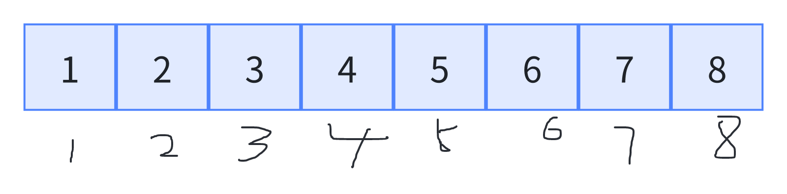
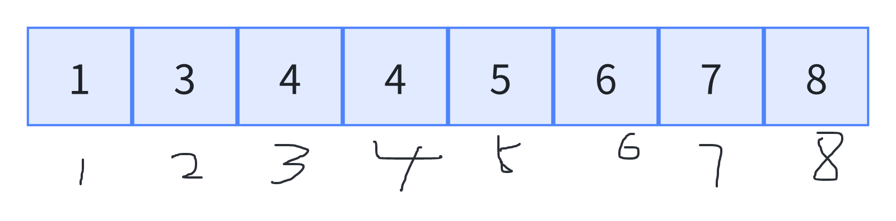

# 并查集

## 何为并查集？

​	并查集是一种树型结构，它是一种集合，特殊地是，每个集合中都有一个代表元素代表着该集合。它支持查找和集合合并，故名并查集。它的时间复杂度本文不再介绍，有兴趣的同学自行学习，均摊时间复杂度为O(1)。

### 并查集的初始化

​	初始化时，每个下标都指向自己，代表每个元素所在的集合只有自己。

​	代码如下：

```cpp
void build(int n) {
	for(int i = 0; i <= n; i++) {
        father[i] = i;
    }
}
```

​	并查集有一种很常用的打标签的技巧，包括下文的size数组也是打标签，打标签的操作可以在初始化的时候做。

## 并查集的合并

​	我们用一个数组来模拟集合，每个下标对应的值是该下标的父结点。

​	一开始每个集合都只有自己：



​	2与3执行合并操作，由于2和3分属两个不同的集合，故可以进行合并操作，我们让2加入3，则2这个集合在想象的树上就挂到3下面，在数组中的呈现：


​	相当于3变成了2的父结点。

​	再让2所在的集合与4所在的集合合并，我们让2所在的集合加入4：



​	直接找到2所在集合的代表，让它的父结点变为4即可，4是其所在集合的代表。

## 并查集的查找

​	并查集的查找其实就是找代表元素，我们发现上面的例子缺少一个具体找代表的过程，实际就是并查集的查找，我们发现，每次集合合并都是直接拿代表元素去挂，故我们沿着下标一直向上找就可以找到代表元素了，也就是我们想象的树根。

​	这个过程可以递归实现，也可循环实现。

### 递归实现

​	查到下标的值作为下一次的下标，一直到下标与对应值相同即可。

​	代码如下：

```cpp
int father[105]; // 用于保存每个结点的父结点 

// 寻找x所属集合的代表元素 
int find(int x) {
	if(x != father[x]) {
		x = find(father[x]);
	}
	return father[x];
}
```

### 循环实现

​	这个就更好理解了，只要下标不等于自身，一直找下去。

​	代码如下：

```cpp
int find(int x) {
	while(x != father[x]) {
		x = father[x];
	}
	return father[x];
}
```

## 并查集的优化

​	既然是树型结构，那么最坏情况下会退化为线性结构，所以需要去优化。

### 小挂大

​	为了不让其退化为线性结构，那么其实在我们想象中的那棵树就是较扁的。为了达到这个效果，在合并集合的时候，我们遵循一个原则，那就是在找出两个集合的代表元素后，让数量少的元素集合的代表元素挂在数量多的元素集合代表下。这样建出来的树就不会一边倒了。我们可以维护一个size数组，size数组规模同father数组，记录当前节点为代表元素时，其所代表的集合中元素的数量。通过比较做合并操作。

​	代码如下：

```cpp
void merge(int x, int y) {
	int fx = find(x);
	int fy = find(y);
	if(fx != fy) {
		if(size[fx] <= size[fy]) {
			father[fx] = fy;
			size[fy] += size[fx];
		}
		else {
			father[fy] = fx;
			size[fx] += size[fy];
		}
	}
}
```

​	通过程序可以观察到，size数组当某个下标不再是树根时，那么该下标代表的集合元素数量就没用了，我们弃之不用。

​	且该操作需要一个额外的数组，需要占用额外的空间，该写法也略显臃肿笨拙，所以我们不用改方法，而1用下面的扁平化过程。

### 扁平化

​	扁平化的操作可以直接改变节点的父结点，使之直接与其集合中的代表元素相连。具体来说，我们在每次查询的时候，递归地找到每个集合的代表元素，然后将其father数组中的值直接变成该代表元素，这样就可以使所有的元素都挂在树根下了。换句话说，在合并的时候我们不去管小挂大，在每次查找做上述的扁平化，这样虽然会有接近线性结构出现，但是它只能出现一次，之后就被我们的扁平化操作优化掉，再查找的时候，时间效率就变得非常高了。

​	代码如下：

```cpp
int find(int x) {
	if(x != father[x]) {
		father[x] = find(father[x]);
	}
	return father[x];
}
```

​	循环写法：

```cpp
int find(int x) {
    while(set[x] != x) {
        x = set[x] = set[set[x]];
    }
    return x;
}
```

​	这里循环体内的语句相当于先执行后面的赋值，在把值赋给前面的x，该过程的扁平化就没有递归形式的直接，但是二者在速度上差的不多。

## 并查集做分类处理

### 练习题目一

​	题目链接：https://www.luogu.com.cn/problem/P1525

​	此题可以把两个监狱看成两类，每个人属于一个监狱，就属于同一类。两个有恩怨的犯人需要属于不同的监狱，所以，对于每个犯人，记录其第一个遇到的仇人，如果没遇到默认是0，当读入两个犯人时，先判断二者是否已经处于同一个集合，如果已经属于同一个集合，就说明他们俩分不到不同的监狱，此时他俩的恩怨值就可以作为答案返回了；如果不属于同一个集合，假设两个人是 a 和 b，如果 a 还没有仇人出现，就将 a 的仇人设置为 b，如果 a 的仇人已经有了，就将 a 的仇人与 b 关在一个监狱，即合并到一个集合；对于b也同理。AC代码如下：

```c++
#include <bits/stdc++.h>
using namespace std;

#define MAXN 20005
#define MAXM 100005
const int mod = 1e9 + 7;
typedef long long ll;

class UnionFindSet {
	int n;
	vector<int> father;

public:
	UnionFindSet(int size) {
		n = size;
		father.resize(n + 1);
		iota(father.begin(), father.end(), 0);
	}

	int find(int x) {
		if(x != father[x]) {
			father[x] = find(father[x]);
		}
		return father[x];
	}

	void merge(int x, int y) {
		int fx = find(x), fy = find(y);
		if(fx != fy) {
			father[fx] = fy;
		}
	}

	bool same(int x, int y) {
		return find(x) == find(y);
	}
};

int n, m;
int ene[MAXN];
int ans;

int main() {
	ios::sync_with_stdio(false);
	cin.tie(nullptr);
	
	cin >> n >> m;
	UnionFindSet uf(n);
	vector<vector<int>> arr(m, vector<int>(3));
	for(int i = 0; i < m; i++) {
		cin >> arr[i][0] >> arr[i][1] >> arr[i][2];
	}
	sort(arr.begin(), arr.begin() + m, [](const auto& a, const auto& b) { return a[2] > b[2]; });

	ans = 0;
	for(int i = 0; i < m; i++) {
		int l = arr[i][0], r = arr[i][1], v = arr[i][2];
		if(uf.same(l, r)) {
			ans = v;
			break;
		}
		else {
			if(ene[l] == 0) ene[l] = r;
			else uf.merge(ene[l], r);
			if(ene[r] == 0) ene[r] = l;
			else uf.merge(l, ene[r]);
		}
	}

	cout << ans;

	return 0;
}
```

### 练习题目二

​	题目链接：https://www.luogu.com.cn/problem/P1892

​	这题思路同上题，将敌人的敌人合并过来，如果是朋友就直接合并过来，最后计算集合个数即可。AC代码如下：

```c++
#include <bits/stdc++.h>
using namespace std;

#define MAXN 1005
#define MAXM 100005
const int mod = 1e9 + 7;
typedef long long ll;

class UnionFindSet {
	int n;
	vector<int> father;

public:
	UnionFindSet(int size) {
		n = size;
		father.resize(n + 1);
		iota(father.begin(), father.end(), 0);
	}

	int find(int x) {
		if(x != father[x]) {
			father[x] = find(father[x]);
		}
		return father[x];
	}

	void merge(int x, int y) {
		int fx = find(x), fy = find(y);
		if(fx != fy) {
			father[fx] = fy;
		}
	}

	bool same(int x, int y) {
		return find(x) == find(y);
	}

	bool ishead(int i) {
		return i == father[i];
	}
};

int n, m, ans;
int enemy[MAXN];

int main() {
	ios::sync_with_stdio(false);
	cin.tie(nullptr);
	
	cin >> n >> m;
	UnionFindSet uf(n);
	char op;
	for(int i = 1; i <= m; i++) {
		int p, q;
		cin >> op >> p >> q;
		if(op == 'E') {
			if(enemy[p] == 0) enemy[p] = q;
			else uf.merge(enemy[p], q);
			if(enemy[q] == 0) enemy[q] = p;
			else uf.merge(enemy[q], p);
		}
		else if(op == 'F') {
			uf.merge(p, q);
		}
	}

	for(int i = 1; i <= n; i++) {
		if(uf.ishead(i)) ans++;
	}

	cout << ans;

	return 0;
}
```

## 练习题目

​	https://www.luogu.com.cn/problem/P3367

​	https://leetcode.cn/problems/number-of-islands/

​	https://leetcode.cn/problems/similar-string-groups/

​	https://leetcode.cn/problems/couples-holding-hands/

​	https://atcoder.jp/contests/abc447/tasks/abc447_e （一般++）

​	https://www.luogu.com.cn/problem/P2097 （容易++，直接搜索也可以做）
