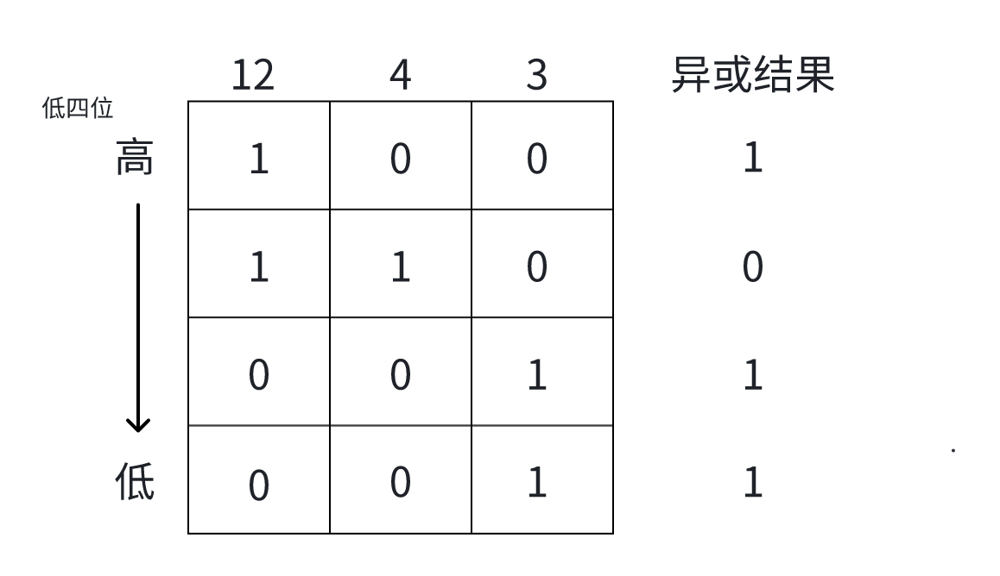
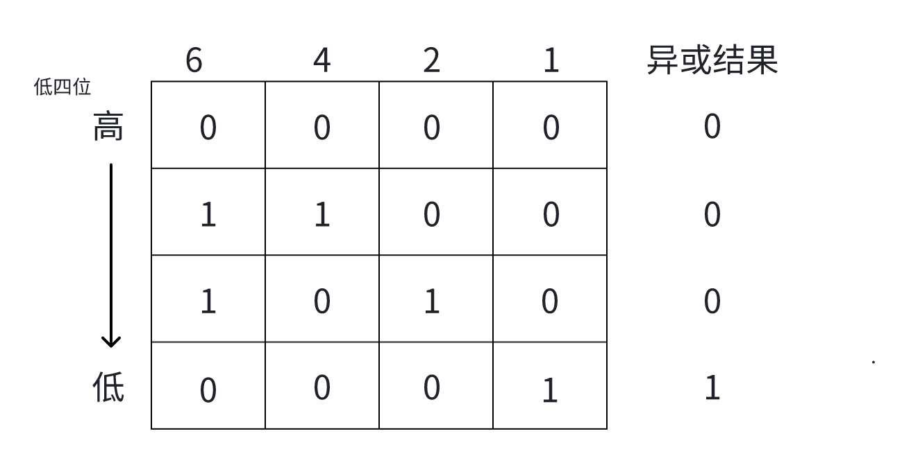
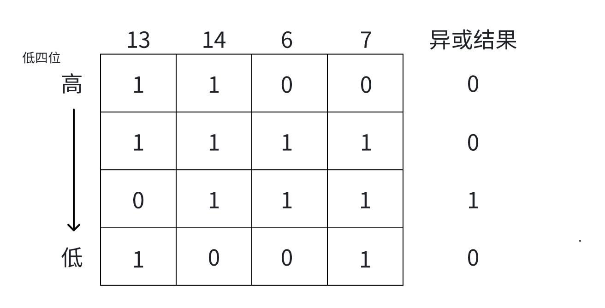
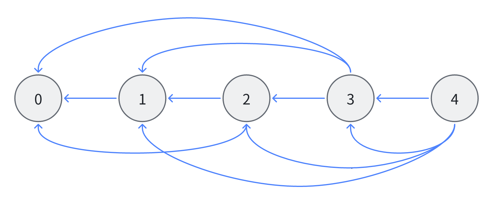
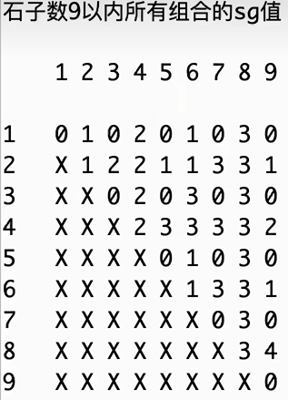

# 博弈论

## 前言

​	如果你经常打cf，就会发现cf前面两题很喜欢出博弈论的问题。所谓博弈论，就是两个人进行一个游戏，都以最优的步骤进行，问哪种情况谁能获胜的题目。我们回望所有博弈论问题，规则五花八门，有时候灵光乍现，一下找到问题所在；有时却被卡一个晚上。我们力求介绍的详细、且能找到一种通用的规则来解决大部分的博弈论问题。

​	博弈类问题大致分为三类：公平组合游戏，非公平组合游戏（绝大多数的棋类游戏），反常游戏。这三类是计算机领域中大厂笔试面试和竞赛中常见的类型。而例如经济类博弈就不是我们领域所涉及的。

​	其实我们只需关注公平组合游戏（ICG），因为反常游戏是该游戏的变形。游戏特征是这样的：

​		1、两个玩家轮流行动且游戏方式一致；

​		2、两个玩家对状况完全了解；

​		3、游戏一定会在有限步数内分出胜负；

​		4、游戏以玩家无法行动结束。

​	且博弈的双方都被认为是神之个体，当局面确定，结果必然注定，没有任何的随机成分。游戏中的每个状态，最终导致的结果也必然注定，只有必胜和必败两种状态。换句话说，初始状态定下来，结局就定下来，一方是不能通过努力去改变的，结果没有任何意外。

## 一些经典的博弈问题

### 巴什博弈（Bash Game）

​	一共有n颗石子，两个人轮流拿，每次可以拿1~m颗石子，拿到最后一颗石子的人获胜，根据n、m返回谁赢。

​	**结论：如果n不等于(m+1)的整数倍，一定是先手赢；如果n等于(m+1)的整数倍，那么是后手赢。**

​	先说前面这部分结论，先手为什么一定能赢？因为先手可以控制剩余石子的数量一定为(m+1)的整数倍。例如，n = 75，m = 6，这个例子中m+1=7，发现75不是7的倍数，那么先手就可以拿走5个，这个数字是小于m+1=7的，剩余石子70个，到后手的回合。后手面对m+1的整数倍，又能怎样呢？后手拿完后，剩余石子一定不是m+1的整数倍，因为每人只能拿1-m颗，拿不到m+1颗，自然剩下的石子就不是m+1的倍数。最后的最后，一定是后手先面对剩余石子为7这个状态，这样后手无论拿几个，剩下的一定能被先手一把拿完，所以先手必胜。后面的结论同理，先手无论拿几个，都不是m+1的整数倍，而后手可以让先手一直面对m+1的整数倍，到最后，先手会面对剩余7个石子的状态，此时先手无论拿几个，后手都能一把拿完，后手获胜。

### 巴什博弈扩展（质数次方版取石子）

​	题目链接：https://www.luogu.com.cn/problem/P4018

​	这道题确实需要找规律，同时，结论也很简洁：**如果n % 6 != 0，先手赢；如果n % 6 == 0，后手赢。**

​	为什么是6这个数字呢？因为我们发现，所有6的整数倍都不等于题目要求的质数的自然数次方，原因在于6的倍数有两个因子：2和3，而质数的自然数次方只能分解出同一个质数，不可能分解出2和3两种因子，所以一次拿走的数量一定不是6的倍数。这会导致什么呢？我们可以知道1至5都是质数的自然数次方（这里说明一下，0算作自然数），所以1-5个是可以拿的。当初始石子n不是6的倍数时，先手可以通过拿1-5个，使得剩余石子变为6的整数倍个，此时后手面对6的整数倍，同时又不能拿6的整数倍个石子，所以后手拿完，剩余石子一定不是6的整数倍，这时先手就可以一直让后手面对6的整数倍个石子，到最后，后手面对剩余6个石子，只能拿1-5个，先手获胜；反之分析亦然。

​	整个过程和巴什博弈很类似，甚至在扩展版中，我们只看到6的倍数，而普通版的却是m+1的倍数，看起来条件缩小了，但是扩展版的分析难度要大于普通版。

### 尼姆博弈（Nim Game）

​	***前置知识：异或运算***

​	题目链接：https://www.luogu.com.cn/problem/P2197

​	我们可以分析一些简单的情况，做一些猜测：比如跟石头的堆数的奇偶性有关等等。但是结论依然非常简洁：**如果所有数字异或起来不等于0，先手赢；如果所有数字异或起来等于0，后手赢。**

​	我们逐层拆解来分析这个结论，还是先看前半段。当把所有数字异或起来不等于0，那么先手一定可以通过采取某些动作，让剩余的所有数字异或起来等于0；而后手无论采取什么行动，剩余的所有数字异或起来一定不等于0，最终所有石子堆的个数都是0，异或起来为0，一定是后手面对的，此时后手失败。这是我们大体的流程。现在想要证明我们的结论，只需考虑上述的两个操作：（1）后手无论拿几个，都使得剩余数字异或起来不等于0；（2）先手一定有一种拿法，使得剩余数字异或起来等于0。

​	我们先来证明结论（1）：

​	后手面对的状态是，所有数字异或起来为0，想要达到这个状态，需要让所有数字的二进制的对应位上1的个数全是偶数。比如所有数字二进制的第4位上有4个1，其余都是0，这样该位异或起来才是0；所有位的异或结果都是0，最终结果才是0。此时后手面对该状态，必须拿石子的情况下，无论拿几个，都会使该堆数字变少，而该堆数字一旦变少，在该位置原来的石子数量的二进制表示上，一定会有某位或某几位的1消失，而一旦某位上的1消失，就不能维持该位上二进制1的个数为偶数，此时异或结果一定不为0。结论（1）得证。

​	再来证明结论（2）：

​	结论（2）的证明要比（1）稍难一些，我们不妨先来看一个例子：



​	假设我们这里有三堆石子，数量分别是12、4、3，这三个数字异或结果为11，不等于0。此时我们需要让异或结果为0，数字12最高位只有一个1，4和3在在该位都是0，所以要想异或结果为0，一定要让12变小，小到该位为0，剩余的位呢？剩余的位需要跟4和3作比较，从低位往高位数，第三位上4是1，3是0，这里需要一个1；第二位和第一位上4都是0,3都是1，这两位分别需要一个1，所以最终12变为7，7、4、3三个数字异或起来结果就是0了。那么是不是一定要让最大的数字变小才能达到目的呢？不是这样的。我们来看一个新的例子：



​	假设有四堆石子，数量分别是6、4、2、1。这时如果让最大的6变小，那么从低到高第三位的1一定会消失，这样该位上只有一个1，此时无论如何，异或结果都不等于0，失败。但是我们可以将1变为0，这样最终异或结果就是0了。有没有一般性的规律？再来看一个例子：



​	在这个例子中，我们如果想去掉异或结果中的1，我们发现可以用14、6、7哪一个去掉该位上的1都符合条件。更一般的结论：对于异或结果最高位上的1，我们总可以通过变小某个数字，使得该位异或结果为0。当我们选择6来解决时，13、14、7的异或结果是：0100，该数值是4，这就意味着，6需要变为和该数值一样的数值，最终异或结果才是0，而6>4，可以通过变小的方式去掉原异或结果中最高位的1。对于该位置之上的位，由于最终异或结果为0，所以13、14、7三个数字异或起来与6的最高两位一定相同，这就导致13、14、7的异或结果一定小于等于6，也就是说，我们一定可以通过拿走某些石子使得最终异或结果为0。

​	总结：无论哪种情况，我们总能变小一个数字，使得最终异或结果0。结论（2）证明完毕。

​	故原结论（黑体）成立。

### 反尼姆博弈（反常游戏）

​	题目链接：https://www.luogu.com.cn/problem/P4279

​	该问题是尼姆博弈改过来的，说它是反常游戏，是因为正常游戏中，谁拿走最后的石子谁赢，而这里却是谁拿走最后的石头谁输。

​	我们还是考虑一些简单的例子培养一下直觉：**当每堆石头的个数都是1时，只需要看有奇数堆还是偶数堆就可以了，可以看异或结果是0还是1**；如果只有一堆石头个数大于1，其余都是1，这种情况先手一定赢，因为大于1的那堆会给先手缓冲，使情况向我们刚讨论的全1情况靠近。同时这种状态异或结果一定不为0；第三种情况，如果若干堆石子数量大于1，还有若干堆石子数量等于1，这时如果所有数字异或起来结果不是0，那么一定可以变到情况2，因为情况2初始状态异或结果一定不为0，刚才证明，如果一开始异或结果不为0，那么先手一定可以一直面对这种情况，直到情况2，而情况2先手必胜，所以情况三**只需要看初始异或结果是否为0，不为0，先手赢；为0，后手赢。**

​	总结只有上面标黑的两种情况，全1和非全1，分别讨论即可。

### 斐波那契博弈

​	题目链接：https://www.luogu.com.cn/problem/P6487

​	我们发现，先手一次性全拿直接赢。但是题目要求最少拿几颗，可以先手稳赢。所以全拿在大多数情况下都是不正确的。这里有一个小结论：**如果初始石子的个数属于斐波那契数列，那么先手必须全拿才能获胜，否则必败。**在说明该结论的正确性之前，还需要阐述一个结论：**假设当前项是斐波那契数列的第 i 项，那么第 i+1 项的数字一定小于第 i 项的数字乘以2，同时第 i+2项的数字一定大于第 i 项的数字乘以2。**该结论证明很容易，拿斐波那契数列的递推式作放缩即可验证。

​	下面说明该结论的正确性：我们假设先手第一次不全拿走，n = 1时，先手拿0，后手拿1，先手败（这里假设先手可以取0个，实际上是不行的，只是在我们假设的条件下运转）。n = 2时，先手拿1，后手拿1，先手输。n = 3时，先手拿1，后手拿2，先手输；先手拿2，后手拿1，先手输。n = 5时，有意思的来了，先手一定不能取两个及以上，假设先手取两个，剩下三个小于后手能取的最大值四个，所以后手取三个，先手输；先手取的越多，只要不都取，先手一定输，而如果先手取1个，后手取一个，游戏就变成剩三个石子且先手成为这个新游戏的先手，前面分析n = 3时先手败，所以n = 5时，只要先手不全拿，先手必输。这个结论的一般性在于：斐波纳契数列的当前项*2一定大于等于当前项的下一项，且这个等于只在1和2处成立。而对于所有的斐波那契数，都能分解成前面两个斐波那契数相加，假设前面的斐波那契数为a，后面的为b，那么先手第一次取不能大于等于a个，因为b一定小于a * 2，后手总可以一次取完；而如果先手第一次取的数量小于a，那么后手就可以把游戏分为a个石子和b个石子，且原先手成为新先手，一直分解下去，先手必输。则上面的结论是正确的。

​	知道了初始石子数量属于斐波那契数列，那么非斐波那契数列的初始石子数该如何处理呢？这里介绍**Zeckendorf（齐肯多夫）定理：任何一个不属于斐波那契数列的数字，都能拆分成若干个不相邻的斐波那契数之和。**这种情况如何看输赢呢？假设初始石子数为n，n不是斐波那契数列中的数，n分解为若干个不相邻的斐波那契数，假设 a + b + c + d = n，其中a,b,c,d递增排序，先手第一次拿a个就必胜了。为什么呢？假设先手拿了a个，由于b与a不相邻，所以b一定大于a * 2，所以后手不可能全拿b，此时对于b个石子，如果把b个石子看成单独一次游戏，那么跟前面的结论一样，n = b是斐波那契数，且原来的后手现在先手，且先手不能一次拿完b个石子，该后手必输。如果先手第一次拿不够a个，那么b可以拿剩下的，这就也回到了前面的结论，先手没能全拿a，a是斐波那契数，先手必输。所以**当初始石子数n不是斐波那契数时，先手要拿够n能分解的几个斐波那契数的和数中的最小值个，才能保证必胜。**

​	总结：先手必胜分为两种情况：当初始石子数为斐波那契数时，先手最少也要全拿完；当初始石子数不为斐波那契数时，先手要拿够a个，a是初始石子数分解出的若干不相邻的斐波那契和数中的最小值。

​	最后再补充一些细节，拆分不相邻的斐波那契数时，可以用二分，找到小于n且离n最近的斐波那契数，不断去找直到最后剩下1或者2拆分不下去为止。既然二分，就需要生成一个斐波那契数组，题目的n给到1e15的范围，但其实斐波那契数100项就可以到达这个程度，斐波那契数列的增长是非常快速的。

​	另外，关于Zeckendorf定理的证明，本文最后会放一个英文版的图片，需要自行观看。

​	代码如下（此题在洛谷是黑题，最难的一档，但是无论是题解中的写法，还是我们的二分写法，都很简洁，此题难在分析，在考场想证明某个写法是正确的，根本不可能，我们需要更通用的方法）：

```c++
#include <iostream>
using namespace std;

typedef long long ll;

ll n;
ll f[101];

// 二分找到小于等于n的最大的数，并返回
ll bs(ll n)
{
    int l = 0, r = 100, mid;
    while(l <= r)
    {
        mid = l + ((r - l) >> 1);
        if(f[mid] > n) r = mid - 1;
        else l = mid + 1;
    }
    return f[r];
}

int main()
{
    cin >> n;
    f[0] = 1;
    f[1] = 2;
    for(int i = 2; i < 101; i++)
    {
        f[i] = f[i - 1] + f[i - 2];
    }

    ll ans = -1, find;
    while(n != 1 && n != 2)
    {
        find = bs(n);
        if(n == find)
        {
            ans = find;
            break;
        }
        else
        {
            n -= find;
        }
    }

    if(ans != -1) cout << ans;
    else cout << n;
    
    return 0;
}
```

### 威佐夫博弈（Wythoff Game）

​	题目链接：https://www.luogu.com.cn/problem/P2252

​	此题直接给结论：**当小的数字 != (大的数字 - 小的数字) * 黄金分割比例时，先手赢；反之如果相等，后手赢。**想要证明该结论，直接去洛谷题解看吧，也可以自行搜索了解相关结论和证明。还是那句话，我们想要一个通用的博弈论问题的解法！

​	代码如下，这里需要高精度的计算，不然过不了：

```c++
#include <iostream>
#include <cmath>
#include <algorithm>
using namespace std;

int main()
{
    long long a, b;
    cin >> a >> b;
    
    if (a > b) swap(a, b);
    long long diff = b - a;
    
    const long double phi = (sqrtl(5.0L) + 1.0L) / 2.0L;
    
    long double k_diff = diff;
    long double expected = k_diff * phi;
    
    const long double eps = 1e-12;
    
    long long floor_val = (long long)(expected + eps);
    
    if (abs(a - floor_val) < eps) cout << 0;
    else cout << 1;
    
    return 0;
}
```

## 博弈问题更加通用的解法

​	对于公平组合游戏（ICG），我们试图找到一种通用的解决问题的方法。

### 图游戏

​	这里先来介绍一个小概念：任何局面都认为是图中的点，每一个局面都可以通过一种行动，走向图中的下一个点。如果当前行动有若干个，那么后继节点就有若干个。最终，必败局面的点认为不再有后继节点。那么ICG就可以对应成一张图。

### SG函数（Sprague-Grundy函数）

​	对于一个ICG，我们都可以画出一个图游戏。此处拿巴什博弈举例，其中n = 8，m = 3，其中某些点的图如下图所示：



​	对应图游戏的概念，必败节点（0）没有后继节点，当前行动有若干个（m = 3），后继节点就有若干个（3）。

​	这里需要简单介绍一个概念：**mex**。作者经常在cf的比赛上见到这个概念，求一个数组的mex，是指求出这个数组中没有出现过的最小的自然数（再次强调一下，0也算自然数）。例如：mex( {0, 1, 2} ) = 3，mex( {0, 1, 3, 4} ) = 2，mex( {1, 2, 3} ) = 0。这里需要用到这个技巧求每个节点的SG函数值，还是回到上图的巴什博弈例子中。

​	首先，对于必败节点0，SG(0) = 0；对于其他所有的非必败节点，该**节点的SG函数值为其所有后继节点的SG函数值取mex**。这就是SG函数的求法，俗称mex过程。例如：节点1，其后继节点为0，SG值为0，那么SG(1) = 1；对于节点2，其后继节点为0，1，SG(0) = 0，SG(1) = 1，那么SG(2) = 2；对于节点3，其后继节点为0，1，2，SG(0) = 0，SG(1) = 1，SG(2) = 2，那么SG(3) = 3；对于节点4，其后继节点为1，2，3，SG(1) = 1，SG(2) = 2，SG(3) = 3，那么SG(4) = mex( {1, 2, 3} ) = 0，其他以此类推。

​	如果一个节点的SG值为0，那么该节点的状态为必败态；如果一个节点的SG值不为0，那么该节点的状态为必胜态。说明一下这个结论为什么是正确的：当一个节点的SG值不为0，说明该节点的后继节点有必败态，也就是SG值为0的节点，那么该节点的状态就可以让对手进入后继的必败态；反之，当一个节点的SG值为0，说明该节点的后继节点中没有必败态，全是必胜态，也就是SG值都不为0，此时无论该节点做出什么行动，对手都会进入必胜态。看起来有点自圆其说的感觉，接下来会有具体的例子来演示如何使用SG函数得到答案。

### SG定理（Bouton定理）

​	如果一个ICG游戏（总），有若干个独立的子游戏构成（分1、分2、分3……），那么有如下结论：

​	**SG（总） = SG（分1）^ SG（分2） ^ SG（分3）^ ……**

​	上面的结论过于抽象，这里举个例子，尼姆博弈就是可以分割的ICG游戏。比如给出几堆石子：6、5、4、3、6，每堆石子都可以看做一个子游戏，比如先手在第一堆里拿了两个石子，变成：4、5、4、3、6，后手也可以拿最后一堆，都是独立的子游戏。那么整个的SG值就是各个石子堆这个子游戏的SG值异或起来。比如，对于第一堆石子，求SG(6) = ？，我们首先SG(0) = 0，这是必败态，在单独的取石子游戏中。SG(1) = 1，因为1的后继节点有0；2的后继有0、1，SG(2) = 2。这里因为在每一堆石子中，可以随意取，所以每个节点都可以成为其前面节点的后继节点，SG(6) = 6，就是这堆石子的初始数量。回想尼姆博弈的结论，跟这里就对应上了。尼姆博弈会不会是特例呢？不会的，任何ICG游戏都是如此，正确性证明类似尼姆博弈。总的SG值为0，说明先手处于必败态，反之同理。

​	简单说明一下该结论的普遍性。我们现有一个ICG游戏（不单单是尼姆博弈了），该总游戏可以分为a、b、c，三个子游戏，规则不变，还是拿走最后一个的人获胜。这里假设SG(a) = 17（这里注意，可能有新的游戏策略，不要局限于尼姆博弈），为什么能得到17？说明该节点的后继节点的SG值包括0-16所有值，对于b和c子游戏同理，这里不再列出。先手能不能赢，只需要看SG(a) ^ SG(b) ^ SG(c) != 0是否成立，假设该异或不等于0，先手是否可以通过调整SG(a)的值来使得总异或结果为0？一定可以，因为SG(a)一定可以变小，且0-16都是它的后继节点，它想变成多少就变成多少，只要变小后使得总异或结果为0即可。此时后手面对总异或结果为0的情况，无论采取什么行动，又只能使得总异或结果不为0，此时先手必胜。证明同尼姆博弈，这里不再赘述。

### 一些题目来验证SG函数和SG定理

#### 题目一（巴什博弈）

​	题目链接：没链接，还是巴什博弈，可以回看文章开头对于巴什博弈问题的阐述。

​	关键在于mex的求解，以及对后续节点状态的判断。假设巴什博弈一开始有n个石子，每次取不超过m个，返回先手赢还是后手赢，代码如下：

```c++
string bash_sg(int n, int m)
{
    vector<int> sg(n + 1);
    vector<bool> v(m + 1, false); // 记录哪些数字出现过，用于求mex。
    for(int i = 1; i <= n; i++)
    {
        // 每轮求mex都需要一个新的标记数组
        fill(v.begin(), v.end(), false);
        
        for(int j = 1; j <= m && i - j >= 0; j++)
        {
            // 例如：n = 10, m = 3，想求sg[10]需要看sg[9] sg[8] sg[7]，并把这三个值标记为true（出现过）
            v[sg[i - j]] = true;
        }
        // 下面找出mex，也就是本轮最小的、没出现过的自然数
        for(int s = 0; s <= m; s++)
        {
            if(!v[s])
            {
                sg[i] = s;
                break;
            }
        }
    }
    return sg[n] != 0 ? "先手" : "后手";
}
```

​	注意：可以通过打印求解的sg表来观察规律，读者可以自行验证。

​	该问题不牵扯到子游戏，所以也没有涉及SG定理，只要求SG函数值即可。

#### 题目二（尼姆博弈）

​	这个问题上面举例说明过，可以分解子游戏，需要用到SG定理。

​	给出每堆石子数，返回先手赢还是后手赢，代码如下：

```c++
string nim_sg(vector<int>& arr)
{
    int mx = 0;
    for(int x : arr) mx = max(mx, x);
    
    vector<int> sg(mx + 1); // 假设几堆石子：43、12、27、5，我们从小到大推sg函数值，所以sg值需要求到最大的石子数
    vector<bool> v(mx + 1, false);
    for(int i = 1; i <= mx; i++)
    {
        // 每轮求mex都需要一个新的标记数组
        fill(v.begin(), v.end(), false);
        
        // 在尼姆博弈中，sg值与该堆石子数相同的，但是我们还是老老实实递推过去，最后打印sg表，看看是不是这样的规律
        // 打印sg表交给读者自行验证
        for(int j = 0; j < i; j++) v[j] = true;
        
        for(int s = 0; s <= mx; s++)
        {
            if(!v[s])
            {
                sg[i] = s;
                break;
            }
        }
    }
    
    int eor = 0;
    for(int x : arr) eor ^= sg[x];
    
    return eor != 0 ? "先手" : "后手";
}
```

​	打表发现，只有尼姆博弈中sg[i] == i。其他的因为规则不同，sg值可能不同。需要具体问题具体分析。

#### 题目三（两堆石头的巴什博弈）

​	题目链接：没链接，但是来自大厂真题。

​	问题描述：有两堆石头，数量分别为a和b，两个人轮流拿，每次可以选择其中一堆石头，拿1~m颗。拿到最后一颗石子的人获胜。给出a、b、m，返回谁能获胜。

​	很明显可以分成两个子游戏，需要应用到SG定理，求出SG(a) ^ SG(b)，看结果是否为0即可。而巴什博弈sg值的规律是：sg[i] = i % (m + 1)，题目一打表可以看到。也就是：a % (m + 1) != b % (m + 1)时，SG(a) ^ SG(b) != 0，先手赢；反之后手赢。找到了O(1)的答案。当然也可以暴力求sg表，时间复杂度要稍微低一些，但是都可以通过，自己写相关代码，下面给出最优解：

```c++
string bash_two(int a, int b, int m)
{
    return a % (m + 1) != b % (m + 1) ? "先手" : "后手";
}
```

#### 题目四（三堆石头的斐波那契博弈）

​	题目链接：没链接，但是来自大厂真题。

​	问题描述：有三堆石头，数量分别为a、b、c。两个人轮流拿，每次可以选择其中一堆石头，拿斐波那契数的石头，拿到最后一颗石头的人获胜。给出a、b、c，返回谁能获胜。最大石子数量不超过10^5。

​	很显然，还是能分解为三个子游戏，使用SG定理求解。如何求每堆石子的SG值呢？一样的，只不过后续状态是减去所有小于该石子数的斐波那契数得到的，求这些数的SG值的mex即可。代码如下：

```c++
const int MAXN = 100001;

string fib_sg(int a, int b, int c)
{
    vector<int> fib;
    fib.push_back(1);
    fib.push_back(2);
    int x1 = 1, x2 = 2;
    // 求出小于MAXN的斐波那契数，存放在fib数组中
    while(x1 + x2 <= MAXN)
    {
        int x3 = x1 + x2;
        fib.push_back(x3);
        x1 = x2;
        x2 = x3;
    }
    
    vector<int> sg(MAXN);
    vector<bool> v(MAXN, false);
    for(int i = 1; i < MAXN; i++)
    {
        // 每轮求mex都需要一个新的标记数组
        fill(v.begin(), v.end(), false);
        
        for(int j = 0; j < fib.size() && i - fib[j] >= 0; j++)
        {
            v[sg[i - fib[j]]] = true;
        }
        
        for(int s = 0; s < MAXN; s++)
        {
            if(!v[s])
            {
                sg[i] = s;
                break;
            }
        }
    }
    
    return sg[a] ^ sg[b] ^ sg[c] != 0 ? "先手" : "后手";
}
```

​	上述读者也可以打表观察sg值，并不能发现什么明显的规律，所以只能暴力求解。MAXN限定了数据量，大厂真题要求数据量在10^5，我们来分析一下时间复杂度：首先最外层肯定MAXN都跑一遍，内部有两个for循环，第一个for循环其实跑不了几次，因为只遍历斐波那契数，而斐波那契数的增长速度非常快，到第25项时就已经超过10^5这个规模了，所以第一个for循环最多执行24次。第二个for循环同样很高效，跑不了几次，为什么呢？因为来到一个状态x，x要减去小于它的斐波那契数看后续状态，而后续状态通过刚才的分析，最多24个，也就是说x的mex一定能在0-24之内找到，所以第二个for循环最多跑25次。但是fill数组会使我们的时间复杂度升高，需要优化掉，我们可以使用时间戳，将标记数组改为int型，使用一个变量cur来标记，例如，当前cur = 10，那么当前状态会找所有后继状态，这时将 v[后继状态] = cur。我们接下来找mex，只需要在v数组中找到第一个v[j] != cur即可，不是本回合标记的。等下次循环将cur++，又是一个新的标记，这样fill的时间复杂度就被优化下来了，整体时间复杂度为O（MAXN），常数时间大概是50。改进代码如下：

```c++
const int MAXN = 100001;
int cur = 1;

string fib_sg(int a, int b, int c)
{
    vector<int> fib;
    fib.push_back(1);
    fib.push_back(2);
    int x1 = 1, x2 = 2;
    // 求出小于MAXN的斐波那契数，存放在fib数组中
    while(x1 + x2 <= MAXN)
    {
        int x3 = x1 + x2;
        fib.push_back(x3);
        x1 = x2;
        x2 = x3;
    }
    
    vector<int> sg(MAXN);
    vector<int> v(MAXN, 0);
    for(int i = 1; i < MAXN; i++)
    {
        cur++;
        for(int j = 0; j < fib.size() && i - fib[j] >= 0; j++)
        {
            v[sg[i - fib[j]]] = cur;
        }
        
        for(int s = 0; s < MAXN; s++)
        {
            if(v[s] != cur)
            {
                sg[i] = s;
                break;
            }
        }
    }
    
    return sg[a] ^ sg[b] ^ sg[c] != 0 ? "先手" : "后手";
}
```

#### 题目五

​	题目链接：https://www.luogu.com.cn/problem/P2148

​	此题就属于暴力求SG值过不了了，需要打表观察规律的题目。读完题读者可以自行思考一下如何求SG值，如何应用SG定理？思考过后来看此题如何解決。

​	我们先来看此题是否能应用SG定理：可以。因为每组分割都是每组自己的事，不会影响其他组，同时，当一个组两堆石子数都为1时，决出胜负。那么就有一个大的结论：每组的SG值都异或起来，看结果是否为0即可。但是每组的SG值怎么求呢？我们注意到：每组两堆石子，所以SG表可能需要一张二维表。sg[ i ] [ j ]表示，当前组一堆石子数为i，一堆石子数为j时的SG值。但是回到题目观察石子数可以达到1e9级别，如果就用二维表，空间直接爆掉。这使得我们不得不使用小数据量暴力求解SG表的一部分值，然后观察规律得出简洁结论。

​	我们考虑当前状态的后续状态都是什么？举个例子：当前组的两堆石头个数分别是5和7，那么5和7都可以分解，我们先看只拿走7的情况，后续可能的状态有：(1, 4)、(2, 3)、(3, 2)、(4, 1)。当然显而易见的是：sg[a] [b] = sg[b] [a]，跟顺序无关。只拿走5的情况一样。所以有这么多后续状态，我们可以写递归来搜索每一种状态，这样比较容易写，同时你会发现：求解sg值的过程和记忆化搜索或者动态规划的过程如此相似！没错，都是根据后面的一些状态推出当前状态，当然SG函数求的是mex值，而dp一般求解最优值或方案数。那么就可以递归（记忆化搜索）去尝试，代码如下：

```c++
const int MAXN = 1001;
int dp[MAXN][MAXN];

void init()
{
    for(int = 0; i < MAXN; i++)
    {
        for(int j = 0; j < MAXN; j++)
        {
            dp[i][j] = -1;
        }
    }
}

// 求解sg[a][b]的值
int sg(int a, int b)
{
    if(a == 1 && b == 1) return 0;
    if(dp[a][b] != -1) return dp[a][b];
    
    vector<bool> v(max(a, b) + 1); // 这个初始化大小靠猜，可以直接写大一点，够用就行
    if(a > 1) // 分解a
    {
    	for(int i = 1, j = a - 1; i < a; i++, j--)
        {
            v[sg(i, j)] = true;
        }
    }
    if(b > 1) // 分解b
    {
        for(int i = 1, j = b - 1; i < b; i++, j--)
        {
            v[sg(i, j)] = true;
        }
    }
    int ans = 0;
    for(int s = 0; s < max(a, b); s++)
    {
    	if(!v[s])
        {
            ans = s;
            break;
        }
    }
    dp[a][b] = ans;
    return ans;
}
```

​	上述代码读者可以选择一个较小的数字来跑，例如a和b分别取1-9。当然我们可以只要右上角的部分。打印出来之后的数据长这样：



​	这个图是左程云老师在算法通关系列课程视频必备96中跑的，此处我直接截取该结果。在此另外说明：这种测试类的代码作者并没有自己运行验证，因为左老师在视频里都做出了演示，作者这里偷懒，作者值得信赖的代码都是提供了在线测试链接的，作者AC后才放上去，但是有关这部分测试代码，需要读者自己跑一下，如果有问题，也欢迎反馈。

​	我们观察了结果，好像很难找到规律，难道方向错了？当然不是，规律确实很难发现，此处直接给出规律是什么。我们把行号和列号都减去一，也就是1-9变为0-8。但是二维矩阵的内容不变。我们观察 sg[0] [7] 和 sg[0] [8] 两个位置，发现：0和7的sg值为3，0和8的sg值为0。这又能发现什么？二进制两个数字按位或之后最低位0的所在！例如0:0000,7:0111，二者按位或之后是0111，最低位的0在第三位（从0开始），对于0和8也一样。读者利用打表自行验证该规律。

​	于是我们得出结论：**一组石子个数分别是a和b，它的sg值为：(a - 1) | (b - 1) 的结果的二进制表示中，最低位的0所在位置，这里从0开始计数。**那么如何求一个数字二进制状态的最低位的0的位置呢？不断右移直到遇到0就可以了，代码如下：

```c++
// 求出n的二进制状态的最低位的0所在位置
int lowZero(int n)
{
    int cnt = 0;
    while(n > 0)
    {
        if(n & 1 == 0) break;
        n >>= 1;
        cnt++;
    }
    return cnt;
}
```

​	其余代码就很简单了，读入一组石子数，lowZero的结果异或进来，直到最后得出总的异或值，看其是否为0即可，代码如下：

```c++
#include <iostream>
using namespace std;

int lowZero(int n)
{
    int cnt = 0;
    while(n > 0)
    {
        if((n & 1) == 0) break;
        n >>= 1;
        cnt++;
    }
    return cnt;
}

int main()
{
    int t; cin >> t;
    while(t--)
    {
        int n; cin >> n;
        int sg = 0;
        for(int i = 0, a, b; i < n; i += 2)
        {
            cin >> a >> b;
            sg ^= lowZero((a - 1) | (b - 1));
        }
        if(sg) cout << "YES" << "\n";
        else cout << "NO" << "\n";
    }
    
    return 0;
}
```

​	观察规律也太难了！多做题目，说不定下次一个很离谱的“观察得出”是你自己写出来的。

#### 题目六

​	题目链接：https://www.luogu.com.cn/problem/P3185

​	读题之后，可以确定这是一个ICG游戏。且我们可以得出一个小结论：**最终一定是所有的豆子都集中在最后一个瓶子中**。因为 i < j <= k 这个取法，导致左边的瓶子中的豆子一定会减少直到0，右边一定会增加，这样下去，最终不能进行游戏时，豆子一定都在最后一个瓶子中。既然是ICG游戏，我们看能否使用SG定理，想使用SG定理，就要把游戏拆分为子游戏。但是我们读题之后的思考，瓶子之间并不是独立的，任意两或三个瓶子都可能组合在一起，这没法拆分成子游戏，并不独立。此题让豆子作为单独的游戏，豆子之间是独立的。假设有三个瓶子，我们只看第一个瓶子中的一颗糖豆，游戏规则和原题相同，都移动到最后一个瓶子中，不能移动的人输，这样就是一个独立的子游戏了，总游戏是所有豆子都移到最后一个瓶子中。换句话说，在进行其中一个豆子的游戏时，移动到下面两个瓶子（无论相不相同）后，都可以看成两个独立的新游戏。

​	好了，第一个难题--如何拆分子游戏解决了，下面需要解决的难题就是每个糖豆的SG值如何计算。我们刚才说了，输的人会面对一个状态：所有糖豆都在最后一个瓶子中，这是必败态。而对于以前的经验，我们会让sg[0] = 0，这里我们就让最后一个瓶子成为0号，也就是把原来的瓶子编号顺序反过来，方便我们接着分析问题，换句话说，**最后这个瓶子（0号瓶子）中的所有糖豆的sg值都是0**。那么在1号瓶子（原倒数第二瓶，后面不再提醒，除非明确说明）的豆子SG值如何计算？就看他们接下来会有什么行动，很显然，他们只能去到0号瓶子。到了0号瓶子的两个豆子看成两个独立的子游戏，它们身处0号瓶，SG值为0，那么1号瓶这颗豆子的SG值为一个mex，其分裂的两个豆子的SG值异或值为0，这是1号瓶的后续状态的SG值，那么其mex值就是1。推广一下：**1号瓶的豆子SG值都为1**。再来看2号瓶子中的豆子，它能做的操作就多了：211、210、200。这里提一下，因为前面将瓶子编号反转一下，所以此时操作选取的 i < j <= k 的条件就变成了 i > j >= k，我提到的操作211指的是：从2号瓶子拿出一颗豆子，分裂的两个豆子都放入1号瓶子。就拿211操作举例，分裂的两个豆子都进入1号瓶，那么分裂的两个子游戏的总异或值就是1，这两个1再异或，表示211这个操作下的后续状态的SG值，为0；下面再看操作210，一个豆子进入1号瓶，SG值为1，另一个豆子进入0号瓶，SG值为0，汇总结果应该是 1 ^ 0 = 1，也就是在210这个操作下，后续状态的SG值为1；200这个操作，后续状态的SG值就是 0 ^ 0 = 0；最后求出三种后续状态的SG值的mex = 2，作为2号瓶这颗豆子的SG值，也就是sg[2] = 2。这个过程是SG函数的定义，觉得饶的可以多看几遍，回头翻翻SG函数也可以。我们再来分析3号瓶子的豆子。它的所有后继状态所需操作为：322、321、320、311、310、300，这里省略计算，类似于求sg[2]，求得sg[3] = 4。从右往左算，算完后，所有糖豆的SG值都知道了，例如：3号瓶子有3个豆子，异或结果就是sg[3] = 4；如果有偶数个豆子，异或结果就是0。很容易计算总sg值。

​	接下来说题目相关的：打印字典序最小的一种操作以及第一步可以获胜的总操作数。先手怎么行动会赢？一定是操作后的sg总值为0，如何让操作后的sg值为0呢？我们的操作是：i 号瓶子拿一颗豆子，j 号瓶子和 k 号瓶子多一颗豆子，在计算出最开始没移动的sg总值后，操作一次的sg值就是：sg总 ^ sg[i] ^ sg[j] ^ sg[k]，原因在于：无论i、j、k瓶子中的豆子是偶数变奇数，还是奇数变偶数，都是异或的关系。例如 i 原来有奇数个豆子，操作后剩余偶数，那么总的sg值相当于再异或一个sg[i]；如果 i 原来有偶数个豆子，操作后剩余奇数，那么总的sg值还是相当于异或一个sg[i]，其余同理。所以**先手想赢，要保证第一次操作的三个瓶子i、j、k，操作后的sg总值 = sg总 ^ sg[i] ^ sg[j] ^ sg[k] == 0**。

​	AC代码如下，这里有一个小细节，求字典序最小，那么求字典序最大，再用总数减去即是字典序最小，因为我们有一个将顺序反转的操作，所以倒着枚举，这样只需记录一次即可：

```c++
#include <iostream>
#include <vector>
using namespace std;

const int MAXN = 21;
const int MAXV = 101;

int sg[MAXN];

// 求出每个瓶子中的豆子的sg值
// 这里注意，我们将最后一个瓶子看作0号瓶子，原来是i j k的顺序，现在是k j i的顺序
// 也就是说，i位置的sg值靠前面的位置推出，因为sg值总是从小往大推，从sg[0]推
// 如果不反转，sg[n - 1] = 0，这样推不符合我们的习惯
void build()
{
    int cnt = 1;
    vector<int> v(MAXV, 0);
    for(int i = 1; i < MAXN; i++)
    {
        cnt++;
        for(int j = i - 1; j >= 0; j--)
        {
            for(int k = j; k >= 0; k--)
            {
                v[sg[j] ^ sg[k]] = cnt;
            }
        }

        for(int s = 0; s < MAXV; s++)
        {
            if(v[s] != cnt)
            {
                sg[i] = s;
                break;
            }
        }
    }
}

void solve()
{
    int n; cin >> n;
    vector<int> nums(n);
    // 我们有一个反转瓶子编号的前提，所以这里倒序读入
    // 每次遍历时从n - 1开始遍历，相当于原来的从0开始遍历
    // 这样倒序遍历正好对应着我们求sg值的倒序状态
    for(int i = n - 1; i >= 0; i--)
    {
        cin >> nums[i];
    }
    
    int eor = 0;
    for(int i = n - 1; i >= 0; i--)
    {
        if(nums[i] & 1) eor ^= sg[i];
    }
    if(eor == 0)
    {
        cout << "-1 -1 -1\n" << 0 << "\n";
        return ;
    }
    int ans = 0, a = -1, b = -1, c = -1, pos;
    for(int i = n - 1; i >= 1; i--)
    {
        if(nums[i] > 0)
        {
            for(int j = i - 1; j >= 0; j--)
            {
                for(int k = j; k >= 0; k--)
                {
                    pos = eor ^ sg[i] ^ sg[j] ^ sg[k];
                    if(pos == 0)
                    {
                        ans++;
                        if(a == -1)
                        {
                            a = i; b = j; c = k;
                        }
                    }
                }
            }
        }
    }
    cout << n - 1 - a << " " << n - 1 - b << " " << n - 1 - c << "\n" << ans << "\n";
}

int main()
{
    build();
    int t;
    cin >> t;
    while(t--)
    {
        solve();
    }
    
    return 0;
}
```

​	太难了！还是要多练习。

​	好了，本节就暂时介绍到这里，如果后面发现什么比较好玩的博弈论问题，会在下面进行补充的，同时，各个OJ的有关博弈论的题目链接我也会放在下边，持续更新。

​	博弈论的问题想弄清楚很难，考场没有时间，所以SG函数和SG定理能帮助我们解决很多复杂的博弈论问题。

## 练习题目

​	洛谷题单：https://www.luogu.com.cn/training/948368

​	