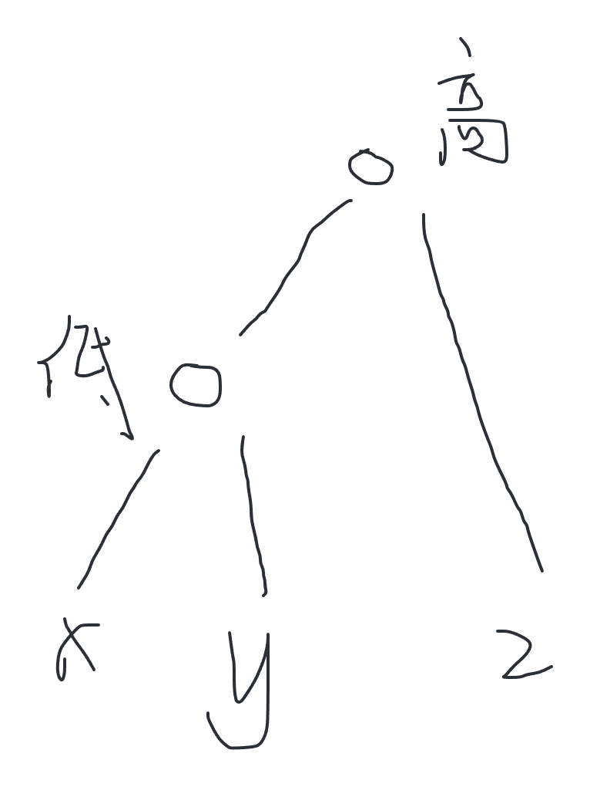

# 树上倍增和LCA

​	***前置知识：倍增算法和ST表、并查集、链式前向星、树型dp***

## 树上倍增

​	树上倍增其实就是在树上跳，不过是从某个节点向上跳，即向着树根部跳。st[i] [p]表示节点 i 往上走2的 p 次方步到达哪个节点，而st[i] [0] 就代表 i 这个节点向上走一步到达的节点，其实就是 i 节点的父节点。任意步数的递推式仍然是：st[i] [p] = st[st[i] [p-1]] [p-1]。那么我们就可以通过st表来快速查询：从节点 i 向上走到第 s 层到达哪个节点。

​	想要解决这个问题，还需要求出每个节点所在的层数deep[i]，这样可以快速求解。i 号节点所在层数为deep[i]，往上走到第 s 层，就不断拆解2的幂，凑出步数即可，注意如果走2的幂超过第 s 层，即在第 s 层的上方，就跳过。

​	题目：https://leetcode.cn/problems/kth-ancestor-of-a-tree-node/

​	我们是从根节点逐步向下递归求deep[i]，也就是根节点的deep默认为1，其余就是父节点的deep+1，这样从上向下更新信息，正好可以同时建立st表，st表中的每一项也仅依赖于上一项。AC代码如下：

```c++
const int MAXN = 50005;
const int LIMIT = 16;

int head[MAXN];
int to[MAXN];
int nxt[MAXN];
int cnt;
void addegde(int u, int v) {
    nxt[cnt] = head[u];
    to[cnt] = v;
    head[u] = cnt++;
}

int power;
int deep[MAXN];
int st[MAXN][LIMIT];
int log2(int n) {
    int ans = 0;
    while((1 << ans) <= (n >> 1)) ans++;
    return ans;
}
void dfs(int i, int fa) {
    if(i == 0) deep[i] = 1;
    else deep[i] = deep[fa] + 1;

    st[i][0] = fa;
    for(int p = 1; p <= power; p++) st[i][p] = st[st[i][p - 1]][p - 1];
    for(int e = head[i]; e != 0; e = nxt[e]) dfs(to[e], i);
}

class TreeAncestor {
public:
    TreeAncestor(int n, vector<int>& parent) {
        cnt = 1;
        power = log2(n);
        memset(head, 0, sizeof(head));
        for(int i = 1; i < parent.size(); i++) {
            addegde(parent[i], i);
        }
        dfs(0, 0);
    }
    
    int getKthAncestor(int node, int k) {
        if(deep[node] <= k) return -1;
        int s = deep[node] - k;
        for(int p = power; p >= 0; p--) {
            if(deep[st[node][p]] >= s) {
                node = st[node][p];
            }
        }
        return node;
    }
};
```

## LCA问题

​	该问题最朴素的递归求解在 "020.二叉树" 一节有介绍，作为了解即可。但是平时见到的LCA问题应该追求更高效的求解方法。

​	LCA就是最近公共祖先，即在一棵二叉树上给定两点 a 和 b，找出离 a 和 b 最近的公共祖先。常用求解方式有三种：1、本节介绍的树上倍增，在线查询，单次复杂度O(logn)；2、本节会介绍的Tarjan算法+并查集，离线查询，一次遍历解决一批查询；3、树链剖分，详情可见 "109.树链剖分" 一节。

### 树上倍增解决LCA问题

​	题目链接：https://www.luogu.com.cn/problem/P3379

​	流程很简单，原理也比较容易理解。假设找 a 与 b 的 LCA，就先让二者处于同一层，让更深的那个节点跳到与另一个节点相同的一层，然后一同向上跳，跳2的幂，如果二者跳之后到达同一个节点，就不跳，此时说明跳的这个步数超过了二者的 LCA；如果到达的不是同一节点，就跳上去，向最近公共祖先靠近，即所谓的倍增算法。整个过程被 st 表和 deep 数组加速，预处理二者的时间复杂度是O(n * logn)，单次查询为O(logn)。详见AC代码：

```c++
#include <bits/stdc++.h>
using namespace std;

#define MAXN 500005
#define MAXM 100005
const int mod = 1e9 + 7;
typedef long long ll;
const int LIMIT = 20;

int n, m, s;

int head[MAXN];
int to[MAXN << 1];
int nxt[MAXN << 1];
int cnt;
void addedge(int u, int v) {
	nxt[cnt] = head[u];
	to[cnt] = v;
	head[u] = cnt++;
}

int power;
int log2(int n) {
	int ans = 0;
	while((1 << ans) <= (n >> 1)) ans++;
	return ans;
}

int deep[MAXN];
int st[MAXN][LIMIT];

void dfs(int i, int fa) {
	deep[i] = deep[fa] + 1;
	st[i][0] = fa;
	for(int p = 1; (1 << p) <= deep[i]; p++) {
		st[i][p] = st[st[i][p - 1]][p - 1];
	}
	for(int e = head[i]; e != 0; e = nxt[e]) {
		if(to[e] != fa) dfs(to[e], i);
	}
}

int lca(int a, int b) {
	if(deep[a] <= deep[b]) swap(a, b); // 让a充当更深的那个节点

	// 让a跳到b的同一层
	for(int p = power; p >= 0; p--) {
		if(deep[st[a][p]] >= deep[b]) a = st[a][p];
	}
	// 此时如果发现a与b相同，那么这个节点就是LCA
	if(a == b) return a;

	// 不然就跳，一起向LCA靠拢
	for(int p = power; p >= 0; p--) {
		if(st[a][p] != st[b][p]) {
			a = st[a][p];
			b = st[b][p];
		}
	}
	return st[a][0]; // 结束节点的父节点就是LCA
}

int main() {
	ios::sync_with_stdio(false);
	cin.tie(nullptr);
	
	cin >> n >> m >> s;
	memset(head, 0, sizeof(head));
	cnt = 1;
	power = log2(n);
	for(int i = 1; i <= n - 1; i++) {
		int u, v;
		cin >> u >> v;
		addedge(u, v);
		addedge(v, u);
	}
	dfs(s, -1);

	for(int i = 0; i < m; i++) {
		int a, b;
		cin >> a >> b;
		cout << lca(a, b) << "\n";
	}

	return 0;
}
```

#### 树上倍增改迭代

​	上面这个题目C++可以放心过，但是 Java 会爆栈，此处介绍递归函数 dfs 改为迭代的方法。

​	设置 deep 数组和 st 表的过程就是来到节点遍历设置，不需要改，需要改的就是 dfs 下去子节点的过程，我们不使用系统栈，用一个栈来替代系统栈。那么这个栈保存什么信息呢：当前处理的节点编号、父节点编号（为了防止走回头路）、边的编号。只要边的编号不为0，就说明当前节点还有边未处理，就继续压栈。栈不空就弹出处理，直到空为止。这样就很好的用栈替代了系统栈的递归过程，每个节点的子节点都是处理到最深然后返回，处理下一个子节点。实现细节上，当前节点如果是刚来到的，即没有任何子节点的访问，那就把边号设置为-1，这样当看到边号-1时，就可以更新这个节点的 deep 数组和 st 表，这是正确的时机。修改dfs过程如下，需要自行实现栈：

```c++
// 当前来到u号节点，父节点是f，当前处理的边号是e
// e == -1表示从未处理过该点；e == 0表示该点的子节点都处理完成
void dfs(int u, int f, int e) {
    pushdown(root, 0, -1); // 自行设置一个栈，二维数组模拟，全局变量stacksize,每个元素包含三个信息
    while(stacksize > 0) {
        popup(); // 自行设置全局变量u,e,f接收栈弹出的信息，供后续代码使用
        if(e == -1) {
            deep[u] = deep[f] + 1;
            st[u][0] = f;
            for(int s = 1; (1 << s) <= deep[u]; s++) {
                st[u][s] = st[st[u][s - 1]][s - 1];
            }
            e = head[u];
        }
        else e = nxt[e];
        if(e != 0) {
            pushdown(u, f, e);
            if(to[e] != f) pushdown(to[e], u, -1);
        }
    }
}
```

### Tarjan算法解决LCA问题

​	这是离线查询批量LCA问题的高效算法，来自 Robert Tarjan，是一位1986年的图灵奖得主。

​	算法过程如下：

​		1）建立问题列表，例如，查询 x 与 y 的LCA，这是第 k 个查询，就让 x 与 y 之间建立一条双向的权值为 k 的边；

​		2）当前来到 cur 节点，标记 vis[cur] = true；

​		3）遍历 cur 的所有子树，每棵子树遍历完成之后，都将该子树与 cur 合并为一个集合，并且代表节点设置为 cur；

​		4）遍历完 cur 的所有子树后，处理 cur 的问题列表，例如查询 (cur, x) 的LCA：

​			如果发现 vis[x] == true，答案就是 x 所在集合的代表节点，将答案填在问题 (cur, x) 的序号处；

​			如果发现 vis[x] == false，就不处理，等到遍历到 x 的时候进行处理。

​	整体过程遍历一次树，处理了 m 个查询，时间复杂度为O(n + m)。详情见代码：

```c++
#include <bits/stdc++.h>
using namespace std;

#define MAXN 500005
#define MAXM 100005
const int mod = 1e9 + 7;
typedef long long ll;

int n, m, s;

// 这个图是题目给出的树
int headt[MAXN];
int tot[MAXN << 1];
int nxtt[MAXN << 1];
int cntt;
void addedget(int u, int v) {
	nxtt[cntt] = headt[u];
	tot[cntt] = v;
	headt[u] = cntt++;
}

// 这个图是问题列表形成的关系
int headq[MAXN];
int toq[MAXN << 1];
int nxtq[MAXN << 1];
int wq[MAXN << 1];
int cntq;
void addedgeq(int u, int v, int idx) {
	nxtq[cntq] = headq[u];
	toq[cntq] = v;
	wq[cntq] = idx;
	headq[u] = cntq++;
}

int father[MAXN];
int find(int x) {
	if(x != father[x]) {
		father[x] = find(father[x]);
	}
	return father[x];
}

int ans[MAXN];
bool v[MAXN];
void tarjan(int u, int fa) {
	v[u] = true;
	for(int e = headt[u]; e != 0; e = nxtt[e]) {
		int to = tot[e];
		if(to != fa) {
			tarjan(to, u);
			father[to] = u;
		}
	}
	for(int e = headq[u]; e != 0; e = nxtq[e]) {
		int to = toq[e];
		if(v[to]) {
			ans[wq[e]] = find(to);
		}
	}
}

int main() {
	ios::sync_with_stdio(false);
	cin.tie(nullptr);
	
	cin >> n >> m >> s;
	memset(headt, 0, sizeof(headt));
	memset(headq, 0, sizeof(headq));
	cntt = 1;
	cntq = 1;
	for(int i = 1; i <= n; i++) {
		father[i] = i;
	}
	for(int i = 1; i <= n - 1; i++) {
		int u, v;
		cin >> u >> v;
		addedget(u, v);
		addedget(v, u);
	}

	for(int i = 1; i <= m; i++) {
		int a, b;
		cin >> a >> b;
		addedgeq(a, b, i);
		addedgeq(b, a, i);
	}

	tarjan(s, 0);

	for(int i = 1; i <= m; i++) {
		cout << ans[i] << "\n";
	}

	return 0;
}
```

#### Tarjan算法改迭代

​	此处需要改两个位置，一个是并查集 find() 方法的递归改迭代，这里不再赘述；另一个就是 tarjan 函数改迭代。

​	这里需要将 tanjan 函数中的 father[to] = u 一行删除，将合并行为放到最后，改成 father[u] = fa。这样操作可以保证：刚访问一个新节点时，只需要设置 vis 数组，不需要有多余的操作，方便改递归。而修改后的其实与修改前是等价的。其余修改参考前面树上倍增改迭代问题即可，设置栈的方式相同，流程相同，此处不再赘述。

## 题目解析

​	下面列出了几道例题，读者均可以先行尝试，然后再来看解析。

### 题目一

​	题目链接：https://www.luogu.com.cn/problem/P4281

​	这个题目是三个点的 LCA 问题，但是尝试洛谷的样例后会发现：不是单纯的求三个点的 LCA。我们令 x 与 y 的 LCA 是 h1，x 与 z 的 LCA 是 h2，y 与 z 的 LCA 是 h3。可以得出结论：**h1、h2、h3 必定全相同，或者有两个相同，不可能全不相同**。z 节点如果在 x 与 y 这棵子树(即以h1为头)的内部，那么 z 节点要么与 x 节点单独有 LCA(h2)，此时 z 与 y 的 LCA 一定是 h1，这时h1、h2、h3三者至少有两个是相同的，z 与 y 单独有 LCA(h3)同理；如果 z 不在 h1的内部，那么 x 与 y 是同一 LCA(h1)，x 与 z、y 与 z 的 LCA 一定相同。

​	所以其实 x y z 只有两个点的 LCA，这两个点要么相同高度，要么可以分出一高一低，相同高度即为同一个 LCA，此时计算路径长度即可；不同高度时区分出高的LCA是哪个、低的是哪个，分析如何计算：



​	这个例子中分出高低后，如何计算最低花费？一定是聚集到更低的这个点 h1 上，因为如果聚集到 更高的点 h2、h3 上，x 与 y 会计算两次路径，而如果汇聚到 h1，z 只需计算一次路径就好，会更优。

​	下面分析如何计算路径，我们准备了 deep 数组，利用这个就可以快速加工。根节点到 x 的路径长度 - 根节点到 h1 的路径长度 = x 到 h1 的路径长度，对 y 也同理。z 到 h1 是 z 先到 h2，再到 h1，这个距离 = (根节点到 z 的路径长度 - 根节点到 h2 的路径长度) + (根节点到 h1 的路径长度 - 根节点到 h2 的路径长度)。将这三个式子合并相消，可得：总距离 = deep[x] + deep[y] + deep[z] - 2 * deep[h2] - deep[h1]。

​	其他细节见AC代码：

```c++
#include <bits/stdc++.h>
using namespace std;

#define MAXN 500005
#define MAXM 100005
const int mod = 1e9 + 7;
typedef long long ll;
const int LIMIT = 19;

int n, m;
int power;

int head[MAXN];
int nxt[MAXN << 1];
int to[MAXN << 1];
int cnt = 1;
void addedge(int u, int v) {
	nxt[cnt] = head[u];
	to[cnt] = v;
	head[u] = cnt++;
}

int deep[MAXN];
int st[MAXN][LIMIT];

int log2(int n) {
	int ans = 0;
	while((1 << ans) <= (n >> 1)) ans++;
	return ans;
}

void dfs(int u, int fa) {
	deep[u] = deep[fa] + 1;
	st[u][0] = fa;
	for(int p = 1; (1 << p) <= deep[u]; p++) st[u][p] = st[st[u][p - 1]][p - 1];
	for(int e = head[u]; e != 0; e = nxt[e]) {
		if(to[e] != fa) dfs(to[e], u);
	}
}

int lca(int a, int b) {
	if(deep[a] < deep[b]) swap(a, b);
	for(int p = power; p >= 0; p--) {
		if(deep[st[a][p]] >= deep[b]) a = st[a][p];
	}
	if(a == b) return a;
	for(int p = power; p >= 0; p--) {
		if(st[a][p] != st[b][p]) {
			a = st[a][p];
			b = st[b][p];
		}
	}
	return st[a][0];
}

int main() {
	ios::sync_with_stdio(false);
	cin.tie(nullptr);
	
	cin >> n >> m;
	power = log2(n);
	memset(head, 0, sizeof(head));
	for(int i = 1; i <= n - 1; i++) {
		int a, b;
		cin >> a >> b;
		addedge(a, b);
		addedge(b, a);
	}

	dfs(1, 0);

	for(int i = 1; i <= m; i++) {
		int x, y, z;
		cin >> x >> y >> z;
		int h1 = lca(x, y), h2 = lca(x, z), h3 = lca(y, z);
		// 求高的点和低的点这里画图体会一下
		int high = h1 != h2 ? (deep[h1] < deep[h2] ? h1 : h2) : h1;
		int low = h1 != h2 ? (deep[h1] > deep[h2] ? h1 : h2) : h3;
		int togather = low;
		ll cost = (ll) (deep[x] + deep[y] + deep[z] - 2 * deep[high] - deep[low]);
		cout << togather << " " << cost << "\n";
	}

	return 0;
}
```

### 题目二

​	题目链接：https://www.luogu.com.cn/problem/P1967

​	这道题目较为综合，但是容易理解，前提是会Kruskal求最大生成树。分析题目，就是找到一条通路，使得路径上的权值最小值尽可能大，给出的是图，很容易想到构建出最大生成树，这是贪心的思想，因为答案一定在这棵最大生成树上。当然图可能是不联通的，这时输出-1，这个利用Kruskal+并查集很容易判断。如果是联通的，并且最大生成树已经构建好了，如何快速求出两点路径上的最小权值呢？肯定不能遍历，那样太慢了，考虑使用倍增算法维护最小值，假设两个点是 a 和 b，找到二者的 LCA，求出 a 到 LCA 的路径上最小权值，以及 b 到 LCA 的路径上的最小权值，二者最小值即为答案。在找 LCA 的过程中，需要维护一个 st 表，除此之外，快速求最小值仍然需要一个 stmin 表，该表的更新也很容易，从 a 节点向上跳2的 p 次方步的最小值，等于min(跳2的 p-1 步的最小值，跳2的 p-1 步后再向上跳 p-1 步的最小值)，即 stmin[a] [p] = min(stmin[a] [p - 1], stmin[st[a] [p - 1]] [p - 1])，本质就是前半段和后半段pk出最小值。

​	其他详情见AC代码：

```c++
#include <bits/stdc++.h>
using namespace std;

#define MAXN 10005
#define MAXM 50005
const int mod = 1e9 + 7;
typedef long long ll;

int n, m, q;
vector<vector<int>> edge; // 存储一开始所有边信息

// 链式前向星建图，存储最大生成树
int head[MAXN];
int nxt[MAXN << 1];
int to[MAXN << 1];
int weight[MAXN << 1];
int cnt = 1;
void addedge(int u, int v, int w) {
	nxt[cnt] = head[u];
	to[cnt] = v;
	weight[cnt] = w;
	head[u] = cnt++;
}

int father[MAXN];
int find(int x) {
	if(x != father[x]) {
		father[x] = find(father[x]);
	}
	return father[x];
}

int deep[MAXN];
int st[MAXN][21]; // 树上倍增维护跳跃到哪
int stmin[MAXN][21]; // 树上倍增维护最小值
int power;

int log2(int n) {
	int ans = 0;
	while((1 << ans) <= (n >> 1)) ans++;
	return ans;
}

bool v[MAXN];
void dfs(int u, int w, int fa) {
	v[u] = true;
	if(fa == 0) {
		deep[u] = 1;
		st[u][0] = u;
		stmin[u][0] = INT_MAX;
	}
	else {
		deep[u] = deep[fa] + 1;
		st[u][0] = fa;
		stmin[u][0] = w;
	}
	for(int p = 1; (1 << p) <= deep[u]; p++) {
		st[u][p] = st[st[u][p - 1]][p - 1];
		stmin[u][p] = min(stmin[u][p - 1], stmin[st[u][p - 1]][p - 1]);
	}
	for(int e = head[u]; e != 0; e = nxt[e]) {
		if(!v[to[e]]) {
			dfs(to[e], weight[e], u);
		}
	}
}

// 求两个节点到LCA的路径的最小值
int lca(int a, int b) {
	if(find(a) != find(b)) return -1;
	int ans = INT_MAX;
	if(deep[a] < deep[b]) swap(a, b);
	for(int p = power; p >= 0; p--) {
		if(deep[st[a][p]] >= deep[b]) {
			ans = min(stmin[a][p], ans);
			a = st[a][p];
		}
	}
	if(a == b) return ans;
	for(int p = power; p >= 0; p--) {
		if(st[a][p] != st[b][p]) {
			ans = min(ans, min(stmin[a][p], stmin[b][p]));
			a = st[a][p];
			b = st[b][p];
		}
	}
	ans = min(ans, min(stmin[a][0], stmin[b][0]));
	return ans;
}

int main() {
	ios::sync_with_stdio(false);
	cin.tie(nullptr);
	
	cin >> n >> m;
	edge.resize(m + 1, vector<int>(3));
	for(int i = 1; i <= n; i++) {
		father[i] = i;
	}
	power = log2(n);
	for(int i = 1, x, y, z; i <= m; i++) {
		cin >> x >> y >> z;
		edge[i][0] = x;
		edge[i][1] = y;
		edge[i][2] = z;
	}
	sort(edge.begin() + 1, edge.end(), [&](auto a, auto b) { return a[2] > b[2]; });

	for(int i = 1; i <= m; i++) {
		int u = edge[i][0], v = edge[i][1];
		int fu = find(u), fv = find(v);
		if(fu != fv) {
			father[fu] = fv;
			addedge(u, v, edge[i][2]);
			addedge(v, u, edge[i][2]);
		}
	}
	for(int i = 1; i <= n; i++) {
		if(!v[i]) {
			dfs(i, 0, 0);
		}
	}

	cin >> q;
	for(int i = 1, x, y; i <= q; i++) {
		cin >> x >> y;
		cout << lca(x, y) << "\n";
	}

	return 0;
}
```

### 题目三

​	题目链接：https://leetcode.cn/problems/minimum-edge-weight-equilibrium-queries-in-a-tree/

​	这道题目关键在于如何判断一条路径上哪个权值出现次数最多，观察数据范围可知，边权范围[1, 26]，很有限，可以哈希表记录从头节点到当前节点，每种边权出现几次，这个过程dfs就求得了，如何更新边权表呢？先继承父节点的边权表，再让该节点与父亲节点这条边的边权+1即可。有了这张边权表，就很容易求出哪个边权出现次数最多了，假设询问的是 a 与 b，二者 LCA 记录在数组 lca 中，假设为 h，那么 a 到 b 的每种边权的数量就可以通过头节点快速得出，头节点到 a 的各种权值数量 + 头节点到 b 的各种权值数量 - 2 * 头节点到 h 的各种权值数量，这个过程更新最大 maxcnt，并且将 a 到 b 路径上的所有边计数 allcnt，最后的答案就是 allcnt - maxcnt。求 lca 此处使用 tarjan 算法，其他详情见AC代码：

```c++
class Solution {
public:
    const static int MAXN = 10005;
    const static int MAXM = 20005;
    int father[MAXN];
    int find(int x) {
        if(x != father[x]) father[x] = find(father[x]);
        return father[x];
    }

    // 链式前向星存树
    int head[MAXN];
    int to[MAXN << 1];
    int nxt[MAXN << 1];
    int weight[MAXN << 1];
    int cnt;
    void addedge(int u, int v, int w) {
        nxt[cnt] = head[u];
        to[cnt] = v;
        weight[cnt] = w;
        head[u] = cnt++;
    }

    // 链式前向星存问题关系，用于tarjan算法求lca
    int headq[MAXN];
    int toq[MAXM << 1];
    int nxtq[MAXM << 1];
    int weightq[MAXM << 1];
    int cntq;
    void addedgeq(int u, int v, int w) {
        nxtq[cntq] = headq[u];
        toq[cntq] = v;
        weightq[cntq] = w;
        headq[u] = cntq++;
    }

    int weightcnt[MAXN][27];
    bool v[MAXN];
    int lca[MAXM];

    void build(int n) {
        memset(head, 0, sizeof(head));
        memset(headq, 0, sizeof(headq));
        memset(v, false, sizeof(v));
        cnt = cntq = 1;
        for(int i = 0; i < n; i++) father[i] = i;
    }

    // weightcnt[u][i]表示从头节点到u节点，边权i出现了几次
    void dfs(int u, int w, int fa) {
        if(u == 0) memset(weightcnt[u], 0, sizeof(weightcnt[u]));
        else {
            for(int i = 1; i <= 26; i++) weightcnt[u][i] = weightcnt[fa][i];
            weightcnt[u][w]++;
        }
        for(int e = head[u]; e != 0; e = nxt[e]) {
            if(to[e] != fa) dfs(to[e], weight[e], u);
        }
    }

    void tarjan(int u, int fa) {
        v[u] = true;
        for(int e = head[u]; e != 0; e = nxt[e]) {
            if(to[e] != fa) tarjan(to[e], u);
        }
        for(int e = headq[u]; e != 0; e = nxtq[e]) {
            int tar = toq[e];
            if(v[tar]) {
                lca[weightq[e]] = find(tar);
            }
        }
        father[u] = fa;
    }

    vector<int> minOperationsQueries(int n, vector<vector<int>>& edges, vector<vector<int>>& queries) {
        build(n);
        for(auto e : edges) {
            addedge(e[0], e[1], e[2]);
            addedge(e[1], e[0], e[2]);
        }
        dfs(0, 0, -1);
        int m = queries.size();
        for(int i = 0; i < m; i++) {
            addedgeq(queries[i][0], queries[i][1], i);
            addedgeq(queries[i][1], queries[i][0], i);
        }
        tarjan(0, -1);
        vector<int> ans(m);
        for(int i = 0, a, b, c; i < m; i++) {
            a = queries[i][0];
            b = queries[i][1];
            c = lca[i];
            int allcnt = 0, maxcnt = 0;
            for(int w = 1, wcnt; w <= 26; w++) {
                wcnt = weightcnt[a][w] + weightcnt[b][w] - 2 * weightcnt[c][w];
                maxcnt = max(maxcnt, wcnt);
                allcnt += wcnt;
            }
            ans[i] = allcnt - maxcnt;
        }
        return ans;
    }
};
```

### 题目四

​	题目链接：https://leetcode.cn/problems/maximize-value-of-function-in-a-ball-passing-game/

​	这题是一道树上倍增的问题，不关LCA什么事，但是这道题目最优解为基环树dp，会在后面介绍。使用树上倍增算法可以勉强通过该题目。

​	读题后发现这就是在各个位置跳，使用倍增算法与st表再合适不过，递推出每个位置跳2的0次方步、1次方、……，就可以知道跳 k 步可以到哪，这个过程还可以利用另外的 stsum 表来记录这条路上的编号值，从0到n-1每个顶点开始走 k 步，评出最大的编号和即可。很明显需要将 k 分解为2的幂的和，这样可以快速知道需要跳2的几次幂、跳到哪。实现详情见下方AC代码：

```c++
class Solution {
public:
    int kbits[34]; // 记录k分解出的都是2的几次幂
    int power, m; // m就是kbits的长度
    int st[100005][34];
    long long stsum[100005][34];

    void build(long long k) {
        power = 0;
        while((1l << power) <= (k >> 1)) power++;
        m = 0;
        for(int p = power; p >= 0; p--) {
            if((1l << p) <= k) {
                kbits[m++] = p;
                k -= (1l << p);
            }
        }
    }
    long long getMaxFunctionValue(vector<int>& receiver, long long k) {
        build(k);
        int n = receiver.size();
        for(int i = 0; i < n; i++) {
            st[i][0] = receiver[i];
            stsum[i][0] = receiver[i];
        }
        for(int p = 1; p <= power; p++) {
            for(int j = 0; j < n; j++) {
                st[j][p] = st[st[j][p - 1]][p - 1];
                stsum[j][p] = stsum[j][p - 1] + stsum[st[j][p - 1]][p - 1];
            }
        }

        long long ans = 0, sum;
        for(int i = 0, cur; i < n; i++) {
            cur = i;
            sum = i;
            for(int j = 0; j < m; j++) {
                sum += stsum[cur][kbits[j]];
                cur = st[cur][kbits[j]];
            }
            ans = max(ans, sum);
        }
        return ans;
    }
};
```

### 题目五

​	题目链接：https://ac.nowcoder.com/acm/contest/78807/G

​	这道题目是一道难题。需要结合字符串哈希的知识才能解决。

​	很容易想到大体思路：假设查询的两点是 a 到 b，h为 a 与 b 的 LCA，那么就计算从 a 到 LCA 再到 b 的字符串哈希值，再计算从 b 到 LCA 再到 a 的字符串哈希值，对比二者是否相同即可。关键点在于：路径上的字符串哈希值如何快速加工出来？这里需要两个倍增表：stup[u] [p] 表示从 u 节点出发走2的 p 次方步得到的字符串哈希值；stdown[u] [p] 表示从某个 u 的祖先节点向下走2的 p 次方步能够到 u，所得到的这部分字符串哈希值。前者如何递推？其实就是乘以一个进制的加法问题，先走一半求出哈希值，将该值乘以进制的一半步长次幂，再加上剩下部分的哈希值就可以了。后者如何递推？跟上面思路一致，先不求走到 u 的哈希值，先求走一半的哈希值，将该值乘以进制的一半步长次幂，，再加上剩下部分的哈希值就可以了。初始化及实现见下方：

```c++
stup[u][0] = stdown[u][0] = s[fa];
for(int p = 1, v; p <= power; p++) {
	v = st[u][p - 1];
	stup[u][p] = stup[u][p - 1] * kpow[(1 << (p - 1))] + stup[v][p - 1];
	stdown[u][p] = stdown[v][p - 1] * kpow[(1 << (p - 1))] + stdown[u][p - 1];
}
```

​	注意到：stup[u] [p] 的定义是不包含 u 这个点的，举个例子：stup[u] [0] 表示 u 向上走一步，即 u 的父节点的哈希值，此时不包括 u 这个点的哈希值。同理对于 stdown[u] [p] 也一样，u 的某个祖先走2的 p 次方步可以到 u，但是哈希值却不包括 u 这个点的，而是包括那个祖先。在计算时初始化一下就好了。

​	最后将上坡与下坡的哈希值拼凑在一起就可以了，上坡到 LCA，下坡从 LCA 的子节点开始到最下方。这里需要注意：下坡求哈希值拼接时，由于也是倒着推，所以每次高位得到的哈希值乘以进制的走过的树高次方才是对的，因为该过程其实是在不断令 b 点向上跳加工哈希值，对比上坡过程，从最下方开始向上跳加工哈希值，只不过上坡时，最下方的哈希值就是最高位，每次乘以进制的步长次方就可以了；而下坡过程相反的，最下面的哈希值其实是最低位，所以就需要记录树高，可以让高位正确左移。拼接时上坡哈希值乘以进制的下坡树高次方就可以了，这个树高是在 b 点不断向上跳时记录的。整体哈希值计算过程如下：

```c++
ll hs(int from, int lca, int t) {
	ll up = s[from];
	for(int p = power; p >= 0; p--) {
		if(deep[st[from][p]] >= deep[lca]) {
			up = up * kpow[1 << p] + stup[from][p];
			from = st[from][p];
		}
	}
	if(t == lca) return up;
	ll down = s[t];
	int height = 1;
	for(int p = power; p >= 0; p--) {
		if(deep[st[t][p]] > deep[lca]) {
			down = stdown[t][p] * kpow[height] + down;
			height += 1 << p;
			t = st[t][p];
		}
	}
	return up * kpow[height] + down;
}
```

​	整体AC代码如下：

```c++
#include <bits/stdc++.h>
using namespace std;

#define MAXN 100005
#define MAXM 100005
const int mod = 1e9 + 7;
typedef long long ll;

int n, q;

int head[MAXN];
int to[MAXN << 1];
int nxt[MAXN << 1];
int cnt;
void addedge(int u, int v) {
	nxt[cnt] = head[u];
	to[cnt] = v;
	head[u] = cnt++;
}

int st[MAXN][17];
int deep[MAXN];
int power, si = 1;
ll stup[MAXN][17], stdown[MAXN][17];
int s[MAXN];
ll kpow[MAXN];
ll k = 499;

int log2(int n) {
	int ans = 0;
	while((1 << ans) <= (n >> 1)) ans++;
	return ans;
}

void build() {
	cnt = 1;
	power = log2(n);
	kpow[0] = 1;
	for(int i = 1; i <= n; i++) {
		kpow[i] = kpow[i - 1] * k;
	}
}

void dfs(int u, int fa) {
	deep[u] = deep[fa] + 1;
	st[u][0] = fa;
	stup[u][0] = stdown[u][0] = s[fa];
	for(int p = 1, v; p <= power; p++) {
		v = st[u][p - 1];
		st[u][p] = st[v][p - 1];
		stup[u][p] = stup[u][p - 1] * kpow[(1 << (p - 1))] + stup[v][p - 1];
		stdown[u][p] = stdown[v][p - 1] * kpow[(1 << (p - 1))] + stdown[u][p - 1];
	}
	for(int e = head[u]; e != 0; e = nxt[e]) {
		if(to[e] != fa) dfs(to[e], u);
	}
}

int lca(int a, int b) {
	if(deep[a] < deep[b]) swap(a, b);
	for(int p = power; p >= 0; p--) {
		if(deep[st[a][p]] >= deep[b]) {
			a = st[a][p];
		}
	}
	if(a == b) return a;
	for(int p = power; p >= 0; p--) {
		if(st[a][p] != st[b][p]) {
			a = st[a][p];
			b = st[b][p];
		}
	}
	return st[a][0];
}

ll hs(int from, int lca, int t) {
	ll up = s[from];
	for(int p = power; p >= 0; p--) {
		if(deep[st[from][p]] >= deep[lca]) {
			up = up * kpow[1 << p] + stup[from][p];
			from = st[from][p];
		}
	}
	if(t == lca) return up;
	ll down = s[t];
	int height = 1;
	for(int p = power; p >= 0; p--) {
		if(deep[st[t][p]] > deep[lca]) {
			down = stdown[t][p] * kpow[height] + down;
			height += 1 << p;
			t = st[t][p];
		}
	}
	return up * kpow[height] + down;
}

bool f(int u, int v) {
	int h = lca(u, v);
	ll up = hs(u, h, v);
	ll down = hs(v, h, u);
	return up == down;
}

int main() {
	ios::sync_with_stdio(false);
	cin.tie(nullptr);
	
	cin >> n;
	build();
	string str; cin >> str;
	for(int i = 0; i < str.size(); i++) {
		s[si++] = str[i] - 'a' + 1;
	}
	for(int i = 1, v; i <= n; i++) {
		cin >> v;
		addedge(i, v);
		addedge(v, i);
	}

	dfs(1, 0);

	cin >> q;
	for(int i = 1, u, v; i <= q; i++) {
		cin >> u >> v;
		if(f(u, v)) cout << "YES\n";
		else cout << "NO\n";
	}

	return 0;
}
```

​	这道题目真的比较难，尤其在字符串哈希计算这里。篇幅有限不能画图展示原理，希望读者可以自行画图来理解整个过程，核心思路都以介绍完成。
