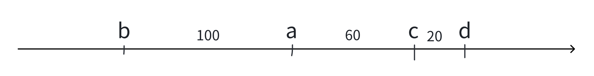

# 带权并查集

​	带权并查集不仅可以像普通并查集一样维护同一个集合的关系，还能维护同一个集合中任意两点之间的一些关系。

​	最经典的是一维数轴相对距离模型。可以这么说：带权并查集的所有变化，都来自该模型。我们来看该模型。

## 一维数轴相对距离模型

​	说a到b的距离是100，就表示a在b的右侧，二者相差100个单位；如果a到b的距离是-20，就表示a在b的左侧20个单位。

​	现有：a到b的距离为100，c到d的距离为-20。根据这两个信息，我们不能推出a到c的距离以及b到d的距离。所以，在这两个集合中，引入一个dist，就表示集合中的点距离该集合头部的距离。比如b的dist是0，那么a的dist就是100（dist[a] = 100）；d的dist是0，c的dist就是-20（dist[c] = -20）。

​	这时给出a到c的距离为-60，那么四个点之间的相对位置我们就都清晰了。在这个关系引进的时候，在数轴上是这样的：

​	