# 带权并查集

***前置知识：并查集***

​	带权并查集不仅可以像普通并查集一样维护同一个集合的关系，还能维护同一个集合中任意两点之间的一些关系。

​	最经典的是一维数轴相对距离模型。可以这么说：带权并查集的所有变化，都来自该模型。我们来看该模型。

## 一维数轴相对距离模型

​	说a到b的距离是100，就表示a在b的右侧，二者相差100个单位；如果a到b的距离是-20，就表示a在b的左侧20个单位。

​	现有：a到b的距离为100，c到d的距离为-20。根据这两个信息，我们不能推出a到c的距离以及b到d的距离。所以，在这两个集合中，引入一个dist，就表示集合中的点距离该集合头部的距离。比如b的dist是0，那么a的dist就是100（dist[a] = 100）；d的dist是0，c的dist就是-20（dist[c] = -20）。

​	这时给出a到c的距离为-60，那么四个点之间的相对位置我们就都清晰了。在这个关系引进的时候，在数轴上是这样的：

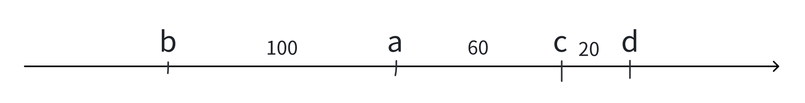

​	在没建立a和c的关系时，它们分属于两个集合，每个集合中两点间的距离都是相对的，每个点与根节点的距离假设存在dist数组中，那么根节点的dist值就应该为0。在a和b这个集合中，b是根节点，a就是b的子节点且dist[a] = 100，在c和d这个集合中，c就是d的子节点，且dist[c] = -20，关系图如下：

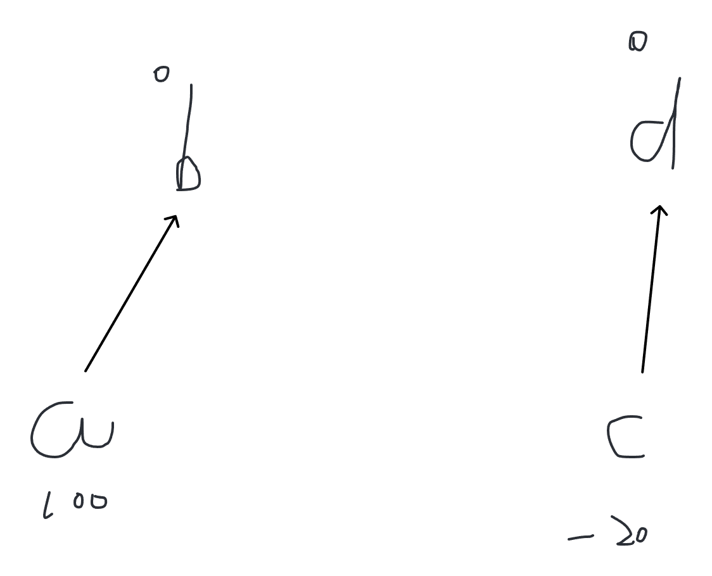

​	当增加一条信息：a和c的距离是-60时，这相当于并查集的合并操作，三个参数a、c和他俩的距离-60。我们要做的操作就是：找出a的祖先b，再找出c的祖先d，让b和d连接起来，如何得到b和d之间的相对距离呢？用dist[c] - dist[a] + ( -60 ) = -180 = dist[b]，此时d作为新的树根，关系图如下：

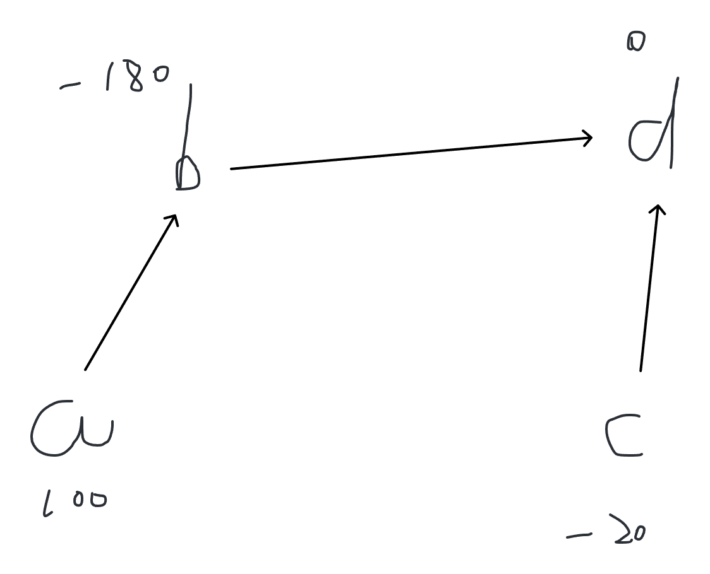

​	这代表：b在d的左侧，距离是180，再看上面的数轴，是对应的。但是dist[a] = 100是老数据，是相对于b来说的距离，相对于d的距离没有更新，所以此时的dist[a]是脏数据，何时更新呢？等到find操作路径压缩时再更新即可。更新时只需累加dist[b]，得到-80，通过数轴可知，a在d的左侧，距离80是正确的。

​	上面这个小例子先来帮助有个印象辅助理解，下面看一个更加具体的例子。

​	有a、b、c、d、e、f、g七个点，初始所有点的dist值都是0，下面加入一些关系：

​		1）a，b，-20；

​		2）b，c，50；

​		3）c，e，-10；

​		4）f，g，10；

​		5）a，g，-10。

​	让我们依次加入这些边，更新dist值所需要的式子就是上面提到的，前面集合的头节点挂在后面集合的头节点下面，即dist[前节点集合的头节点] = dist[后面节点] - dist[前面节点] + 前后节点的相对距离v，例如第一条关系，a集合的头节点是a，b集合的头节点是b，dist[a] = dist[b] - dist[a] + ( -20 ) = -20。但是这个式子只能保证当前合并的点的距离更新是正确的，至于同一集合中其他点的值需要等到find时更新，例如第二条关系，此时a与b已经在同一个集合了，b和c的距离是50，b集合的头节点是b，c集合的头节点是c，利用公式有：dist[b] = dist[c] - dist[b] + v = 0 - 0 + 50 = 50，b相对于c的距离就是50，也就是c成为了该集合新的树根，但是此时dist[a]是相对于b为树根时计算的，所以dist[a]此时的值不正确，不正确就不正确吧，我们等到find到a的时候再更新就可以。加入第一条关系和第二条关系的过程以及此时三个点的位置关系如下图：

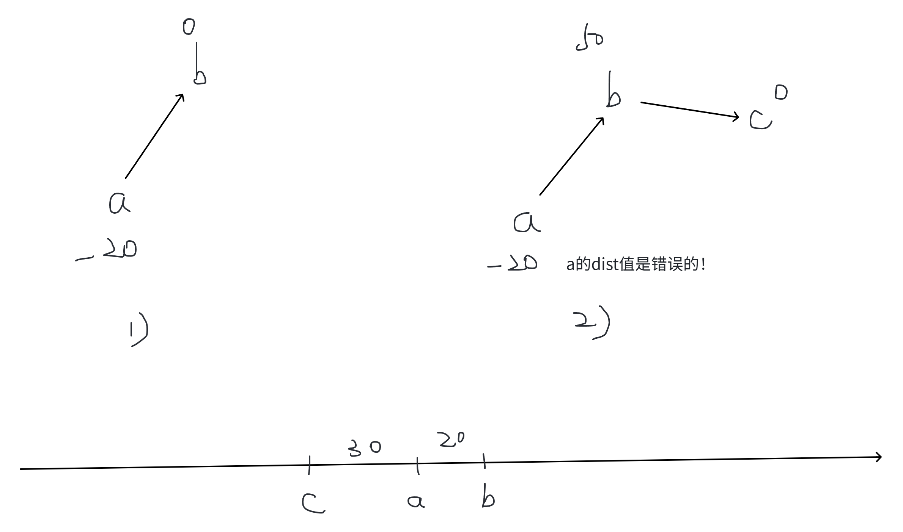

​	再来看加入第三个关系，c集合的头节点是c，e集合的头节点是e，所以dist[c] = dist[e] - dist[c] + v = 0 - 0 + ( -10 ) = -10，所以目前的关系及各个节点相对位置如下图所示：

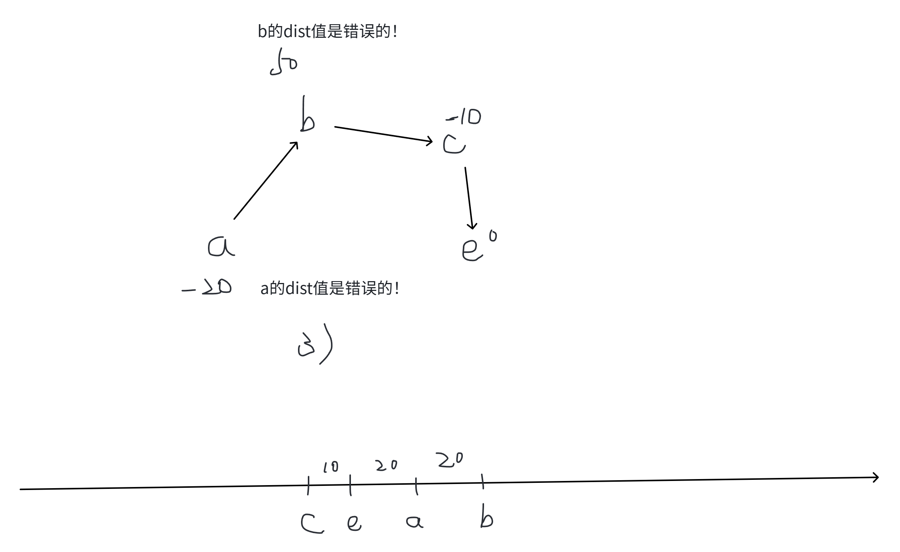

​	接下来加入第四条关系，f集合的头节点是f，g集合的头节点是g，dist[f] = dist[g] - dist[f] + v = 0 - 0 + 10 = 10，也就是f在g的右侧，距离是10。此时a，b，c，e属于一个集合，f，g属于一个集合，两个集合之间没有关系。第五条关系就让这两个集合合并了，a集合的头节点是e，g集合的头节点是g，注意此时在查找a集合的头节点时，通过find函数查找的同时也进行了路径压缩，这个时候我们就将路径上从头节点开始，经过的所有节点dist值累加起来，到哪个点，当前累加的dist值就是这个点更新后的正确的dist值。有点绕，看例子，我们在查找a集合的头节点时，会沿途把所有节点的父节点都修正为e，从头节点e开始累加到c是-10，也就是dist[c] = -10在此时是更新正确了的。再到b，累加dist是40，也就是dist[b] = 40在此时是更新正确了的。最后到a，累加dist值是20，也就是在此时dist[a] = 20是更新正确了的，也就是在a，b，c，e这个集合中，所有点的dist值已经被更新正确，都是距离e这个头节点的正确距离。我们也可以对比上图数轴，发现更新后的关系是正确的。g集合的头节点就是g，此时需要将e节点挂在g的下方，套用公式：dist[e] = dist[g] - dist[a] + v = 0 - 20 + ( -10 ) = -30。此时整体关系与数轴相对位置如下图：

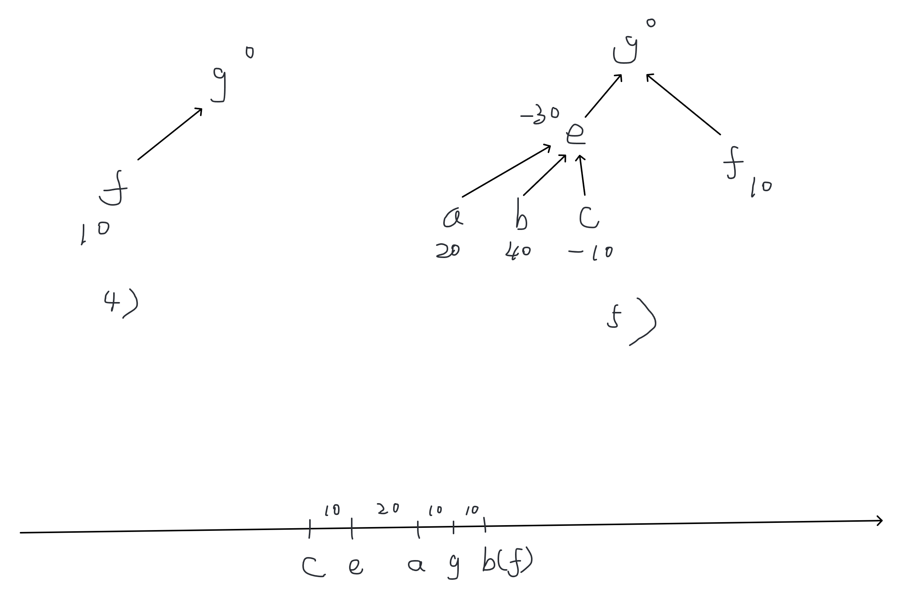

​	现在就可以查找集合内任意两点之间的距离了。例如，查找a到f的距离，首先确认a与f在同一个集合，此时a会经历路径压缩，导致a直接挂在g下面，那么从头节点g到e再到a，这是a原来的路径，压缩后更新dist[a]为该路径dist值的累加值，为-10，也就是意味着，a与g之间的距离为-10，观察数轴，符合预期，f的dist值是正确的。此时如果想要知道a与f之间的距离，直接计算dist[a] - dist[f] = -20，观察数轴，符合预期。

​	稍微总结一下，带权并查集实际上维护了集合内节点与其所在集合的头节点之间的关系，这样在计算集合内任意两点关系时，都能通过头节点找到答案。至于集合内节点与头节点信息的维护，等到find时路径压缩顺带更新，因为所有操作都会在这之后，可以保证脏数据不会污染我们的查询。这就是懒更新的思想，我们在线段树中体会较多。

​	以上就是最经典的一维数轴相对距离模型的介绍，我们需要三个方法：

​		1）merge(l, r, v)，将 l 和 r 所在集合合并，且 l 到 r 的距离是 v。此时可能一个集合中有一个节点是 l ，另一个集合中有一个节点是 r ，l 找到头节点 lf ，此时经过路径压缩会将dist[l]修正正确，对于 r 也同理，此时 lf 直接连接到 rf 下方，就完成了集合的合并，并更新dist[lf]的值，利用dist[r] - dist[l] + v。此时lf的孩子节点的dist值依然不正确，但是等到用到的时候一定会通过find操作更新正确的。 

​		2）find(i)，寻找i节点所在集合的头节点，并进行路径压缩、累加更新dist值；

​		3）query(l ,r)，查询 l 到 r 之间的距离，l 和 r 位于同一集合时，也就是find(l) == find(r)时，这时dist[l]与dist[r]就被修正正确了，l 和 r 之间的相对距离为dist[l] - dist[r]。

​	下面给出三道模板练习题，但是需要稍微转化一下。

### 练习题目一

​	题目链接：https://www.luogu.com.cn/problem/P8779

​	这道题目给出了某些连续区间的和，问一些连续区间的和，其中可能有推断不出来的，打印信息即可。我们看如何转化为上面提到的模型。

​	假设数组有n个数字，我们并不知道这n个数字都是什么，但是知道某段连续区间的和，例如，给定1到n这段区间的和为100，那我们就可以认为，从1号点到n+1号点的距离是100，这样就转化为上面的模型了。更通常地说，给定区间[l, r]的和，我们就认为 l 到 r + 1的距离是这个和即可，为什么右端点需要加1？看下图就明白了：

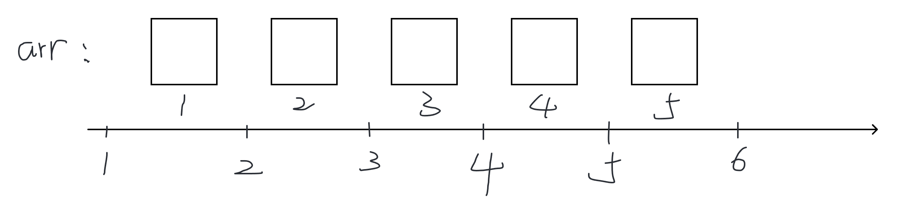

​	在查询时，如果 l 与 r 属于一个集合，就是知道他们的相对位置关系，也就能查到这段区间和，否则打印信息即可。AC代码如下：

```c++
#include <bits/stdc++.h>
using namespace std;

#define MAXN 100005
const int mod = 1e9 + 7;
typedef long long ll;

int n, m, q;
int father[MAXN];
ll dist[MAXN];

int find(int i) {
	if(i != father[i]) {
		int tmp = father[i];
		father[i] = find(tmp);
		dist[i] += dist[tmp];
	}
	return father[i];
}

void merge(int l, int r, ll v) {
	int lf = find(l), rf = find(r);
	if(lf != rf) {
		father[lf] = rf;
		dist[lf] = dist[r] - dist[l] + v;
	}
}

ll query(int l, int r) {
	if(find(l) != find(r)) return LONG_MAX;
	else return dist[l] - dist[r];
}

int main() {
	ios::sync_with_stdio(false);
	cin.tie(nullptr);
	
	cin >> n >> m >> q;
	for(int i = 0; i <= n + 1; i++) {
		father[i] = i;
		dist[i] = 0;
	}

	int l, r;
	ll v;
	for(int i = 1; i <= m; i++) {
		cin >> l >> r >> v;
		merge(l, r + 1, v);
	}

	for(int i = 1; i <= q; i++) {
		cin >> l >> r;
		ll ans = query(l, r + 1);
		if(ans == LONG_MAX) cout << "UNKNOWN\n";
		else cout << ans << "\n";
	}

	return 0;
}
```

### 练习题目二

​	题目链接：https://www.luogu.com.cn/problem/P2294

​	这道题目的转化思路同上题，这里说说如何判断真假。

​	当给出一组数据(l, r, v)时，先看看 l 与 r 是否处于同一个集合，如果在同一个集合，那么他俩之间的距离已经可以算出，与v进行比较，不一致就是假的；如果不在同一个集合，该合并就合并即可。AC代码如下：

```c++
#include <bits/stdc++.h>
using namespace std;

#define MAXN 105
const int mod = 1e9 + 7;
typedef long long ll;

int n, m;
int father[MAXN];
int dist[MAXN];
bool ans;

int find(int i) {
	if(i != father[i]) {
		int tmp = father[i];
		father[i] = find(tmp);
		dist[i] += dist[tmp];
	}
	return father[i];
}

void merge(int l, int r, int v) {
	int lf = find(l), rf = find(r);
	if(lf != rf) {
		father[lf] = rf;
		dist[lf] = dist[r] - dist[l] + v;
	}
}

bool check(int l, int r, int v) {
	if(find(l) == find(r)) {
		if(dist[l] - dist[r] != v) return false;
	}
	return true;
}

void solve() {
	cin >> n >> m;
	ans = true;
	for(int i = 1; i <= n + 1; i++) {
		father[i] = i;
		dist[i] = 0;
	}
	for(int i = 1, l, r, v; i <= m; i++) {
		cin >> l >> r >> v;
		if(!check(l, r + 1, v)) ans = false;
		else merge(l, r + 1, v);
	}
	if(ans) cout << "true\n";
	else cout << "false\n";
}

int main() {
	ios::sync_with_stdio(false);
	cin.tie(nullptr);
	
	int t; cin >> t;
	while(t--) {
		solve();
	}

	return 0;
}
```

### 练习题目三

​	题目链接：https://acm.hdu.edu.cn/showproblem.php?pid=3038、https://vjudge.net/problem/HDU-3038

​	这题跟第二题非常相似，这里不再赘述，需要注意的是这道题目是多组测试。AC代码如下：

```c++
#include <bits/stdc++.h>
using namespace std;

#define MAXN 200005

int n, m, ans;
int father[MAXN];
int dist[MAXN];

int find(int i) {
	if(i != father[i]) {
		int tmp = father[i];
		father[i] = find(tmp);
		dist[i] += dist[tmp];
	}
	return father[i];
}

void merge(int l, int r, int v) {
	int lf = find(l), rf = find(r);
	if(lf != rf) {
		father[lf] = rf;
		dist[lf] = dist[r] - dist[l] + v;
	}
}

bool check(int l, int r, int v) {
	if(find(l) == find(r)) {
		if(dist[l] - dist[r] != v) return false;
	}
	return true;
}

int main() {
	ios::sync_with_stdio(false);
	cin.tie(nullptr);
	
	while(cin >> n >> m) {
		for(int i = 0; i <= n + 1; i++) {
			father[i] = i;
			dist[i] = 0;
		}
		ans = 0;
		for(int i = 1, l, r, v; i <= m; i++) {
			cin >> l >> r >> v;
			if(!check(l, r + 1, v)) ans++;
			else merge(l, r + 1, v);
		}

		cout << ans << "\n";
	}

	return 0;
}
```

### 练习题目四

​	题目链接：https://www.luogu.com.cn/problem/P1196

​	这题稍微有点变化，在合并 l, r 所在集合时，是 l 所在集合挂在 r 所在集合下，这样我们多维护一个集合大小的数组，在 l 集合挂到 r 集合下时，直接让dist[lf] += len[rf]，也就是 lf 到 rf 的距离，有了这个距离，我们计算两战舰之间的距离就容易了，两个dist的绝对值再减去一，就是这两艘战舰之间隔着的战舰数。具体AC代码如下：

```c++
#include <bits/stdc++.h>
using namespace std;

#define MAXN 30005
#define MAXM 100005
const int mod = 1e9 + 7;
typedef long long ll;

int t;
int father[MAXN];
int dist[MAXN];
int len[MAXN];

int find(int i) {
	if(i != father[i]) {
		int tmp = father[i];
		father[i] = find(tmp);
		dist[i] += dist[tmp];
	}
	return father[i];
}

void merge(int l, int r, int v) {
	int lf = find(l), rf = find(r);
	if(lf != rf) {
		father[lf] = rf;
		dist[lf] += len[rf];
		len[rf] += len[lf];
	}
}

int query(int l, int r) {
	if(find(l) != find(r)) return -1;
	return abs(dist[l] - dist[r]) - 1;
}

int main() {
	ios::sync_with_stdio(false);
	cin.tie(nullptr);
	
	cin >> t;
	char op;
	int x, y;
	for(int i = 0; i <= 30000; i++) {
		father[i] = i;
		dist[i] = 0;
		len[i] = 1;
	}
	for(int i = 1; i <= t; i++) {
		cin >> op >> x >> y;
		if(op == 'M') {
			merge(x, y, 1);
		}
		else if(op == 'C') {
			cout << query(x, y) << "\n";
		}
	}

	return 0;
}
```

## 带权并查集维护倍数关系

​	题目链接：https://leetcode.cn/problems/evaluate-division/

​	这道题目的并查集边权维护的是集合内各个节点与头节点的倍数关系，例如给出["a", "b"] = 8.0，说明a是b的8.0倍。与上面的模型相比，就是dist维护方式变化了，一维距离模型中是加减关系，此处由于是倍数，就是乘除关系，合并是计算dist[lf] = dist[r] / dist[l] * v。同时，在find压缩路径时，也要更新dist，此时就不是累加，而是累乘了。

​	此题编码上较为麻烦，因为都是string和double类型，所以可以使用哈希表来维护father数组和dist数组，初始化时father[s] = s，自己是自己的父亲，dist[s] = 1.0，自己到自己的倍数是1。然后题目规定了，查询时遇到没出现过的字符串，默认返回-1，且题目给出的关系没有矛盾，那就直接通过给出的关系建立并查集，同时find函数多加一个判断：如果在给出条件中没有出现过的字符串，直接返回空字符串，这样在query时，如果查出来当前节点所在集合的头节点居然是空字符串，就说明该查询字符串并未给出过，返回-1.0即可。细节就这么多，AC代码如下：

```c++
class Solution {
public:
    unordered_map<string, string> father;
    unordered_map<string, double> dist;
    string find(string& s) {
        if(father.find(s) == father.end()) return "";
        if(s != father[s]) {
            string tmp = father[s];
            father[s] = find(tmp);
            dist[s] *= dist[tmp];
        }
        return father[s];
    }
    void merge(string s1, string s2, double v) {
        string fs1 = find(s1), fs2 = find(s2);
        if(fs1 != fs2) {
            father[fs1] = fs2;
            dist[fs1] = dist[s2] / dist[s1] * v;
        }
    }
    double query(string s1, string s2) {
        string fs1 = find(s1), fs2 = find(s2);
        if(fs1 == "" || fs2 == "" || fs1 != fs2) return -1.0;
        return dist[s1] / dist[s2];
    }

    vector<double> calcEquation(vector<vector<string>>& equations, vector<double>& values, vector<vector<string>>& queries) {
        for(auto t : equations) {
            for(string s : t) {
                father[s] = s;
                dist[s] = 1.0;
            }
        }
        for(int i = 0; i < values.size(); i++) {
            merge(equations[i][0], equations[i][1], values[i]);
        }

        vector<double> ans;
        for(int i = 0; i < queries.size(); i++) {
            ans.push_back(query(queries[i][0], queries[i][1]));
        }
        return ans;
    }
};
```

## 带权并查集维护种类信息

​	题目链接：https://www.luogu.com.cn/problem/P2024

​	这题有点类似于剪刀石头布的关系，下面也会用他们进行举例。而且，这种关系带有明显的循环色彩，所以我们联想到：可能跟 %3 有关系。

​	下面来定义这个dist数组，假设a与b在同一个集合，b是头节点，那么此时a与b仅有三种关系，a吃b，a被b吃，a与b是同类。令dist[a] = 0表示a与头节点是同类，dist[a] = 1表示a吃头节点，dist[a] = 2表示a被头节点吃。那么在find路径压缩时，如何将节点的dist更新正确？根据一维数轴相对距离模型来猜测：dist[i] = (dist[i] + dist[tmp]) % 3，来验证一下：

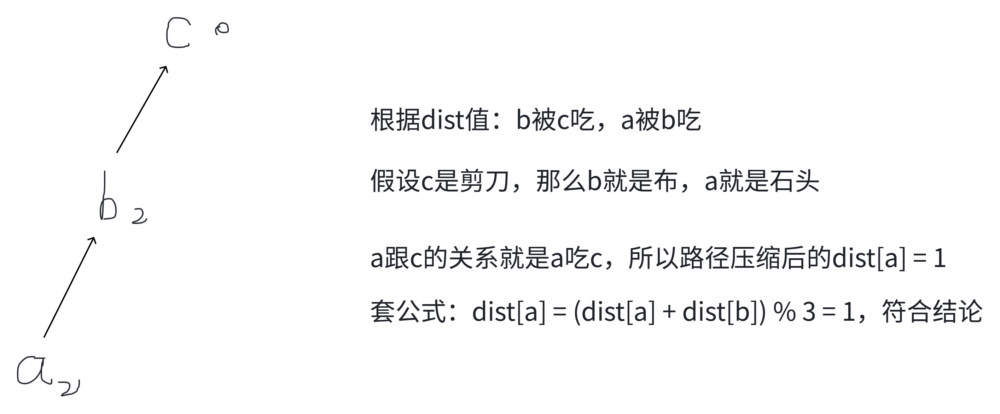

​	合并的时候如何考虑呢？依然是根据一维数轴相对距离模型来推测：dist[lf] = (dist[后] - dist[前] + v) % 3，继续验证：

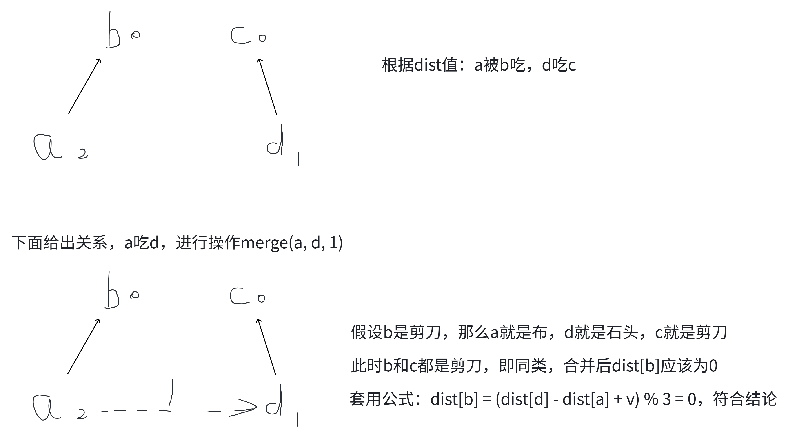

​	下面就剩下真话假话判断了，1操作是需要发现x和y有一个大于n的就算假话，2操作需要发现自己吃自己的行为算假话，那么我们在check函数的参数加一个op操作数，区分到底是1操作还是2操作即可。

​	对于操作1，如何二者不属于同一个集合，即推不出矛盾，我们认为二者是同一类，并进行合并；反之如果二者属于同一个集合，我们就能根据dist值来推断出是否有矛盾，这里二者是同类的充要条件就是：二者的dist值相同。因为二者对于头节点的关系是一样的，要么都被头节点吃，要么都吃头节点，要么都与头节点是同类。

​	对于操作2，除了判断自己不能吃自己之外，还有一个 x 吃 y 的条件，该条件如果成立，是要加入到并查集中去的，此时如何来判断 x 吃 y 这个条件成立呢？有三种情况：1）dist[x] = 1, dist[y] = 0，假设头节点是剪刀，那么 x 就是石头，y 就是剪刀，此时 x 吃 y；2）dist[x] = 2, dist[y] = 1，假设头节点是剪刀，那么 x 就是布，y 就是石头，此时 x 吃 y；3）dist[x] = 0, dist[y] = 2，假设头节点是剪刀，那么 x 就是剪刀，y 就是布，此时 x 吃 y。这三种情况可以写在一起：(dist[x] - dist[y] + 3) % 3 == 1，就说明 x 吃 y，读者可以带入验证。

​	所有细节阐述完毕，写法见AC代码：

```c++
#include <bits/stdc++.h>
using namespace std;

#define MAXN 50005
#define MAXM 100005
const int mod = 1e9 + 7;
typedef long long ll;

int n, k, ans;
int father[MAXN], dist[MAXN];

int find(int i) {
	if(i != father[i]) {
		int tmp = father[i];
		father[i] = find(tmp);
		dist[i] = (dist[i] + dist[tmp]) % 3;
	}
	return father[i];
}

void merge(int x, int y, int v) {
	int fx = find(x), fy = find(y);
	if(fx != fy) {
		father[fx] = fy;
		dist[fx] = (dist[y] - dist[x] + v + 3) % 3;
	}
}

bool check(int op, int x, int y) {
	if(x > n || y > n) return false;
	if(find(x) == find(y)) {
		if(op == 1) {
			return dist[x] == dist[y];
		}
		else if(op == 2) {
			return (dist[x] - dist[y] + 3) % 3 == 1;
		}
	}
	return true;
}

int main() {
	ios::sync_with_stdio(false);
	cin.tie(nullptr);
	
	cin >> n >> k;
	for(int i = 0; i <= n; i++) {
		father[i] = i;
		dist[i] = 0;
	}

	for(int i = 0, op, x, y; i < k; i++) {
		cin >> op >> x >> y;
		if(op == 1) {
			if(!check(1, x, y)) ans++;
			else merge(x, y, 0);
		}
		else {
			if(x == y) { // 自己吃自己，假话
				ans++;
				continue;
			}
			if(!check(2, x, y)) ans++;
			else merge(x, y, 1);
		}
	}

	cout << ans;

	return 0;
}
```

## 带权并查集维护异或关系

​	题目链接：https://acm.hdu.edu.cn/showproblem.php?pid=3234、https://vjudge.net/problem/UVA-12232、https://www.luogu.com.cn/problem/UVA12232

​	下面首先介绍如何维护两个数字的异或关系，因为我们发现：带权并查集维护的信息都是集合内节点与头节点的相对关系，而对于题目中的第一种操作，是一个绝对的值，我们先不去处理。给定a ^ b = v，我们如何来维护？给出具体例子，a ^ b = 0110，c ^ d = 1100，如图：

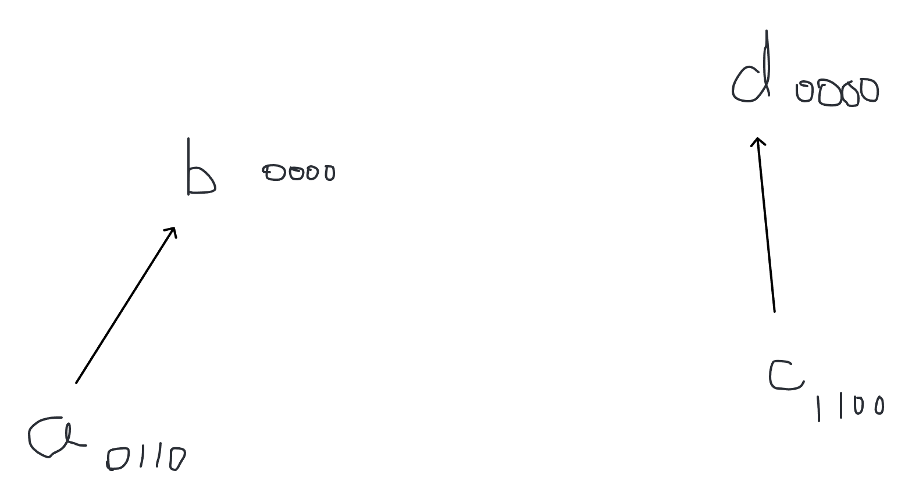

​	下面给出：a ^ c = 0011，此时 b 需要挂在 d 的下面，但是dist值如何更新？依然参考一维数轴相对距离模型，dist[b] = dist[c] ^ dist[a] ^ v = 1010 ^ 0011 = 1001。这个式子是正确的，我们来验证：假设 a 为0001，那么 b 就是0111，c 就是0010，d 就是1110，那么此时，dist[b]就应该是 b ^ d 的结果，计算等于1001，符合。

​	在路径压缩时，猜测是将路径上的值都异或起来，给出例子：

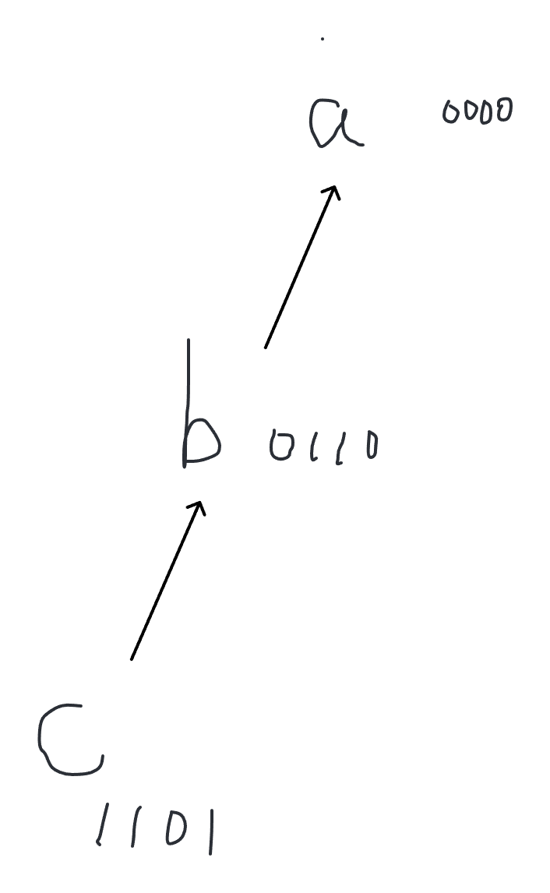

​	c 挂在 a 下面，那么 c 的值更新为：1101 ^ 0110 = 1011，读者可以自行验证。

​	下面来解决第一个操作，即给出具体的数字该如何维护并查集。做法也很容易理解，原来有0~n-1的数字，现在增加下标为n的数字，其值是0，接下来称这个点为虚点。虚点有什么用呢？我们发现：给出一个数字的值时，可以让这个数字挂在虚点下，相当于操作二：a ^ n = v。在未来可能某个操作使得虚点的集合与其他集合产生了联系，那么让其他集合的头节点挂在虚点下方，也就是合并操作要始终保持虚点的头节点地位。这样做在最终虚点的并查集中，所有节点的修正后的值均为其本来的值，因为虚点的值是0，相对于0的异或值都是自己本身。

​	下面来看关于查询的操作如何解决。先假设查询的所有点来自于同一集合，且该集合不是虚点所在集合，那么此时就与查询节点的个数有关系，假设是4个点abcd，想求他们四个异或的结果，就是dist[a] ^ dist[b] ^ dist[c] ^ dist[d]，因为dist[a]是 a 异或这个集合头节点的结果，偶数个异或头节点，直接消为0了，所以此时不需要知道头节点的值是多少；反之如果是奇数个点，就需要知道头节点的值，如果不在虚点的集合中，是求不出来的。如果查询的点都处于虚点所在集合中，就无所谓奇偶了，因为每个节点的值都是原来的值（路径压缩后），直接取dist异或即可。如果这些点来自不同的集合，只需要看：所有来自非虚点集合的点，在各自集合中出现的次数是否为偶数，如果有一个集合中点出现个数是奇数，那就求不出来。比如要查询的点是a、b、f，在刚才的例子中，a 和 b 来自同一个集合且该集合不是虚点集合，f 来自虚点集合，那么这个就可以求出结果；如果 f 来自非虚点集合，那么 f 无论处于ab集合或者是其他非虚点集合，对应集合的点出现个数为奇数，就不能求出答案。

​	处理细节见下面AC代码：

```c++
#include <bits/stdc++.h>
using namespace std;

const int MAXN = 20005;

int n, Q;
int father[MAXN];
int distXor[MAXN];

int findSet(int x) {
    if (father[x] != x) {
        int fa = father[x];
        father[x] = findSet(fa);
        distXor[x] ^= distXor[fa];
    }
    return father[x];
}

void init() {
    for (int i = 0; i <= n; i++) {
        father[i] = i;
        distXor[i] = 0;
    }
}

bool mergeSet(int p, int q, int v) {
    int fp = findSet(p);
    int fq = findSet(q);

    if (fp == fq) {
        return (distXor[p] ^ distXor[q]) == v;
    }

    if (fp == n) {
        swap(fp, fq);
    }

    father[fp] = fq;
    distXor[fp] = distXor[p] ^ distXor[q] ^ v;

    return true;
}

bool query(const vector<int>& nums, int& ans) {
    ans = 0;
    vector<int> roots;

    for (int x : nums) {
        int fx = findSet(x);
        ans ^= distXor[x];
        roots.push_back(fx);
    }

    sort(roots.begin(), roots.end());

    for (int i = 0; i < (int)roots.size(); ) {
        int j = i;
        while (j < (int)roots.size() && roots[j] == roots[i]) {
            j++;
        }

        int cnt = j - i;
        if (cnt % 2 == 1 && roots[i] != n) {
            return false;
        }

        i = j;
    }

    return true;
}

int main() {
    ios::sync_with_stdio(false);
    cin.tie(nullptr);

    int tc = 0;

    while (cin >> n >> Q) {
        if (n == 0 && Q == 0) break;

        init();

        cout << "Case " << ++tc << ":\n";

        bool conflict = false;
        int factCnt = 0;

        for (int i = 0; i < Q; i++) {
            char op;
            cin >> op;

            if (op == 'I') {
                string line;
                getline(cin, line);

                stringstream ss(line);
                vector<int> a;
                int x;

                while (ss >> x) {
                    a.push_back(x);
                }

                if (!conflict) {
                    factCnt++;

                    bool ok;
                    if (a.size() == 2) {
                        int p = a[0];
                        int v = a[1];
                        ok = mergeSet(p, n, v);
                    } else {
                        int p = a[0];
                        int q = a[1];
                        int v = a[2];
                        ok = mergeSet(p, q, v);
                    }

                    if (!ok) {
                        conflict = true;
                        cout << "The first " << factCnt << " facts are conflicting.\n";
                    }
                }
            } else if (op == 'Q') {
                int k;
                cin >> k;

                vector<int> nums(k);
                for (int j = 0; j < k; j++) {
                    cin >> nums[j];
                }

                if (!conflict) {
                    int ans;
                    if (query(nums, ans)) {
                        cout << ans << '\n';
                    } else {
                        cout << "I don't know.\n";
                    }
                }
            }
        }

        cout << '\n';
    }

    return 0;
}
```

